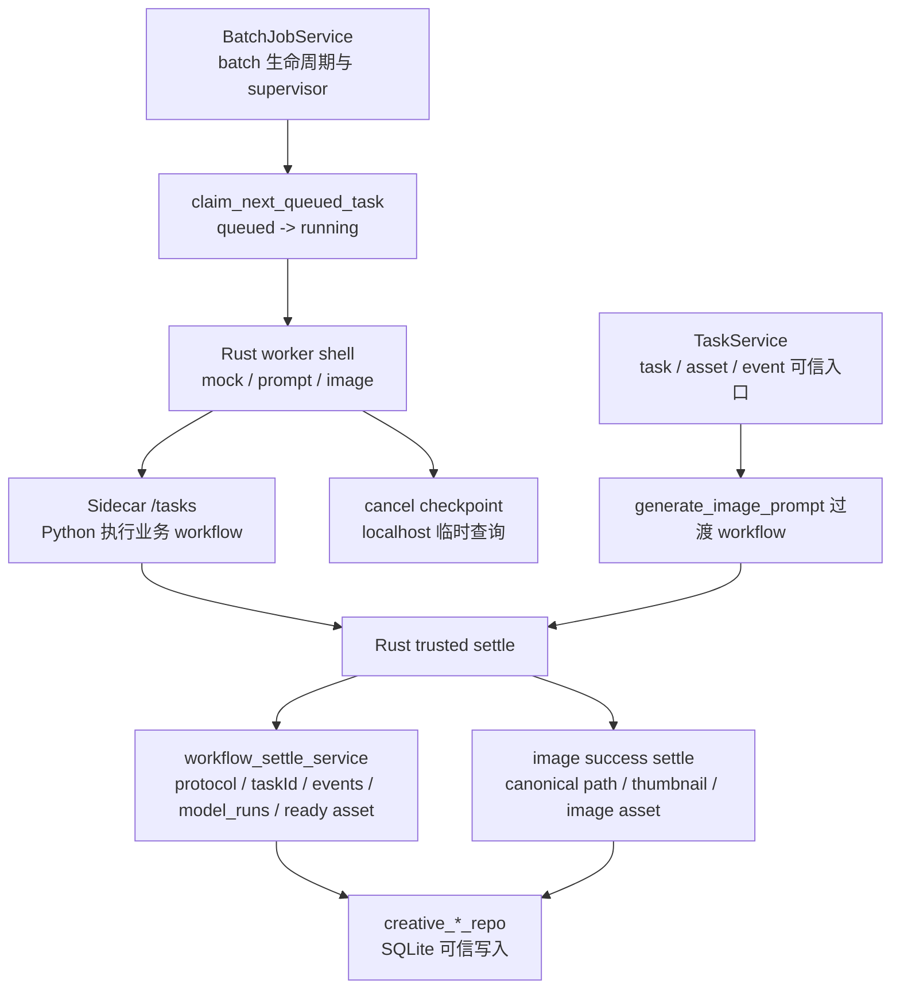
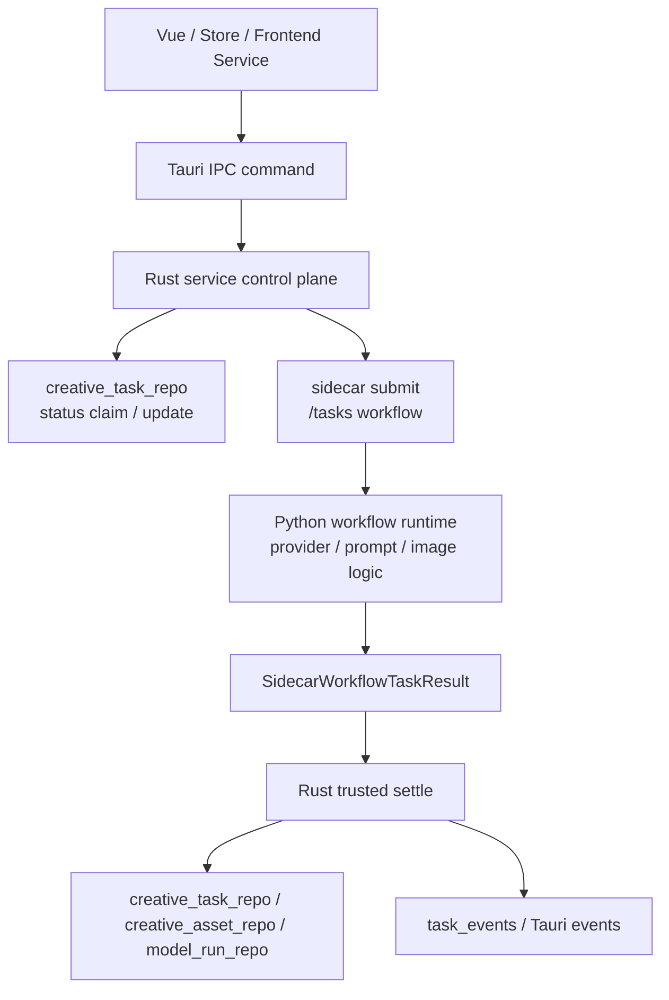

# Workflow Runtime Boundary：AI 工作流运行时边界

## 1. Vue

Vue 负责展示任务、创建用户请求、展示进度、展示资产、人工审核、暂停/取消按钮。

Vue 不负责 workflow 编排、复杂状态机、retry 策略、直接模型调用、直接 Python 通信。

## 2. Rust

Rust 是控制面，负责：

- Tauri commands；
- 权限；
- SQLite 主库；
- TaskService；
- AssetService；
- EventBridge；
- SidecarLifecycleService；
- 文件路径授权；
- 取消和暂停入口；
- 写入可信状态。

Rust 不负责具体小说生成逻辑、prompt 构建、审查推理、多 Agent 推理。

## 3. Python AI Engine

Python 是执行面，负责：

- workflow runtime；
- worker pool；
- provider client；
- prompt builder；
- context builder；
- review agent；
- revision agent；
- consistency agent；
- image processing。

Python 不负责桌面权限、UI 状态、Tauri capability、文件写入越权。

## 4. Provider Gateway

sub2api/cockpit 只负责模型中转，不负责业务流程。

## 5. 正确模式

```text
Vue -> Frontend Service -> Rust TaskService -> Python Workflow -> Rust/DB/AssetService -> Vue Event
```

错误模式：

```text
Vue -> Python
Python -> 任意改主库
Rust -> 写 prompt 业务
Provider Gateway -> 管业务状态
```

## 6. 当前代码事实

截至 2026-06-11，当前实现仍是过渡态，但 batch prompt / image 的 provider 执行已经从 Rust worker 迁到 Python sidecar workflow：

- `src-tauri/src/services/sidecar_lifecycle_service.rs` 负责启动 `creative_health_server.py`、分配 localhost 端口、注入 runtime token、执行 `/health` 检查，并通过 `/tasks` 提交 `generate_image_prompt`、`image.prompt.batch` 与 `image.generate.batch` workflow。
- `src-tauri/sidecars/python/creative_health_server.py` 当前仍是最小 HTTP runtime：`GET /health`、`GET /events`、`POST /tasks`。其中 `generate_image_prompt` 已按本协议返回 `outputs / modelRuns / events / retry` 标准结果，`image.prompt.batch` 已能在 Python 侧调用 OpenAI-compatible `/chat/completions`，`image.generate.batch` 已能在 Python 侧调用 OpenAI-compatible `/images/generations`，并把图片保存到 Rust 授权的输出目录；Python 暂时仍接受旧 `demo.image.prompt/generate` taskType 作为兼容别名。`GET /events` 已从空 stub 升级为内存 ring buffer 查询，按 `after/limit` 返回 workflow events、`nextCursor`、`runtimeInstanceId` 和 `runtimeStartedAt`，但还不负责写主库。
- `src-tauri/src/services/worker_queue_service.rs` 已经有 SQLite-backed queue 的基础控制面：claim queued task、request cancel、cancel checkpoint、complete running task、startup recovery。
- `src-tauri/src/services/batch_job_service.rs` 当前仍在 Rust 内运行 batch supervisor 与 batch worker 壳层。其中 `demo.image.mock` 仍是本地 smoke worker；`demo.image.prompt` 与 `demo.image.generate` worker 已改为提交 sidecar workflow，Rust 负责结果校验、取消后的状态映射、输出文件路径校验、asset/model_runs/task_events 写入和事件广播。Rust batch 控制面现在也接受 `image.prompt.batch` / `image.generate.batch` 作为正式 batch type 别名，并路由到同一组 worker。
- Sidecar request 已不再使用空 `budget` 占位：Rust 会提交 `maxDurationMs / maxImages / maxTokens / maxCostEstimate` 形态的预算对象，sidecar HTTP read timeout 和 Python provider timeout 会按该预算收敛。
- `TaskService::run_review_asset_quality_stub` 仍在 Rust 内生成 review result 和 revise draft task；这只能作为 stub，不应扩展成真实审查/返工/一致性规则。
- `batch_job_service.rs` 的 prompt/image worker 已不再直接每个任务独立 new/stop sidecar；生产路径会优先复用 Tauri app-managed `SidecarLifecycleService`，未注入 state 的测试/孤立调用才退回临时 sidecar。当前 batch 提交只在确保 sidecar endpoint 时持有 lifecycle 锁，实际 `/tasks` 长请求在锁外执行，避免 Rust lifecycle mutex 把 batch 并发槽位串行化。普通 `generate_image_prompt` Tauri command 也已切到同样的 endpoint-provider 模式，长请求不再持有 sidecar lifecycle mutex。
- `SidecarLifecycleService` 已具备首段 recovery circuit、graceful shutdown、恢复可观测字段、Tauri 生命周期事件、生命周期诊断摘要和 `/events` polling 入口：`unhealthy/failed` 后会尝试受控恢复，恢复失败会打开短冷却窗口，冷却期间快速拒绝后续恢复请求；`SidecarStatusSnapshot` 会暴露 `recoveryFailureCount`、`lastRecoveryFailureAt` 和 `recoveryBackoffRemainingMs`；显式 stop 会先向 Python sidecar 发送受 token 保护的 `/shutdown`，短等待后再兜底 kill，并在 `stopped` message 中记录 `durationMs/shutdownRequested/killFallback` 摘要；`creative-sidecar-status-changed` 的 eventType 覆盖 `starting/health_ok/health_failed/recovery_failed/recovery_backoff_active/stopping/stopped/process_exited`，payload status 记录 `starting/running/unhealthy/failed/stopping/stopped` 等当前状态，同 status 重复事件有 1 秒节流；同源摘要会写入 `sidecar-lifecycle.log`；`poll_sidecar_runtime_events` 可读取带 runtime instance 边界的 Python workflow event buffer；设置诊断页已通过 `useSidecarStore` 只读消费该诊断流。这仍不等同于完整 worker-pool 熔断体系，也不代表 Python 可以写 `task_events`。

因此下一阶段不是直接让 Python 任意读写主库，也不是继续把新生产型 worker 分支写进 `BatchJobService`；batch provider DTO 与 prompt builder 已先后退出 Rust demo/test 语义，后续重点转向受控 worker-pool API、继续观察物理诊断日志是否足够，以及按需抽更稳定的 submit/settle 小 helper。

### 6.1 Python sidecar `/events` 持久化策略

`/events` 现在是 Python runtime 的内存诊断流，不是新的任务审计主通道。它和 `task_events` 的关系按以下规则处理：

| 事件来源 | 当前用途 | 是否进入 `task_events` | 说明 |
|---|---|---|---|
| `/tasks` 返回体里的 `events` | workflow result 的一部分 | 是，由 Rust settle 写入 | `append_sidecar_result_events` 已在 Rust 校验 `protocolVersion/taskId` 后落库，这是可信审计路径 |
| Python `/events` polling | sidecar runtime 诊断、UI 诊断面板、进度观察 | 默认否 | 当前 event id 只在 Python 进程内递增，重启后会重置；直接落 `task_events` 会与 settle 事件重复 |
| Tauri `creative-sidecar-status-changed` | Rust lifecycle 状态观察 | 默认否 | 当前是 UI/runtime 事件；如需跨会话审计，应由 Rust 明确写诊断记录 |

如果后续要持久化 `/events`，必须先补 Rust 受控策略：

- Python 仍只生产事件，不直接写主库。
- Rust 负责拉取、过滤、脱敏、限流、去重和选择落点。
- 只有能关联到已知 `creative_tasks.id`、且未通过 `/tasks` result settle 落过库的任务语义事件，才可由 Rust 转成 `task_events`。
- lifecycle、provider 细节、恢复/关闭耗时、runtime 异常等非任务审计信息，应进入 Rust 控制的诊断记录或物理日志，不混入 `task_events`。
- 持久化 payload 只能包含小型摘要、ID、状态、耗时、错误码等字段，不存 API key、完整 prompt、大文本、base64、大响应体或未授权文件路径。
- `/events` response 和 event 已携带 `runtimeInstanceId` / `runtimeStartedAt`；Rust 会把它们和 source event id 组合成诊断来源键，不能单独依赖 Python 进程内自增 `id`。
- 当前第一阶段持久化落点是 Rust-owned 物理日志 `sidecar-runtime.log`，由 `poll_sidecar_runtime_events` 在成功拉取后 best-effort 写入。日志行只包含 runtime/source id、taskId、workflowType、eventType、message 摘要，不写 payload；具体落盘仍经过 `LoggerInfra` 脱敏，并会被系统诊断导出收集。
- sidecar lifecycle 控制面事件的第一阶段持久化落点是 `sidecar-lifecycle.log`，由 `SidecarLifecycleService::emit_status_event` 同源写入。该日志继承状态事件节流规则，只记录 eventType、status、port、pid、recoveryFailureCount、backoff 和 message 摘要，并经过 `LoggerInfra` 脱敏。

## 7. 推荐迁移模式：Rust 主动提交，Python 执行业务

短期采用以下模式：

```text
Vue
  -> creative-batch.service.ts / creative-task.service.ts
  -> Rust Command
  -> Rust Service creates or claims task
  -> Rust updates task to running and emits event
  -> Rust SidecarLifecycleService POST /tasks
  -> Python executes workflow/provider/review/image logic
  -> Python returns structured result
  -> Rust validates result and writes task/assets/model_runs/events
  -> Rust emits task/batch events
```

这个模式保留 Rust 控制面，同时让 Python 承担真实 workflow 执行。它比“Python 直接拉 SQLite 队列并写库”更适合当前阶段，因为现有权限、路径、event bridge、repo 写入和 audit 入口都在 Rust。

当前 Rust 编排边界判定：

| 职责 | Rust 当前是否可保留 | 说明 |
|---|---|---|
| task / batch 最小状态机 | 是 | queued、running、cancelling、cancelled、succeeded、failed、paused、completed 等可信状态仍由 Rust/repo 写入 |
| asset / model_runs / task_events 最终写入 | 是 | 这是审计、路径安全和 UI 事件桥的共同边界 |
| sidecar task request/result 协议校验 | 是 | Rust 必须校验 `protocolVersion`、`taskId`、`status`、授权路径和结果摘要 |
| batch supervisor / concurrency slots | 短期是 | 在正式 worker pool、恢复协议、熔断和生命周期复用稳定前，先由 Rust 保留 |
| prompt builder / review / revision / consistency | 否 | 正式业务逻辑应进入 Python workflow runtime |
| provider 调用和图片处理 | 否 | prompt/image provider 执行已经迁到 Python；后续不要回流到 Rust worker |
| batch sidecar lifecycle | 首段可保留 | batch worker 已优先复用 app-managed lifecycle，并已把 endpoint 获取和 HTTP task request 分离；当前已有 recovery backoff、graceful shutdown、恢复可观测字段、节流后的 Tauri 生命周期事件、`sidecar-runtime.log` 和 `sidecar-lifecycle.log` 摘要日志；WorkerQueue Rust IPC 已有 claim/checkpoint/complete 首段，但下一步仍需先设计带 runtime token、worker identity、lease 和 heartbeat 的 localhost sidecar control API |

中期才评估 Python 拉队列模式：

```text
Python worker -> Rust IPC/localhost control API -> claim/checkpoint/complete
```

不建议让 Python 直接任意写 `monster_workbench.db`。如果未来确实需要 Python 写库，也必须先定义受限仓储协议、迁移策略、锁策略和审计边界。

## 8. Sidecar Task Request 草案

Rust 提交给 Python 的请求建议统一为：

```json
{
  "protocolVersion": 1,
  "taskId": 123,
  "projectId": "project-a",
  "taskType": "generate_image_prompt",
  "workflowType": "image_prompt",
  "attempt": 1,
  "maxRetries": 2,
  "cancelToken": "task-123",
  "budget": {
    "maxDurationSeconds": 120,
    "maxImages": 1,
    "maxTokens": 4000,
    "maxCostEstimate": 0.2
  },
  "provider": {
    "providerId": "local-test",
    "providerType": "openai-compatible",
    "baseUrl": "http://127.0.0.1:3000/v1",
    "model": "gpt-4.1-mini",
    "requestType": "chat"
  },
  "input": {
    "brief": "visual direction",
    "style": "cinematic",
    "mood": "focused"
  },
  "context": {
    "sourceAssetIds": [1, 2],
    "parentTaskId": null,
    "batchJobId": null,
    "goalId": null
  }
}
```

约束：

- `taskId` 必须来自 Rust 已落库的 `creative_tasks`。
- `provider.apiKey` 不应落入 task payload、task_events 或普通日志；密钥由 Rust 按需注入 Python 进程请求，并在日志脱敏。
- `budget` 来自 Goal / Batch / Workflow / Provider 配置，由 Rust 负责最终熔断；Python 只按协议执行局部 timeout / token / image 数等约束。
- `context` 只传 ID 和必要摘要；大图、大文本、完整资产内容按需通过 Rust 授权路径或后续受限读取协议获取。

## 9. Sidecar Task Result 草案

Python 返回给 Rust 的结果建议统一为：

```json
{
  "protocolVersion": 1,
  "taskId": 123,
  "status": "succeeded",
  "message": "workflow completed",
  "outputs": [
    {
      "assetType": "image_prompt",
      "title": "Generated image prompt",
      "content": "prompt text",
      "filePath": null,
      "thumbnailPath": null,
      "metadata": {
        "workflowType": "image_prompt",
        "source": "python-workflow"
      }
    }
  ],
  "modelRuns": [
    {
      "providerId": "local-test",
      "providerType": "openai-compatible",
      "model": "gpt-4.1-mini",
      "requestType": "chat",
      "status": "succeeded",
      "durationMs": 1200,
      "promptHash": "hash",
      "promptVersionId": "workflow:123:1",
      "inputTokenCount": 100,
      "outputTokenCount": 200,
      "costEstimate": 0.01,
      "errorCode": null,
      "errorMessage": null,
      "metadata": {}
    }
  ],
  "events": [
    {
      "eventType": "workflow_step_completed",
      "message": "prompt built",
      "payload": {}
    }
  ],
  "retry": {
    "shouldRetry": false,
    "reason": null
  }
}
```

Rust 收到结果后必须：

- 校验 `taskId` 与当前 running task 一致。
- 校验 `status` 只允许进入 `succeeded`、`failed`、`blocked`、`cancelled` 或 `retrying` 的受控分支。
- 使用 repo 写入 `assets`、`model_runs`、`task_events` 和最终 `creative_tasks` 状态。
- 事件 payload 只写摘要、ID、状态和小型 metadata；大对象只写 file path / thumbnail path / asset id。
- 不信任 Python 返回的绝对路径；涉及文件路径时必须经过 Rust 授权目录或复制/校验流程。

## 10. 取消与 Checkpoint

取消入口仍由 Rust 暴露：

```text
Vue -> Rust request_cancel -> task status: running -> cancelling
```

Python 执行长任务时必须支持 checkpoint：

```text
Python step boundary
  -> Rust cancel checkpoint API
  -> if cancelling/cancelled: stop provider calls or stop next step
  -> return status cancelled
```

当前 `WorkerQueueService::check_cancel_checkpoint(task_id)` 已具备 Rust 侧查询能力：task 自身为 `cancelling/cancelled` 时返回取消；若 task 归属的父 batch 已是 `cancelled`，也返回取消；父 batch `paused` 不打断已运行 worker，只停止继续调度。worker-control `/worker/checkpoint` 已要求 Python worker 带回 `workerId/runtimeInstanceId/claimToken` 并校验当前未过期 lease；token 不匹配或 lease 过期时返回 `cancelRequested: true` 与 `leaseValid: false`，让 worker 停止继续执行。`generate_image_prompt`、`image.prompt.batch` 与 `image.generate.batch` 已通过 Rust 暴露的 checkpoint 让 Python 在步骤边界查询取消状态，而不是让 Python 直接查询 SQLite。

最低要求：

- 每次 provider 调用前检查取消。
- 每个长循环或多图片生成步骤之间检查取消。
- 已进入不可中断 provider 请求时，完成当前请求后必须再次检查取消，再决定是否落库。
- 取消后的部分输出不得覆盖源资产；如需保留，必须作为 draft / partial asset 并标记来源。

## 11. 批量任务迁移边界

`BatchJobService` 的下一步不应继续增加新的生产 worker 分支。推荐迁移顺序：

1. 保留 `demo.image.mock` 作为 Rust 本地 smoke worker。
2. `demo.image.prompt` batch job 的 provider 调用已从 Rust worker 迁到 Python `image.prompt.batch` workflow；Rust 仍负责 claim、running、结果落库和 batch progress event。
3. `demo.image.generate` batch job 的 provider 调用和图片处理已从 Rust worker 迁到 Python `image.generate.batch` workflow；Rust 负责校验输出文件路径、创建 asset、复制 thumbnail、写 `model_runs`。
4. 新增正式 batch 类型时不要继续扩展 `demo.image.*` 命名；sidecar 协议层已先使用 `image.prompt.batch` / `image.generate.batch`，Rust batch 控制面也已接受同名 batch type 别名；UI / browser mock 当前也已把 prompt/generate 提交值切到正式命名，并保留旧值兼容。
5. batch prompt / image sidecar workflow 已接入 cancel checkpoint，并已具备基础 budget/timeout 协议；batch worker 已优先复用 app-managed sidecar lifecycle，且 batch `/tasks` 提交不再长时间持有 lifecycle mutex。当前已补首段 recovery circuit / backoff、graceful shutdown、恢复可观测字段、节流后的 Tauri 生命周期事件、Python `/events` polling、`sidecar-runtime.log` 与 `sidecar-lifecycle.log` 摘要持久化，且 provider DTO / prompt builder 已退出 Rust demo/test 语义；下一步先设计受控 worker-pool API，只有这些协议稳定后，再讨论 supervisor 是否从 Rust 迁到 Python worker pool。

## 12. Rust 服务代码级边界清单

本节用于评估 `src-tauri/src/services/task_service.rs` 与 `src-tauri/src/services/batch_job_service.rs` 是否继续扩张。后续改动优先按这里判断，而不是只按文件名判断。

### 12.1 `TaskService`

| 函数 / 区域 | 当前职责 | 边界判定 | 后续约束 |
|---|---|---|---|
| `create_creative_task` / `update_creative_task_status` / `append_task_event` | 校验输入、调用 repo、发 Tauri event | Rust 控制面，保留 | 继续保持薄状态入口，不写业务 prompt/review 规则 |
| asset / asset_link 读写方法 | 通过 `creative_asset_repo` 写入资产和关系 | 短期可保留 | 不因为文件名不理想而优先拆；等资产版本、来源、权限模型稳定后再拆 `AssetService` |
| `run_generate_image_prompt_workflow` | 创建 task、启动 cancel checkpoint、提交 sidecar、校验 result、写 asset/model_runs/events/status | 合理的过渡 workflow 入口 | 已通过 endpoint-provider 模式释放 sidecar lifecycle 长锁；后续继续抽象通用 workflow submit/settle，不为每个正式 workflow 手写一套 Rust 编排 |
| `settle_sidecar_non_success` / `resolve_sidecar_failure_status` | 把 sidecar 非成功结果映射为受控 task 状态 | Rust 可信状态面，保留 | 只处理协议状态和 retry budget，不嵌入业务判断 |
| `run_review_asset_quality_stub` / `build_review_result` | Rust 内生成 review result 和 revise draft task | demo/stub，冻结 | 不继续扩展真实审查、返工、一致性规则；正式 review/revision 迁入 Python workflow runtime |

### 12.2 `BatchJobService`

| 函数 / 区域 | 当前职责 | 边界判定 | 后续约束 |
|---|---|---|---|
| `create_batch_image_job` / `start_batch_job` / `pause_batch_job` / `resume_batch_job` / `cancel_batch_job` | batch 生命周期、任务创建、暂停/恢复/取消、事件广播 | Rust 控制面，保留 | 保持为状态控制，不下沉 provider 或业务 workflow 逻辑 |
| `run_batch_supervisor_inner` | 轮询 snapshot、按 concurrency claim queued task、spawn worker、判断 completed | 短期保留 | sidecar recovery、runtime events polling、诊断日志、worker lease 字段、repo API、`WorkerQueueService` lease 方法、localhost control API、通用/图片文件 complete settle 和启动过期 lease recovery 均已落地；迁移前仍需定义 supervisor 拥有权与产品语义 |
| `run_mock_task_worker` | 本地 smoke worker、模拟耗时/失败/取消 | demo，本地验证可保留 | 只服务本地 smoke，不作为正式业务类型模板 |
| `run_prompt_task_worker` / `run_generate_task_worker` | 检查取消、构造 sidecar request、提交 Python workflow、交给 settle 归档 | 过渡 worker shell | 不新增生产 worker 分支；新增正式 workflow 走 sidecar runtime |
| `settle_batch_prompt_sidecar_response` / `settle_batch_image_sidecar_response` | 校验 protocol/taskId/status，写入 asset/model_runs/task_events/status | Rust 可信落库和审计面，保留 | protocol 校验、sidecar events、model_runs、普通 ready asset 与 batch failure/cancelled 状态映射已收口；image 文件 success settle 仍因路径授权和 thumbnail 生成保留在 batch 服务 |
| `validate_sidecar_output_file` / `copy_sidecar_thumbnail` | 校验 Python 输出文件仍在 Rust 授权目录内，并生成缩略图 | Rust 权限与文件边界，保留 | Python 不返回可直接信任的任意绝对路径 |
| Python sidecar `/events` | 已有内存 ring buffer、runtime instance 字段、Rust `poll_sidecar_runtime_events` 读取入口和 `sidecar-runtime.log` 摘要日志 | 过渡诊断流，继续保留 | 不替代 Rust settle 写入的 `task_events`；继续只写诊断摘要，不写 payload / 大对象 / 密钥 |
| sidecar lifecycle diagnostics | 已有 `creative-sidecar-status-changed` Tauri event 和 `sidecar-lifecycle.log` 摘要日志 | 控制面诊断，继续保留 | 不新增 DB 表；同源节流、脱敏、随系统诊断导出收集 |
| `useSidecarStore` / 设置诊断页 | 只读展示 runtime instance、cursor 和最近事件 | 可保留 | 先 `get_sidecar_status`，只有 status 为 `running` 才 polling，避免打开诊断页主动启动 sidecar |
| `read_batch_prompt_template` / Python `build_batch_prompt_request` | Rust 只读取 template；Python 侧替换 `{{sequenceNo}}` / `{{index}}` 并回传 `promptRequest/promptHash` | 已退出 Rust demo-era prompt builder | 保持 prompt builder 在 Python workflow；Rust 继续只做 request 适配、协议校验和可信落库 |
| `build_workflow_provider_config` / `BatchWorkflowProviderConfig` | 把 batch payload 适配成 sidecar workflow provider 配置 | 已退出 `AiProviderConfig` 测试语义 | 保持为 Rust request 适配层；后续如 provider 协议继续扩展，优先靠近 sidecar workflow DTO |
| `maybe_auto_pause_batch_after_failure` | 基于失败阈值自动暂停 batch | 控制面安全策略，可短期保留 | 不继续扩展成复杂业务失败策略；复杂策略进入 workflow runtime 或受控 policy 配置 |

### 12.3 当前推进顺序

1. UI / browser mock 的 prompt/generate batch type 提交值已切到 `image.prompt.batch` / `image.generate.batch`；旧 `demo.image.prompt/generate` 只作为历史兼容保留。
2. 共享 `SidecarLifecycleService` 已具备首段 recovery circuit / backoff、graceful shutdown、恢复可观测字段、节流后的 Tauri 生命周期事件、`sidecar-lifecycle.log` 摘要持久化、Python `/events` polling 入口、runtime instance 字段、设置诊断页只读消费和 `sidecar-runtime.log` 摘要持久化；继续观察物理日志是否足够，必要时再设计正式 Rust-owned diagnostics 表/导出策略。
3. 再抽象 Rust workflow submit/settle 公共路径，减少 `TaskService` 和 `BatchJobService` 内重复的 sidecar 状态映射；当前已先落地 sidecar 协议校验、事件落库、model_runs 持久化、普通 ready asset 创建和 batch failure/cancelled 状态映射 helper，image success settle 只在不削弱路径授权和缩略图生成边界的前提下继续拆小 helper。
4. 最后才评估 supervisor 是否迁给 Python worker pool；当前已有 Rust IPC 形态的 claim/checkpoint/complete/recover 首段，`complete_creative_task` 与 `recover_interrupted_creative_tasks` 也已注册为 Tauri command，但它们没有 runtime token、lease 校验和 sidecar HTTP 暴露，不能直接当作 Python worker-pool API。迁移前必须先明确 localhost sidecar control API、鉴权、租约/心跳和结果入库协议，不允许 Python 任意写主库。

### 12.4 当前边界结论

本次复核后，`TaskService` 与 `BatchJobService` 的升级方向按以下规则判断：

- 不因为 `TaskService` 同时包含 task / asset / event 方法就立即拆文件；当前更高风险是继续把真实 review/revision 规则写进 `run_review_asset_quality_stub`。
- 不把 `BatchJobService` 的 supervisor 立即迁给 Python；当前 Rust supervisor 仍是受控 claim、并发槽位、暂停/恢复/取消和最终状态落库的可信入口。
- 不再为新的正式 batch workflow 增加 Rust worker 分支；新增 workflow 应走统一 sidecar request/result 协议，Rust 只做控制、校验、授权路径和可信落库。
- `build_prompt_request` 已替换为 Rust 侧 `read_batch_prompt_template` + Python 侧 `build_batch_prompt_request`；`AiProviderConfig` 适配也已收口为 `BatchWorkflowProviderConfig`；WorkerQueue 已补 Rust IPC `complete_creative_task` 首段，当前剩余重点是 localhost sidecar control API、租约/心跳和稳定 submit/settle 边界。
- `settle_sidecar_non_success`、`settle_batch_prompt_sidecar_response`、`settle_batch_image_sidecar_response` 代表同一类 Rust 可信 settle 逻辑；当前已先抽出 sidecar 协议校验、事件落库、model_runs 持久化、普通 ready asset 创建和 batch failure/cancelled 状态映射 helper，后续再评估 image success settle 或 Python `/events` polling，而不是把落库职责迁到 Python。
- `SidecarLifecycleService` 已有恢复冷却、受控 shutdown、恢复失败指标、节流后的 Tauri 生命周期事件、`sidecar-lifecycle.log` 摘要持久化、Python `/events` polling、runtime instance 字段、设置诊断页只读消费和 `sidecar-runtime.log` 摘要持久化，下一步不要急着上 Python worker pool；先设计 control API 与租约/心跳，再按观察结果评估正式 diagnostics 表/导出策略或 Rust submit/settle 公共路径。

### 12.5 2026-06-12 再评估：编排边界排序

本轮再次对照 `task_service.rs`、`batch_job_service.rs` 和 `workflow_settle_service.rs` 后，边界排序调整如下：

1. `TaskService::run_generate_image_prompt_workflow_after_task` 仍是合理过渡入口：Rust 创建 task、启动 cancel checkpoint、拿 endpoint、提交 sidecar、校验协议并写入 asset/model_runs/task_events/status；真实 prompt 生成逻辑不回到 Rust。
2. `BatchJobService::run_batch_supervisor_inner` 仍短期保留：它负责 snapshot 轮询、concurrency slot、claim queued task、暂停/取消收敛和最终 completed 判定；在受控 worker-pool API 成型前，不迁给 Python 直接拉队列。
3. `run_prompt_task_worker` / `run_generate_task_worker` 是过渡 worker shell：可以继续负责取消检查、checkpoint server、sidecar submit 和 settle 分派，但不再新增正式业务 worker 分支。
4. `handle_batch_worker_failure_with_model_runs` 与 `handle_batch_worker_cancelled` 已收口 prompt/image 的失败、重试和取消状态；这类 Rust 可信状态 helper 保留。
5. `settle_batch_image_sidecar_response` 的 success 分支暂不强抽：它仍包含授权输出目录校验、thumbnail 生成、image-specific metadata 和 asset 创建；后续最多抽小型 result/status helper，不能把路径信任交给 Python。
6. `build_prompt_request` 已退出 Rust；batch sidecar request 现在传 `promptTemplate`，Python workflow 负责生成 `promptRequest` 并回传 `promptHash`。`build_provider_config` / `build_image_provider_config` 已收口为 `build_workflow_provider_config` / `BatchWorkflowProviderConfig`，不再依赖 `AiProviderConfig` 测试 DTO；`WorkerQueueService::complete_task` 已补齐 Rust IPC complete 首段，下一步优先设计 localhost sidecar control API 与租约/心跳。

### 12.6 Worker-pool 控制协议前置条件

`WorkerQueueService::claim_next_task`、`check_cancel_checkpoint`、`complete_task` 和 `recover_interrupted_tasks` 已形成 Rust IPC/service 的首段闭环，但这还不是 Python worker pool 可以直接接管 `BatchJobService` supervisor 的条件。

当前缺口：

| 缺口 | 当前代码事实 | 迁移前要求 |
|---|---|---|
| worker identity | `creative_tasks` 已有 worker 字段，但 `WorkerQueueService` / sidecar control API 尚未消费 | claim 后必须能识别任务当前归属的 runtime / worker |
| lease / claim token | `claim_next_queued_task_with_lease` 已在 repo 层落地；旧 `claim_next_queued_task` 仍只给 Rust supervisor 使用 | Python worker claim 必须走带 token 的 control API，complete 时校验同一 token |
| heartbeat | `heartbeat_task_lease` 已在 repo 层和 sidecar control API 落地 | Python worker 长任务必须定期续约，Rust 能回收过期 lease |
| result settle | `complete_creative_task` 只能写 status/result/asset_id；batch prompt/image settle 仍在 Rust 内校验 sidecar result | 正式 workflow result 仍要经过 Rust 校验 outputs/modelRuns/events/授权文件路径 |
| recovery | `recover_expired_task_leases` 已在 repo / service / control API 落地，worker control server 启动时也会先回收过期 lease；现有 Tauri recovery 仍是 legacy startup 兜底 | worker-pool 模式后续还需要定义 runtime 重启、worker 退出和主动取消的产品语义 |

推荐下一步仍是 Rust-owned localhost sidecar control API，而不是 Python 直接访问 SQLite：

```text
Python worker
  -> localhost control API with runtime token
  -> Rust WorkerQueueService / settle helpers
  -> creative_task_repo / asset_repo / model_run_repo / task_events
```

注意：这里的 localhost control API 不是当前前端可调用的 Tauri command。Python sidecar 不应通过前端 IPC 路径补齐 worker-pool 能力，而应走 Rust 暴露、带 runtime token 和 lease 校验的本地控制面。

该 control API 的最小集合已经有 Rust 端首段骨架：

| API | 目的 | Rust 可信职责 |
|---|---|---|
| `claim` | 获取可执行任务并生成 lease | 状态从 queued 到 running，写 worker identity / lease / started_at |
| `checkpoint` | 查询取消或暂停 | 只暴露布尔或受控原因，不暴露 DB |
| `heartbeat` | 续约 running task | 校验 worker identity 和 lease，刷新 lease deadline |
| `complete` | 收敛终态 | 校验 lease 未过期；`sidecarResult` 已支持通用非文件输出和 `image.generate.batch` 图片文件输出，文件路径由 Rust 做授权目录 canonical 校验 |

Python worker loop 已首段消费 control API 中的 `image.prompt.batch` 和 `image.generate.batch`。`BatchJobService::run_batch_supervisor_inner` 继续保留在 Rust；`run_prompt_task_worker` / `run_generate_task_worker` 也继续作为过渡 shell，只负责提交 Python workflow 与 Rust settle，不新增正式业务 worker 分支。

### 12.7 2026-06-12 继续评估：迁移门禁

本轮继续对照 `task_service.rs`、`batch_job_service.rs`、`worker_queue_service.rs`、`creative_task_repo.rs` 与 `workflow_settle_service.rs` 后，迁移门禁按“能保留、可抽象、不可迁移”三类执行：

| 类别 | 当前代码事实 | 结论 |
|---|---|---|
| Rust 必须保留 | `creative_task_repo::claim_next_queued_task` 仍只是事务内选择 queued task 并更新为 running；`WorkerQueueCompleteTaskInput` 只有 `taskId/status/resultJson/errorMessage/assetId` | 这只能作为 Rust 内受控收敛入口，不能作为 Python worker-pool 的最终 claim/complete 协议 |
| Rust 必须保留 | `settle_batch_image_sidecar_response` success 分支仍校验输出文件 canonical path、复制 thumbnail、创建 image asset、绑定 model_runs 并写 task status/event | image success settle 暂不迁 Python，也不应强抽成脱离权限上下文的通用 helper |
| Rust 可继续抽象 | `workflow_settle_service.rs` 已承接 protocol/taskId 校验、sidecar events、model_runs、普通 ready asset 创建 | 后续可继续抽 submit/settle 公共骨架，但必须保持 Rust 写库和路径授权 |
| 过渡壳层可保留 | `run_prompt_task_worker` / `run_generate_task_worker` 只做 checkpoint、sidecar submit、transport fallback 和 settle 分派 | 不新增正式生产 worker 分支；新增 workflow 继续走 sidecar request/result |
| 不能提前迁移 | `BatchJobService::run_batch_supervisor_inner` 仍负责 concurrency slot、claim、暂停/取消/完成收敛 | 没有 Rust-owned sidecar control API、runtime token 和 trusted settle 接线前，不让 Python 直接拉队列或拥有 batch supervisor |

因此下一步不是继续移动函数位置，而是先设计最小控制协议和 schema：

1. `creative_tasks` worker ownership / lease 支撑字段已落地，但在 sidecar control API 接线前，继续把任务拥有权留在 Rust supervisor。
2. localhost sidecar control API 必须定义并实现 `claim -> checkpoint -> heartbeat -> complete`，并复用 runtime token 或等价鉴权。
3. `complete` 必须校验 worker identity、lease token 和 lease deadline，再进入 Rust settle helper；不能复用当前 Tauri IPC `complete_creative_task` 作为 Python worker 协议。
4. Python workflow 只返回受控结果摘要、modelRuns、events 和授权输出目录内的文件引用；asset、model_runs、task_events、task status 仍由 Rust 可信写入。
5. 在 control API 和 migration 通过旧库兼容回归前，`BatchJobService` 的 supervisor / worker shell 只做收窄和复用，不做所有权迁移。

### 12.8 2026-06-12 继续评估：编排边界执行口径

本轮继续按当前代码复核后，`TaskService` / `BatchJobService` 的边界应按“控制面、过渡壳层、可信 settle、未来 worker pool”四层理解，而不是按文件长度或函数数量简单拆分：



执行口径：

| 层级 | 当前落点 | 可以继续做 | 不能提前做 |
|---|---|---|---|
| Rust 控制面 | `TaskService` 常规 task/asset/event 方法、`BatchJobService` 生命周期方法 | 保持输入校验、状态变更、事件广播和 repo 写入 | 不把真实 prompt/review/revision 策略写回 Rust |
| 过渡 worker shell | `run_prompt_task_worker`、`run_generate_task_worker`、`submit_with_batch_sidecar` | 继续复用 checkpoint、sidecar endpoint 获取、transport fallback 和 settle 分派 | 不为正式业务新增第四、第五个 Rust worker 分支 |
| Rust trusted settle | `settle_sidecar_non_success`、`settle_batch_prompt_sidecar_response`、`settle_batch_image_sidecar_response`、`workflow_settle_service.rs` | 继续抽小型公共 helper，减少协议校验、events、model_runs、普通 ready asset 的重复 | 不把 asset/model_runs/task_events/status 的最终写入交给 Python |
| 文件与权限边界 | `validate_sidecar_output_file`、`copy_sidecar_thumbnail`、image asset 创建 | 保留 canonical path 校验、授权输出目录和缩略图生成 | 不信任 Python 返回的任意绝对路径 |
| 未来 worker pool | 尚未具备，当前只有 Tauri IPC 形态的 claim/checkpoint/complete/recover 首段 | 先设计 localhost control API、worker identity、claim token、lease deadline、heartbeat、lease-aware complete | 不让 Python 直接拉 SQLite 队列，不把当前 `complete_creative_task` 当 sidecar complete 协议 |

因此，本轮后 Rust 后端已经产出两个可验证产物：

1. `creative_tasks` worker ownership / lease 字段的 migration 与旧库兼容回归矩阵。
2. Rust-owned localhost sidecar control API 首段，覆盖 `claim`、`checkpoint`、`heartbeat`、`complete`、`recover-expired-leases`，并由 `SidecarLifecycleService` 用 runtime token 启动。

图片文件输出已经接入专门 Rust trusted settle。下一步才重新评估 `BatchJobService::run_batch_supervisor_inner` 是否迁出 Rust，或是否把更多 prompt/image worker shell 替换为 Python worker loop。

### 12.9 Worker ownership / lease migration 首段

本节原本是下一步 schema / repo 变更前的草案；2026-06-13 已落地首段 schema、repo 行为和 sidecar control API，且 `/worker/complete` 已支持通用非文件 result settle。当前代码事实是：

- `creative_db_schema.rs` 已新增 migration v4 `add_creative_task_worker_lease_columns`，为 `creative_tasks` 补齐 worker identity、claim token、claimed/heartbeat 时间、lease deadline 和 renewal count 字段。
- `creative_task_repo.rs` 已新增 lease-aware repo API：`claim_next_queued_task_with_lease`、`heartbeat_task_lease`、`complete_task_with_lease` 和 `recover_expired_task_leases`，并由 repo 测试覆盖 owner/token/过期租约路径。
- 旧 `creative_task_repo::claim_next_queued_task` 仍保留为 Rust supervisor 内部原子 claim，不记录任务归属；这有意避免把现有 Tauri IPC 误当成 Python worker-pool 协议。
- `WorkerQueueCompleteTaskInput` 只包含 `taskId/status/resultJson/errorMessage/assetId`，不能证明 complete 调用来自当前 lease owner。
- `recover_interrupted_tasks` 当前只按 `running` / `cancelling` 状态做启动恢复，不区分 worker 过期、runtime 重启、进程退出和主动取消。

推荐的最小字段草案：

| 字段 | 类型 | 允许空 | 当前用途 | 约束 |
|---|---|---|---|---|
| `worker_id` | `TEXT` | 是 | sidecar worker 的稳定实例标识 | 由 Rust claim 写入；Python 只回传，不自定义覆盖 |
| `worker_runtime_instance_id` | `TEXT` | 是 | 绑定当前 Python runtime instance | runtime 重启后旧 lease 不再可 complete |
| `worker_claim_token` | `TEXT` | 是 | claim 时生成的随机 token | heartbeat / complete 必须带回同一 token |
| `worker_claimed_at` | `TEXT` | 是 | claim 发生时间 | 用于诊断和旧 lease 审计 |
| `worker_heartbeat_at` | `TEXT` | 是 | 最近一次 heartbeat 时间 | 用于判断长任务是否仍活跃 |
| `lease_expires_at` | `TEXT` | 是 | lease 过期时间 | Rust 根据 server-side clock 计算，不信任 Python 传入 |
| `lease_renewal_count` | `INTEGER NOT NULL DEFAULT 0` | 否 | 续约次数 | 只在 heartbeat 成功后递增 |

首轮 migration 原则：

1. 只新增 nullable 字段或带默认值字段，不删除旧字段，不改现有状态枚举。
2. `init_schema()` 必须能给旧库补齐字段；旧库中已有 `queued` 任务在字段为空时仍可被 Rust supervisor 按旧路径处理。
3. 旧库中已有 `running` 且无 lease 的任务继续交给现有 `recover_interrupted_tasks` 兜底，不能让新的 sidecar `complete` 接管这些 legacy running task。
4. 新增索引优先覆盖 `status` + `lease_expires_at`、`worker_id` + `worker_claim_token`、`worker_runtime_instance_id`，避免恢复扫描全表。
5. `retrying` 语义必须单独明确：当前 batch worker 失败重试会直接写回 `queued`，而启动恢复会把可重试 running task 写成 `retrying`；如果后续要让 lease recovery 进入 `retrying`，必须同时定义 `retrying -> queued` 的 requeue 规则或 `run_after` 字段，否则 claim 仍只会消费 `queued`。

repo / service 迁移顺序建议：

| 顺序 | 产物 | 验收点 |
|---|---|---|
| 1 | `creative_tasks` 字段 migration 和旧库 fixture | 新库、旧库、字段缺失库都能 `init_schema()`；旧数据不丢失 |
| 2 | `claim_next_queued_task_with_lease` | `queued -> running` 与 lease 字段写入在同一事务内完成；返回 claim token |
| 3 | `heartbeat_task_lease` | 校验 taskId / workerId / runtimeInstanceId / claimToken / 未过期 lease 后续约 |
| 4 | `complete_task_with_lease` | 校验同一 lease owner 后进入 Rust settle；过期或 token 不匹配时拒绝 |
| 5 | `recover_expired_task_leases` | 只回收过期 lease；保留现有 startup recovery 作为 legacy 兜底 |
| 6 | `WorkerQueueService` DTO 分层 | 现有 Tauri IPC DTO 不冒充 sidecar worker-pool 协议 |

旧库兼容回归矩阵：

| 场景 | 预期 |
|---|---|
| 新库首次启动 | 创建字段和索引，`queued` 任务可被旧 Rust supervisor 正常 claim |
| 旧库缺少 lease 字段 | `init_schema()` 补字段；已有 task / asset / batch 数据保持不变 |
| legacy `running` 且无 lease | 不允许 sidecar complete；继续由 startup recovery 标记 retrying/failed |
| `running` 且 lease 未过期 | 不被重复 claim；heartbeat 可续约 |
| `running` 且 lease 过期 | `recover_expired_task_leases` 可由 Rust 回收；过期 worker complete 被拒绝 |
| `cancelling` 且 lease 有效 | checkpoint 返回取消；complete 进入 Rust-controlled cancelled settle |
| terminal 状态 | `succeeded/failed/cancelled/blocked` 不可 claim、heartbeat 或 complete |

### 12.10 Rust-owned localhost control API 首段 contract

本 contract 描述的是 Rust-owned sidecar worker 控制面，不是现有前端 Tauri IPC command，也不是 Python 直接访问 SQLite。当前实现没有引入新的 Rust HTTP 依赖，而是沿用本项目已有的轻量 `TcpListener` 本地控制面模式。

安全边界：

- 只绑定 `127.0.0.1`，不监听局域网地址。
- 复用 sidecar runtime token 或等价 bearer token；token 不写入日志。
- API 只暴露 claim、checkpoint、heartbeat、complete 和 Rust 维护型 recovery 能力，不暴露 SQL、任意文件读写或 Tauri capability。
- Vue 不知道该 API 的端口和 token；前端仍只走 `Frontend Service -> callTauri -> Rust Service`。
- Python 返回的文件引用必须位于 Rust 授权输出目录内；Rust canonicalize 后再写 asset。

最小 API 集合：

| API | 调用方 | 输入核心字段 | 输出核心字段 | Rust 可信职责 |
|---|---|---|---|---|
| `POST /worker/claim` | Python worker | `workerId`、`runtimeInstanceId`、`taskType?`、`projectId?`、`batchJobId?`、`leaseDurationMs?` | `claimed.task`、`claimed.claimToken`、`claimed.leaseExpiresAt`、`claimed.runtimeInstanceId` | 事务内 claim queued task，写 lease 字段，返回最小任务 payload |
| `POST /worker/checkpoint` | Python worker | `taskId`、`workerId`、`runtimeInstanceId`、`claimToken` | `cancelRequested`、`leaseValid` | 校验当前未过期 lease 后只返回受控 checkpoint，不暴露 DB；task 自身取消或父 batch `cancelled` 时返回 true，父 batch `paused` 不打断 in-flight worker；token 不匹配或 lease 过期时返回 `cancelRequested: true` / `leaseValid: false` |
| `POST /worker/heartbeat` | Python worker | `taskId`、`workerId`、`runtimeInstanceId`、`claimToken`、`leaseDurationMs?` | `heartbeat.task`、`heartbeat.leaseExpiresAt`、`heartbeat.leaseRenewalCount` | 校验 lease owner，刷新 lease deadline 和 heartbeat |
| `POST /worker/complete` | Python worker | `taskId`、`workerId`、`runtimeInstanceId`、`claimToken`、`status`、`sidecarResult?`、`resultJson?`、`errorMessage?`、`assetId?` | `completed.task`、`completed.finalStatus`、`completed.assetIds`、`completed.modelRunIds` | 校验 lease 未过期；有 `sidecarResult` 时执行 Rust trusted settle；通用非文件输出写 ready asset，`image.generate.batch` 文件输出走授权目录校验、thumbnail、asset/model_runs/task_events/status 写入 |
| `POST /worker/recover-expired-leases` | Rust maintenance / supervisor | `limit?` | `summary.requeuedTasks`、`summary.failedTasks`、`summary.cancelledTasks` | 回收过期 lease；不作为普通 Python worker 自助抢占入口；worker control server 启动时也会先做一次同类 Rust maintenance recovery |

`complete` 的 result settle contract：

| Python 可返回 | Rust 必须负责 |
|---|---|
| `outputs` 摘要、授权目录内文件引用、content/title/metadata | 校验 protocolVersion、taskId、status、输出文件 canonical path |
| `modelRuns` 摘要 | 写 `model_runs`，绑定 task / asset，脱敏失败信息 |
| `events` 摘要 | 经 `append_sidecar_result_events` 写受控 `task_events` |
| `error` / `message` / retry hint | 映射到受控 task status；是否 retry 由 Rust 判断 |
| `promptRequest` / `promptHash` 等业务摘要 | 写入 result_json / metadata_json，但不让 Python 直接改 DB |

明确不做：

- 不把当前 `complete_creative_task` 直接改名给 Python worker 用；它缺少 runtime token、lease owner、claim token 和 lease deadline 校验。Python worker 应走 `/worker/complete`；该 endpoint 当前已能 settle 通用非文件 `sidecarResult`，并已为 `image.generate.batch` 文件输出接入带授权目录校验的专门 settle。
- 不让 Python worker 直接读取或写入 `monster_workbench.db`。
- 不在 `BatchJobService` 继续新增正式生产 worker 分支；新增正式 workflow 先走 sidecar request/result，再逐步迁到受控 worker loop。
- 不在 lease migration 之前迁移 `run_batch_supervisor_inner` 的任务拥有权。

### 12.11 Rust 编排边界函数级评估

本节继续按当前代码事实评估 `TaskService` 与 `batch_job_service.rs` 的职责归属，目标是给后续架构升级提供“先设计协议，再移动拥有权”的落点，而不是按文件大小机械拆分。

当前 Rust 编排链路可以拆成五段：



函数级边界：

| 代码落点 | 当前职责 | 边界判断 | 后续动作 |
|---|---|---|---|
| `TaskService::create_creative_task` / `update_creative_task_status` / `append_task_event` / asset 方法 | 校验输入、调用领域 repo、发 Tauri event | Rust 可信入口，短期保留 | 后续只抽重复 helper，不把业务策略塞进这些入口 |
| `TaskService::run_generate_image_prompt_workflow_after_task` | 创建运行态、启动 checkpoint、提交 sidecar、校验 result、写 asset/model_runs/events/status | 过渡 workflow 控制面，可保留 | 可继续复用 `workflow_settle_service.rs` 的 submit/settle helper；真实 prompt 逻辑仍在 Python |
| `TaskService::settle_sidecar_non_success` | 将 sidecar 非成功状态映射为 retrying/blocked/cancelled/failed | Rust trusted settle，保留 | 与 batch failure/cancel helper 继续收敛映射规则，但不把复杂审查策略放入 Rust |
| `TaskService::run_review_asset_quality_stub` | 本地生成 review result asset 与 revise draft task | demo/stub，冻结 | 正式 review、revision、一致性检查进入 Python workflow runtime |
| `BatchJobService::create/start/pause/resume/cancel_batch_job` | batch 生命周期、任务生成、暂停/取消状态收敛、事件广播 | Rust 控制面，保留 | 保持状态控制；provider 调用和 prompt/image 业务不回流 |
| `BatchJobService::run_batch_supervisor_inner` | 轮询 snapshot、计算并发槽、claim queued task、spawn worker、最终 completed 判定 | 任务拥有权仍在 Rust，不能迁移 | 必须等图片文件输出 settle 边界稳定后再评估迁移 |
| `run_prompt_task_worker` / `run_generate_task_worker` | 取消兜底、checkpoint server、sidecar submit、transport failure fallback、settle 分派 | 过渡 worker shell | 不新增正式生产 worker 分支；新增 workflow 继续走 sidecar request/result |
| `settle_batch_prompt_sidecar_response` | 校验协议和 taskId，写 prompt asset、model_runs、task_events、task status | Rust trusted settle，保留 | 可继续抽普通 ready asset / model_runs / events helper |
| `settle_batch_image_sidecar_response` | 校验协议、授权输出目录、thumbnail、image asset、model_runs、task_events、task status | Rust 权限边界和 trusted settle，必须保留 | 只抽不削弱 canonical path 校验的小 helper；不交给 Python 直接写 asset |
| `WorkerQueueService::claim_next_task` | 调用 `claim_next_queued_task`，把 queued 原子更新为 running | Rust IPC 首段，不是 worker-pool claim 协议 | Python worker 不消费该旧 IPC；新 worker loop 只能走 `/worker/claim` |
| `WorkerQueueService::complete_task` | 接收终态并写 status/result/asset_id | Rust IPC 首段，不是 lease-aware complete | 不复用给 Python worker；带 runtime token、worker identity、claim token、lease deadline 校验的路径已由 `/worker/complete` 承担，且已支持通用非文件 `sidecarResult` trusted settle |

不能把 `BatchJobService` supervisor 现在迁走的直接原因：

1. `BatchJobService::run_batch_supervisor_inner` 仍使用旧 `claim_next_queued_task`，不是 `/worker/claim`。
2. Python worker loop 已首段消费 `/worker/*` endpoint 的 `image.prompt.batch` 与 `image.generate.batch`，但 batch supervisor 任务拥有权仍实际留在 Rust。
3. `/worker/complete` 已支持带 lease 校验的通用非文件 `sidecarResult` trusted settle，也已支持 `image.generate.batch` 文件输出的专门路径校验与 thumbnail settle。
4. `recover_expired_task_leases` 已由 worker control startup maintenance 和 `/worker/recover-expired-leases` 双路径接入；旧 `recover_interrupted_tasks` 仍只作为 legacy startup 兜底。
5. image success settle 仍需要 Rust 做输出目录 canonical 校验和 thumbnail 落盘，Python result 不能直接成为 DB 资产。

下一步实施顺序应保持为：

1. 先补 `creative_tasks` worker ownership / lease migration，并用旧库 fixture 覆盖缺字段库、legacy running task、running 且 lease 过期、terminal task 等场景。
2. 已完成首段：新增 Rust-owned localhost sidecar control API：`claim`、`checkpoint`、`heartbeat`、`complete`、`recover-expired-leases`，并复用 sidecar runtime token。
3. 已完成首段：`/worker/complete` 支持通用非文件 `sidecarResult` trusted settle，Rust 写入 ready asset、`model_runs`、sidecar events 和 task 终态。
4. 已完成：图片文件输出接入带授权目录 canonical 校验的专门 complete settle，Rust 负责 thumbnail、image asset、model_runs、task_events 和 task status 写入。
5. 最后才评估是否把 `run_batch_supervisor_inner` 的任务拥有权迁到 Python worker loop，或仅把 worker shell 替换为 Python 拉取式执行。

### 12.12 本轮复核后的迁移闸门

本轮继续对照 `task_service.rs`、`batch_job_service.rs`、`worker_queue_service.rs`、`creative_task_repo.rs` 和 `creative_db_schema.rs` 后，结论保持收敛：当前可以继续抽小型 Rust helper，但不能以“尽快搬走 Rust supervisor”为目标。worker ownership / lease、Rust-owned control API、通用 complete、图片文件 complete 与 prompt/image worker loop 已具备首段闭环；真正的下一刀应是评估 worker shell / supervisor 的迁移边界。

| 判断项 | 当前代码证据 | 架构含义 |
|---|---|---|
| task ownership | `creative_tasks` 已有 worker / lease / heartbeat 字段，repo 层、`WorkerQueueService` 和 Rust localhost control API 都有 lease-aware 首段；`/worker/complete` 已支持通用非文件 sidecar result settle 和 `image.generate.batch` 文件输出 trusted settle；Python worker loop 已首段消费 `image.prompt.batch` 与 `image.generate.batch` | Python 已能通过 Rust control API 拥有 prompt/image 子任务；batch supervisor 任务拥有权仍在 Rust |
| claim 语义 | 旧 `claim_next_queued_task` 仍是 Rust supervisor 内部 `queued -> running` 原子 claim，但已加父 batch `running` 状态与 `concurrency` 并发槽保护；`claim_next_queued_task_with_lease` 已接入 `WorkerQueueService::claim_next_task_with_lease`、`/worker/claim` 和 Python prompt/image worker loop | 旧 supervisor claim 与新 lease claim 不再绕过彼此的 batch 并发槽；新 lease claim 已由 Python 首段消费 `image.prompt.batch` 与 `image.generate.batch` |
| complete 语义 | `WorkerQueueService::complete_task` 只校验当前状态为 `running` / `cancelling`，输入没有 worker identity / claim token | 现有 `complete_creative_task` 不能直接给 Python worker 使用 |
| recovery 语义 | `recover_expired_task_leases` 已接入 `WorkerQueueService::recover_expired_task_leases`、worker control startup maintenance 与 `/worker/recover-expired-leases`；Tauri IPC 仍只有 legacy startup recovery | runtime 重启、worker 退出和主动取消之间的产品语义仍待收口 |
| batch supervisor | `run_batch_supervisor_inner` 负责 snapshot 轮询、并发槽计算、claim、spawn worker 和 completed 判定 | 任务拥有权仍在 Rust；迁移前必须先有 lease-aware claim / heartbeat / complete / recovery |
| sidecar settle | prompt/image worker 已把 provider 执行交给 Python，但 Rust 仍校验 result、写 `assets` / `model_runs` / `task_events` / status | 业务执行可在 Python，可信落库仍在 Rust |
| image path boundary | `settle_batch_image_sidecar_response` 仍调用 `validate_sidecar_output_file` 和 `copy_sidecar_thumbnail` | Python 只能返回授权目录内文件引用，不能直接决定 DB 资产路径 |

因此后续推进应分成三个互不混淆的层级：

| 层级 | 可以推进 | 暂不推进 |
|---|---|---|
| Rust helper 收敛 | 抽取重复的 sidecar result 校验、model_runs/events 持久化、失败/取消状态映射；保持行为不变 | 为了“瘦身”删掉 Rust canonical path 校验、task_events 写入或 event emit |
| Worker ownership 设计 | nullable lease 字段、旧库兼容 fixture、claim token、索引、service 方法、Rust localhost control API、通用非文件 complete settle、图片文件 complete settle 和 prompt/image worker loop 已首段落地 | 仍不让 Python 直连 SQLite，也不把旧 Tauri IPC complete 当作 sidecar complete |
| Python worker loop | 已首段消费 `image.prompt.batch` 与 `image.generate.batch` | 现在迁移 `run_batch_supervisor_inner`，或把 `complete_creative_task` 当成 sidecar `complete` 协议 |

下一批若进入编码，验收门槛必须先覆盖：

1. 已完成：新库、旧库、缺字段库都能通过 `init_schema()` 补齐 worker ownership / lease 字段，旧数据不丢失。
2. 已完成：`claim_next_queued_task_with_lease` 在同一事务内完成 `queued -> running` 和 lease 字段写入，并返回 claim token。
3. 已完成：`heartbeat_task_lease` 只允许当前 worker / runtime / token 续约，过期 lease 不能续。
4. 已完成首段：`complete_task_with_lease` 与 `/worker/complete` 校验未过期 lease owner，token 不匹配或 lease 过期会拒绝；`sidecarResult` 的通用非文件输出与 `image.generate.batch` 文件输出会由 Rust 写 asset / model_runs / task_events / status。
5. 已完成首段：`recover_expired_task_leases` 只回收过期 lease，已接入 worker control startup maintenance 与 `/worker/recover-expired-leases`。
6. 已完成首段：Rust-owned worker control API 只绑定 `127.0.0.1`、复用 runtime token、不暴露 SQL 或任意文件能力。
7. 已完成：带 `filePath` / `thumbnailPath` 的 image settle 由 Rust 校验授权输出目录、生成 thumbnail、写 `assets` / `model_runs` / `task_events` 和 task status。
8. 已完成：当 Rust trusted settle 最终判定 task cancelled 时，`TaskService`、`BatchJobService` 和通用 `/worker/complete` 会将 sidecar `modelRuns` 入库状态归一为 `cancelled`，避免出现 task 已取消但 `model_runs.status` 仍为 `succeeded` 的审计不一致。

这也意味着 `TaskService` 当前不是优先拆分对象。它的问题主要是仍有 demo/stub 入口需要冻结边界，而不是需要整体迁移；`BatchJobService` 的 provider 执行已经明显收窄，真正的剩余风险是 supervisor 任务拥有权缺少租约模型。

### 12.13 2026-06-13 继续评估：TaskService / BatchJobService 编排边界

本轮继续对照 `task_service.rs`、`batch_job_service.rs`、`worker_queue_service.rs`、`creative_task_repo.rs`、`creative_db_schema.rs` 和 `workflow_settle_service.rs`，结论是：当前不应把 Rust 编排边界简单理解为“Rust 太厚，需要搬到 Python”。更准确的边界是 Rust 仍拥有可信状态与任务所有权，Python 已经开始承接 provider / prompt / image workflow 执行，但还没有资格成为主动拉取队列的 worker owner。

代码证据：

| 观察点 | 当前代码事实 | 架构判断 |
|---|---|---|
| `TaskService` 常规方法 | `create_creative_task`、`update_creative_task_status`、`append_task_event`、asset/link 方法只做输入校验、repo 写入和 Tauri event | 这是 Rust 可信入口，不是优先迁移对象 |
| `generate_image_prompt` | Rust 创建 task、启动 checkpoint、提交 sidecar、校验 `SidecarWorkflowTaskResult`，再写 asset/model_runs/events/status | 业务生成逻辑可继续在 Python；最终 settle 继续由 Rust 做 |
| review / revision | `run_review_asset_quality_stub` 仍在 Rust 本地构造 review result 和 revise draft | 继续冻结为 demo/stub；正式 review、revision、一致性检查必须进入 Python workflow runtime |
| batch lifecycle | `create/start/pause/resume/cancel_batch_job` 管 batch 状态、子任务生成、暂停/取消收敛和事件广播 | 属于 Rust 控制面，可保留 |
| batch supervisor | `run_batch_supervisor_inner` 做 snapshot 轮询、concurrency slot 计算、旧 `claim_next_queued_task`、spawn worker 和 completed 判定 | 当前任务拥有权仍在 Rust；即便图片文件输出 complete settle 已落地，迁移前仍要定义 supervisor 拥有权、恢复语义和产品交互 |
| prompt / image worker shell | `run_prompt_task_worker` / `run_generate_task_worker` 做 checkpoint、sidecar submit、transport fallback 和 settle 分派 | 可作为过渡壳层保留；不要继续新增正式业务 worker 分支 |
| trusted settle | `workflow_settle_service.rs` 已集中 protocol/taskId 校验、sidecar events、model_runs、ready asset 创建；image settle 还要校验输出目录和 thumbnail | 可以继续抽小 helper，但 asset/model_runs/task_events/status 仍由 Rust 写入 |
| worker queue skeleton | `WorkerQueueCompleteTaskInput` 只有 taskId/status/resultJson/errorMessage/assetId，`complete_task` 只校验当前 status 为 running/cancelling | 这不是 sidecar worker-pool complete 协议，不能直接暴露给 Python worker |
| worker control lease | migration v4、lease-aware repo / service 方法、Rust-owned localhost control API、启动过期 lease recovery、通用非文件 `/worker/complete` trusted settle、`image.generate.batch` 文件输出 trusted settle 和 prompt/image worker loop 已落地 | Python 仍只能通过 Rust control API 成为任务 owner；不能直连 SQLite 或绕过 Rust settle |

后续推进口径：

1. 允许继续收敛 Rust helper：sidecar result 校验、失败/取消映射、model_runs/events 持久化、普通 ready asset 创建可以继续复用，但保持行为不变。
2. 暂不迁移 `run_batch_supervisor_inner` 的任务拥有权；它现在仍承担并发槽、claim、spawn 和最终 completed 判定。
3. 暂不把 `complete_creative_task` 当成 Python sidecar 的 complete API；sidecar worker complete 必须走 `/worker/complete`，带 runtime token、worker identity、claim token、lease deadline 校验，并由 Rust settle。
4. 新增正式 workflow 时，优先走 sidecar request/result；不要在 `BatchJobService` 继续加第四、第五个正式生产 worker 分支。
5. 下一批后端编码应基于已落地的 worker ownership / lease migration、service 方法、Rust-owned localhost control API、通用非文件 complete settle、图片文件 complete settle 和 prompt/image worker loop，评估 worker shell 与 supervisor 的下一步迁移边界。

面向架构升级的判定：`TaskService` 的主要问题是 demo/stub 边界要冻结，`BatchJobService` 的主要问题已经从“缺租约字段 / 缺图片文件 settle”转为“supervisor 任务拥有权是否以及何时迁移”。后续评估 Python worker loop 是否接管更多 prompt/image worker shell 或 batch supervisor 时，不能削弱 Rust 的授权目录校验与可信落库职责。

### 12.14 2026-06-13 实施补充：lease 与 control API 首段落地

本轮已经完成 worker ownership / lease 的第一段实现，更新 12.6-12.13 中关于“schema 仍无 worker / lease 字段”的旧事实：

- `creative_tasks` 现在有 nullable worker ownership / lease 字段和索引；新库、早期旧库、当前完整 schema 但缺 lease 字段的旧库都由 `init_schema()` 补齐。
- `creative_task_repo` 与 `WorkerQueueService` 已具备 lease-aware claim / heartbeat / complete / expired lease recovery 的能力；测试验证了错误 claim token、过期 lease、续约和回收路径。
- `start_worker_control_server` 已提供 Rust-owned localhost control API，endpoint 覆盖 `/worker/claim`、`/worker/checkpoint`、`/worker/heartbeat`、`/worker/complete`、`/worker/recover-expired-leases`；启动时会先执行一次 expired lease recovery；`SidecarLifecycleService::ensure_worker_control_endpoint` 会用 sidecar runtime token 启动该控制面。
- 2026-06-13 继续实施：`/worker/complete` 新增 `sidecarResult` contract；通用非文件输出会由 Rust 校验 `protocolVersion/taskId/status`、创建 ready asset、写 `model_runs`、写 sidecar events 并完成 task 终态；`image.generate.batch` 文件输出会由 Rust 校验授权输出目录、复制 thumbnail、创建 image asset、写 `model_runs`、写 sidecar events 并完成 task 终态。
- 2026-06-13 继续实施：sidecar 启动时会同步启动 Rust worker control server，并通过 `MONSTER_WORKER_CONTROL_URL` / `MONSTER_WORKER_CONTROL_TOKEN` / `MONSTER_WORKER_IMAGE_OUTPUT_DIR` 传给 Python；Python worker loop 已首段消费 `image.prompt.batch` 与 `image.generate.batch`，会 claim / lease-aware checkpoint / heartbeat / complete。
- lease claim 已增加 batch 状态与并发保护：带 `batch_job_id` 的任务只有父 batch job 为 `running` 且当前 running task 数低于 `batch_jobs.concurrency` 时才能被 worker control claim，避免 draft / paused batch 被 Python worker 提前消费，也避免未来多个 Python worker 绕过 batch 并发槽。
- legacy `claim_next_queued_task` 已同步增加父 batch `running` 状态与 `concurrency` 并发保护，避免 Rust supervisor 与 Python worker control claim 同时存在时绕过同一批次的并发槽。
- checkpoint 已明确 batch pause/cancel 与 lease owner 语义：父 batch `cancelled` 可让仍为 `running` 的子任务在 checkpoint 处返回取消；父 batch `paused` 只停止继续 claim，不打断 in-flight worker；Python worker 必须带回 claim token，token 不匹配或 lease 过期时 Rust 返回 `cancelRequested: true` / `leaseValid: false`。该语义已有 `WorkerQueueService` 与 Python worker loop 回归测试覆盖。
- lease complete 已增加父 batch drain 收敛：当 worker control 完成带 `batch_job_id` 的任务后，如果父 batch 已没有 queued / running / cancelling task，Rust 会通过 `creative_batch_repo` 将父 batch 收敛为 `completed`。这让 Python worker loop 即使脱离 Rust supervisor 执行最后一个子任务，也不会让 batch 长期停在 `running`。
- expired lease recovery 已复用同一父 batch drain 收敛：当 `/worker/recover-expired-leases` 或 worker control server startup recovery 将最后一个 batch 子任务收敛为 failed / cancelled 且无 active task 时，Rust 会将父 batch 收敛为 `completed`，避免 worker 退出后 batch 卡在 `running`。
- legacy `complete_creative_task` / startup `recover_interrupted_tasks` 也复用父 batch drain 收敛，作为非 worker-pool 兼容入口的兜底；它们仍不是 sidecar worker complete 协议，但不会再让 batch 终态只依赖 Rust supervisor 轮询。
- cancelled settle 已做 `model_runs` 归一化：当 provider 调用返回后 Rust checkpoint / lease 状态判定最终取消，`persist_cancelled_sidecar_model_runs` 会把 sidecar 返回的 model run 入库状态写为 `cancelled`，不创建 cancelled 输出资产。
- 这仍不是完整 Python worker pool：`complete_creative_task` 仍不是 sidecar complete API，Python 不能直连 SQLite 或拥有 batch supervisor。
- 下一步应重新评估 worker shell / supervisor 的迁移边界，继续保持 asset / model_runs / task_events / task status 由 Rust 写入。

## 13. 不变量

- Vue 永远不知道 Python 端口和 token。
- Python 不拥有 Tauri capability，也不绕过 Rust 访问用户文件。
- Provider gateway 不保存业务状态。
- 所有 AI 调用必须形成 `model_runs` 审计记录。
- 资产生成不覆盖源资产，review / revision 通过关系或新资产表达。
- task status 与 task_events 必须由 Rust 可信写入或通过 Rust 受控 API 写入。
- 正式 workflow 不复用 `AiProviderService::test_provider` 作为生产执行语义；它可以继续作为 provider 测试链路存在。
