# Monster Workbench 当前架构说明

> 生成日期：2026-06-11
> 分析范围：基于当前工作区代码与文档，不等同于干净 `main` 分支快照。
> 验证佐证：本次分析期间执行 `npm run check:architecture`，结果通过。

本文面向后续架构升级与业务调整，重点说明当前项目的分层方式、核心架构、关键业务流、数据边界、风险点和升级建议。本文不包含代码实现方案。

---

## 1. 一页摘要

`monster-workbench` 是一个 Tauri v2 桌面客户端，前端是 `Vue 3 + Pinia + Vue Router + Vite + TailwindCSS + Element Plus/Base*`，后端是 Rust/Tauri 控制面，当前已经引入 Python sidecar 作为 AI Provider 测试脚本和创作 workflow 常驻 stub。

当前最重要的架构结论：

1. 标准调用链已经明确，并且通过脚本检查：

   ```text
   Vue Page/Component
     -> Pinia Store
     -> Frontend Service
     -> callTauri / Native Gateway
     -> Rust Command
     -> Rust Service
     -> Infra / SQLite / File / Python Sidecar
   ```

2. Rust 是桌面控制面，负责 Tauri IPC、权限边界、路径校验、SQLite 可信状态、事件桥接、sidecar 生命周期、更新和系统能力。
3. Vue 是展示与交互面，负责页面、表单、任务看板、资产展示、人工确认和实时状态呈现。
4. Python 当前有两条链路：
   - `ai_provider_tester.py`：一次性脚本，服务现有 AI Provider 连接测试、对话测试、生图测试。
   - `creative_health_server.py`：常驻 sidecar stub，服务持续型 AI 创作系统的 workflow 过渡验证。
5. 数据层有两个 SQLite 分支：
   - `monster_workbench.db`：创作任务、资产、批处理、Goal、model_runs、test_logs 等。
   - `navigation.db`：导航收藏。
6. 创作系统当前处于 Goal 00-13 后的硬化阶段：任务、资产、Goal、多 Agent stub、批量 mock/prompt/real-image demo 链路已经有代码痕迹和验证记录；下一阶段应该从“功能闭环验证”转向“领域拆分、迁移体系、正式 Python workflow runtime、资产版本治理”。

---

## 2. 总体架构图

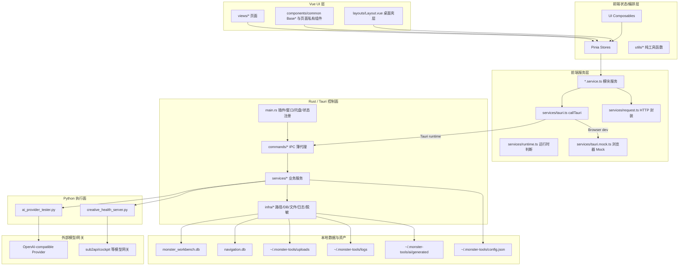

---

## 3. 前端架构分层

### 3.1 应用启动层

主要文件：

- `src/main.ts`
- `src/App.vue`
- `src/router/index.ts`
- `src/layouts/Layout.vue`

启动流程：

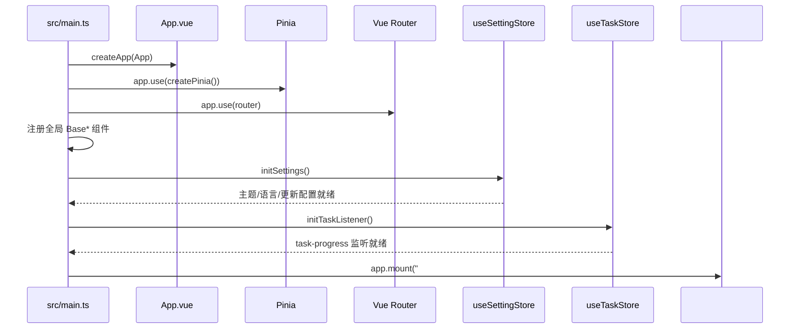

当前事实：

- `main.ts` 承担应用装配、全局基础组件注册、全局异常处理、设置初始化和后台任务监听初始化。
- `App.vue` 只挂载 `Layout`，保持入口壳层轻薄。
- `router/index.ts` 使用 hash history，并且路由页面懒加载。
- `Layout.vue` 是桌面主壳层：Sidebar、AppHeader、AppContent、router-view、UpdateModal、Toast、Message、ConfirmDialog、GlobalLoading 都在这里统一装配。

### 3.2 页面层 `src/views`

当前路由模块：

| 路由 | 页面 | 业务角色 |
|---|---|---|
| `/workspace` | `views/workspace/WorkspacePage.vue` | 工作台入口，当前提供创作系统入口卡片 |
| `/system` | `views/system/SystemPage.vue` | 系统状态、日志终端、错误监控 |
| `/tools` | `views/tools/ToolsPage.vue` | 工具箱：目录、端口、JSON、Base64、时间戳等 |
| `/navigation` | `views/navigation/NavigationPage.vue` | 导航收藏、分类、排序、导入导出 |
| `/ai` | `views/ai/AiPage.vue` | AI Provider 配置、对话、生图、提示词库、功能面板 |
| `/creative` | `views/creative/CreativePage.vue` | 持续型 AI 创作系统工作台/演示台 |
| `/settings` | `views/settings/SettingsPage.vue` | 外观、数据、诊断设置 |
| `/file-manager` | `views/file-manager/FileManagerPage.vue` | 上传文件管理、预览、批量删除、拖拽上传 |
| `/playground` | `views/playground/PlaygroundPage.vue` | 基础组件与工作流调试入口 |
| `/utils-docs` | `views/utils-docs/UtilsDocsPage.vue` | 工具函数文档展示 |
| `/403` `/500` `*` | error pages | 错误页 |

页面层的职责：

- 装配 store 状态和页面私有组件。
- 处理页面级交互，例如弹窗、确认、toast、查询参数。
- 不直接访问 Tauri、SQLite、Python、原始 HTTP。

当前值得注意的页面：

- `views/creative/CreativePage.vue` 只是轻壳，主要逻辑集中在 `views/creative/components/CreativeWorkflowDemo.vue`。
- `CreativeWorkflowDemo.vue` 当前是一个“创作系统综合调试台”，承载 prompt workflow、review stub、domain assets、Goal fan-out、batch mock/prompt/real-image、项目历史等多个业务域。
- `views/ai/AiPage.vue` 是 AI 工作台壳层，按 tab 组合 `AiProviderPanel`、`AiChatPanel`、`AiImagePanel`、`AiPromptPanel`、`AiFeaturePanel`。

### 3.3 组件层

组件分两类：

1. 全局基础组件：`src/components/common/Base*.vue`
   - 负责一致的桌面 UI 原子能力：按钮、输入、表格、面板、时间线、分页、弹窗、状态、上传、布局等。
   - 在 `main.ts` 中集中注册高频基础组件。
2. 页面私有组件：`src/views/<module>/components/*`
   - 例如 `views/navigation/components/*`、`views/file-manager/components/*`、`views/system/components/*`。
   - 只服务单个页面，不跨模块扩散。

### 3.4 Store 层

Store 是当前前端业务编排层。核心 store 如下：

| Store | 主要职责 | 典型下游服务 |
|---|---|---|
| `app` | 应用版本、本地数据目录、布局偏好 | `app.service` |
| `settings` | 主题、语言、自动更新、数据备份恢复 | `config.service`、`system.service` |
| `update` | 更新检查、更新弹窗、更新包下载进度 | `app-updater`、`updater.service`、`task` |
| `system` | DB 状态、日志、诊断导出、错误监控联动 | `system.service`、`logger` |
| `navigation` | 导航分页、分类、增删改、排序、导入导出 | `navigation.service` |
| `file-manager` | 上传文件列表、预览、批量删除、拖拽上传 | `file-manager.service` |
| `tools` | 工具箱各工具状态与系统工具调用 | `tools.service` |
| `ai` | AI provider 配置、会话、提示词库、测试队列、聊天/生图消息 | `ai.service`、`config.service`、`system.service` |
| `task` | 后台任务、创作 workflow、资产、Goal、Batch、事件监听 | `task.service` |
| `window` | 桌面窗口控制状态 | `window-control` |
| `error-monitor` | 从日志中解析错误，记录处理状态 | `error-monitor.service` |
| `native-event` | Tauri 事件监听轻包装 | `native-event.service` |

当前最大 Store：

- `src/stores/ai.ts`：同时承载 provider 配置、多模型配置、chat/image sessions、prompt library、后端队列状态、聊天发送、生图发送、导出等。
- `src/stores/task.ts`：同时承载普通后台任务、创作任务事件、prompt workflow、review workflow、domain assets、Goal、多 Agent stub、Batch job、项目索引和项目历史。

这两个 store 已经能支撑演示和验证，但后续业务正式化时建议拆为更小的领域 store。

### 3.5 Frontend Service 层

Service 是前端唯一允许接触底座、Tauri、HTTP 和浏览器/桌面差异的层。

关键服务：

| 文件 | 职责 |
|---|---|
| `services/tauri.ts` | `callTauri()` 唯一 IPC 网关；Tauri runtime 调 `invoke`，浏览器 dev 调 `tauri.mock.ts` |
| `services/tauri.mock.ts` | 浏览器离线 mock；模拟导航、设置、AI 队列、creative tasks、batch jobs、events |
| `services/runtime.ts` | 判断是否在 Tauri runtime |
| `services/request.ts` | 唯一裸 `fetch` 包装；支持 timeout、params、JSON/text 解析 |
| `services/app-updater.ts` | Tauri updater 插件封装 |
| `services/system.service.ts` | 系统能力聚合：路径、DB、文件、进程、日志、诊断、文件对话框、浏览器降级 |
| `services/task.service.ts` | 创作任务、资产、Goal、Batch、事件监听的前端服务外观 |
| `services/ai.service.ts` | AI Provider 测试/队列/取消的前端服务外观 |
| `services/navigation.service.ts` | 导航数据库 CRUD、备份、图片 URL、打开链接 |
| `services/file-manager.service.ts` | 上传文件列表、删除、引用检查、拖拽上传 |
| `services/config.service.ts` | 偏好配置读写 |
| `services/database.service.ts` | DB 备份导入导出重置 |

Service 层的关键模式：

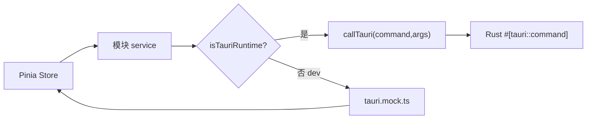

---

## 4. Rust / Tauri 后端分层

### 4.1 后端目录职责

```text
src-tauri/src/
├─ main.rs       # Tauri 入口，插件/窗口/托盘/状态/command 注册
├─ commands/    # IPC 命令薄代理
├─ services/    # Rust 业务服务
└─ infra/       # 路径、DB、文件、日志、脱敏、错误模型等基础设施
```

### 4.2 `main.rs` 控制面

`main.rs` 当前承担：

- 注册 Tauri 插件：dialog、opener、process、updater。
- 创建主窗口，必须通过 `WebviewUrl::App("index.html".into())` 加载前端入口。
- 初始化 `PathProvider`。
- 创建各 Rust service，并通过 `app.manage(Mutex<Service>)` 注入全局状态。
- 初始化 runtime schema。
- 创建托盘与窗口关闭转隐藏行为。
- 集中注册所有 `invoke_handler` commands。

当前被注入的服务包括：

```text
AppService
ConfigService
FileService
TaskService
AuthService
BatchJobService
DatabaseService
GoalService
LogService
SystemService
NavigationService
AiProviderService
SidecarLifecycleService
WorkerQueueService
```

### 4.3 Command 层

Command 层目录：

```text
commands/
├─ app.rs
├─ auth.rs
├─ config.rs
├─ database.rs
├─ file.rs
├─ navigation.rs
├─ system.rs
├─ ai.rs
└─ updater.rs
```

设计原则：

- Command 是 IPC 薄代理。
- 从 `State<Mutex<Service>>` 中取出 service。
- 调用 service 方法。
- 将 `AppError` 转成 JSON 字符串或返回序列化结构。

当前命名边界的一个重要现状：

- `commands/database.rs` 已经不仅是 DB 导入导出；它同时聚合了 creative task、batch job、goal、sidecar、worker queue 的 commands。
- 这在早期推进 Goal 链条时可接受，但后续正式化建议拆分 command namespace，避免“database”成为创作运行时的万能入口。

### 4.4 Service 层

主要 Rust service：

| Service | 当前职责 |
|---|---|
| `AppService` | 版本号、本地数据目录 |
| `ConfigService` | `config.json` 偏好配置读写与校验 |
| `FileService` | 文件选择、上传、列出、删除、目录生成/读取，上传路径沙箱校验 |
| `DatabaseService` | DB 导出、导入、重置、runtime schema 初始化 |
| `NavigationService` | 导航数据 CRUD，忽略前端传入 db path，统一落到应用数据目录 |
| `SystemService` | 打开路径、窗口控制、进程查询/杀进程、文本文件、诊断报告 |
| `LogService` | 日志读写、清空、导出 |
| `AuthService` | 管理密码校验 |
| `AiProviderService` | AI Provider 测试队列、Python 测试脚本、取消、并发控制、生图输出目录 |
| `TaskService` | creative tasks/assets/task_events，prompt workflow，review stub，事件 emit |
| `GoalService` | creative goal、role、fan-out task、stop goal |
| `BatchJobService` | batch job 创建、启动、暂停、恢复、取消、supervisor、mock/prompt/generate worker |
| `SidecarLifecycleService` | Python 常驻 sidecar stub 生命周期、health、token、任务提交 |
| `WorkerQueueService` | claim/cancel/checkpoint/recovery 骨架 |

### 4.5 Infra 层

主要 infra：

| Infra | 当前职责 |
|---|---|
| `path.rs` | 统一定位 `~/.monster-tools` 与 `monster_workbench.db` |
| `db.rs` | 主 DB 导入/导出/重置，SQLite 文件校验 |
| `db_nav.rs` | `navigation.db` 建表、CRUD、自愈列补充 |
| `creative_db.rs` | creative_* schema、CRUD、查询、兼容迁移 |
| `fs.rs` | 测试文件、目录结构生成、目录树读取 |
| `logger.rs` | 日志目录读写、脱敏、路径穿透防护 |
| `sensitive.rs` | 密钥、token、authorization、password 等脱敏 |
| `http.rs` | 基础连接检查 |
| `crypto.rs` | 加密/哈希相关基础能力，当前标记 dead_code |
| `mod.rs` | `AppError` / `AppResult` 统一错误模型 |

---

## 5. 数据与资产架构

### 5.1 存储位置

| 数据/资产 | 存储位置 | 管理方 | 说明 |
|---|---|---|---|
| 应用本地数据根目录 | `~/.monster-tools` | `PathProvider` | 上传、日志、配置、AI 生成文件的主要根 |
| 偏好配置 | `~/.monster-tools/config.json` | `ConfigService` | 主题、语言、自动更新、AI 配置等前端状态的后端持久化容器 |
| 上传文件 | `~/.monster-tools/uploads/images` / `uploads/files` | `FileService` | 文件类型、扩展名、大小、相对路径都有校验 |
| 日志 | `~/.monster-tools/logs` | `LogService` / `LoggerInfra` | 写入前脱敏，拒绝路径穿透文件名 |
| AI 生成缓存 | `~/.monster-tools/ai/generated` | `AiProviderService` | 生图测试输出；有最大文件数与过期清理 |
| 主 SQLite | `monster_workbench.db` | `DatabaseService` / `CreativeDbInfra` | 创作系统、model_runs、test_logs |
| 导航 SQLite | `navigation.db` | `NavigationService` / `DbNavInfra` | 导航收藏独立库 |

### 5.2 Creative 主库核心表

当前 `CreativeDbInfra::init_schema()` 维护：

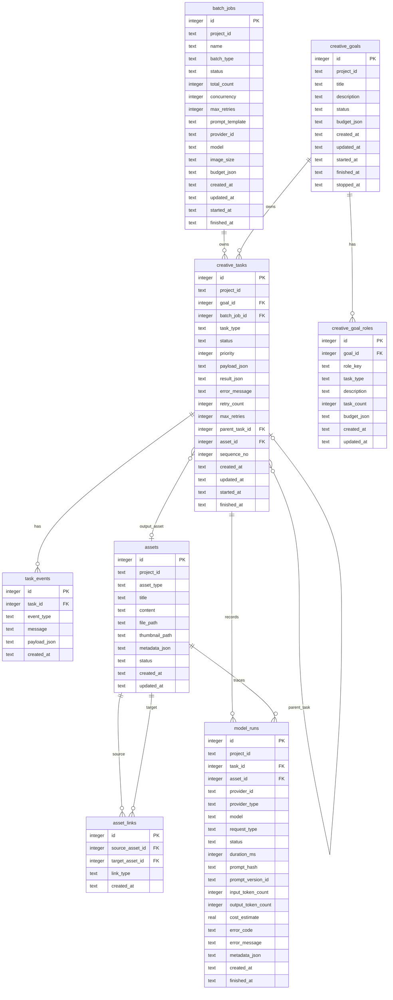

### 5.3 当前数据模型特点

优点：

- `task_events` 与 `creative_tasks` 分离，适合进度和审计。
- `model_runs` 已经预留 provider、model、token、cost、错误分类等观测字段。
- 大图不进 DB，`assets.file_path` / `thumbnail_path` 只存路径。
- `asset_links` 支持 `derived_from`、`uses_character`、`uses_scene`、`part_of` 等资产关系。
- `batch_jobs` 与 `creative_tasks.batch_job_id/sequence_no` 支持批量任务分页与状态统计。

当前不足：

- 没有独立 `projects` 表，`project_id` 仍是字符串维度，适合 demo，不适合正式多项目治理。
- 迁移机制仍以 Rust `init_schema()` / `ensure_column()` 为主，不是独立版本化 migration。
- `asset_version`、`parent_asset_id`、`source_task_id` 等 provenance 字段主要依赖 `metadata_json` 与 `asset_links` 表达，正式化后建议结构化。
- `task_status` 没有 DB-level enum 约束，状态合法性主要靠 service 层约束。

---

## 6. 核心业务域

### 6.1 基础桌面壳层

范围：

- 应用启动。
- 全局布局。
- 侧边栏路由。
- 主题、语言、布局偏好。
- 更新弹窗。
- 全局 Toast / Message / Confirm / Loading。
- 窗口最小化、最大化、关闭隐藏、托盘。

关键路径：

```text
main.ts -> App.vue -> Layout.vue -> Sidebar/AppHeader/AppContent/router-view
```

后端支持：

```text
main.rs -> app/window/updater commands -> AppService/SystemService/Updater
```

### 6.2 系统诊断与日志

范围：

- DB 状态检查。
- 本地数据目录展示。
- 日志读取、过滤、清空、导出。
- 错误监控，从日志行解析错误并维护 review 状态。
- 系统诊断导出。

关键路径：

```text
SystemPage
  -> useSystemStore
  -> system.service / logger
  -> commands::system
  -> SystemService / LogService
  -> LoggerInfra / DbInfra / PathProvider
```

### 6.3 文件上传与文件管理

范围：

- 选择文件、上传文件。
- 图片预览。
- 列出上传文件。
- 删除文件前检查导航引用。
- 强制删除时清理导航引用。
- 桌面拖拽上传。

关键路径：

```text
FileManagerPage
  -> useFileManagerStore
  -> file-manager.service
  -> file/upload/list/delete/check references commands
  -> FileService + NavigationService
  -> ~/.monster-tools/uploads
```

安全边界：

- 上传路径只允许落到 `uploads/images` 或 `uploads/files`。
- 图片有扩展名白名单和 20MB 大小限制。
- 普通文件拒绝脚本/可执行扩展名。
- 删除时拒绝绝对路径、`..` 和非 uploads 根路径。

### 6.4 导航收藏

范围：

- 导航条目 CRUD。
- 分类、精选、热门、点击量。
- 排序。
- 备份导入导出。
- logo/background 图片引用。

关键路径：

```text
NavigationPage
  -> useNavigationStore
  -> navigation.service
  -> commands::navigation
  -> NavigationService
  -> DbNavInfra
  -> ~/.monster-tools/navigation.db
```

注意：

- 前端仍传 `appStore.localPath` 给 navigation service，但 Rust `NavigationService` 当前忽略不可信参数，统一使用 `PathProvider` 定位 app dir。

### 6.5 工具箱

范围：

- 目录生成。
- 目录树读取。
- 端口进程查询和杀进程。
- 进程名查询和杀进程。
- JSON、Base64、时间戳等前端工具。

关键路径：

```text
ToolsPage
  -> useToolsStore
  -> tools.service / system.service
  -> commands::file / commands::system
  -> FileService / SystemService
```

### 6.6 AI Provider 工作台

范围：

- Provider 配置。
- 多模型配置。
- 模型列表查询。
- 聊天测试。
- 图片生成测试。
- 后端队列状态。
- 会话与提示词库。
- 生成结果文件打开、导出等。

核心链路：

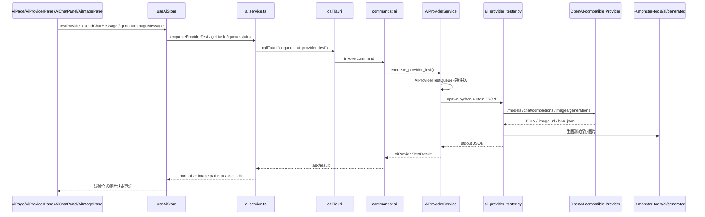

特点：

- AI Provider 测试是一次性 Python 脚本，不是常驻 workflow engine。
- Rust 侧有全局队列、运行槽、配置级串行/并发、取消 token。
- 生图测试输出文件落到 `~/.monster-tools/ai/generated`，前端通过 `convertFileSrc()` 展示。
- Python sidecar 对响应体大小、图片 base64、图片 URL 安全、敏感信息脱敏有防护。

### 6.7 持续型 AI 创作系统

当前创作系统已经具备以下骨架：

| 能力 | 当前入口 | 后端能力 | 状态 |
|---|---|---|---|
| `generate_image_prompt` workflow | `/creative` prompt tab | `TaskService` + `SidecarLifecycleService` + `creative_health_server.py` | 已有最小闭环 |
| review / revision stub | `/creative` prompt/review 区域 | `TaskService::run_review_asset_quality_stub` | stub |
| 领域资产 | `/creative` assets tab | `TaskService::create_creative_asset/link` | demo/stub |
| Goal + 多 Agent stub | `/creative` goal tab | `GoalService::create_goal_multi_agent_stub` | fan-out stub |
| Batch mock | `/creative` batch tab | `BatchJobService` mock worker | demo |
| Batch prompt | `/creative` batch tab | `BatchJobService` prompt worker + model_runs | demo |
| Batch real image | `/creative` batch tab | `BatchJobService` image worker + file path/thumbnail/model_runs | demo |
| Worker queue skeleton | command/service | `WorkerQueueService` | 骨架 |

---

## 7. 关键流程图

### 7.1 标准 Tauri IPC 调用

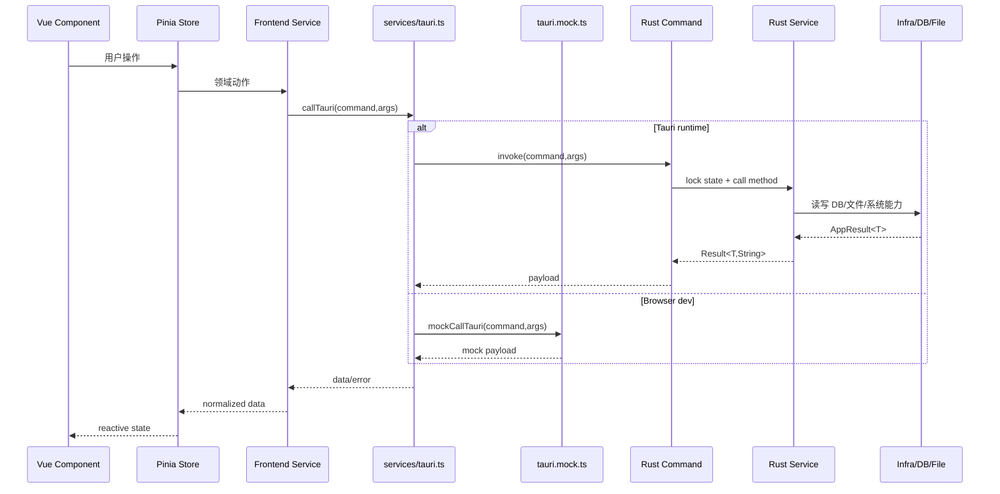

### 7.2 `generate_image_prompt` 最小创作 workflow

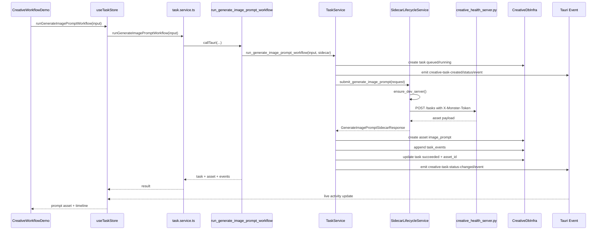

### 7.3 Review / Revision Stub

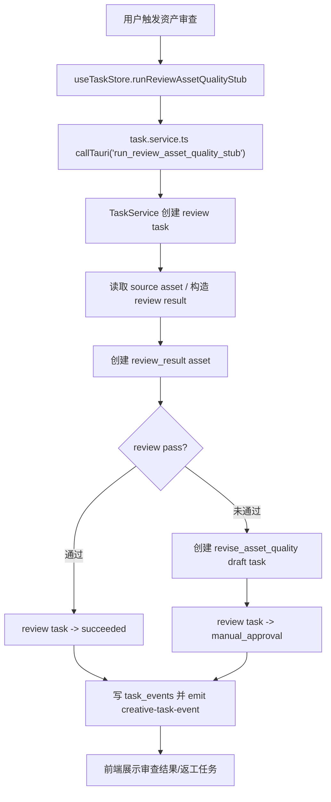

### 7.4 Goal + Multi-Agent Stub

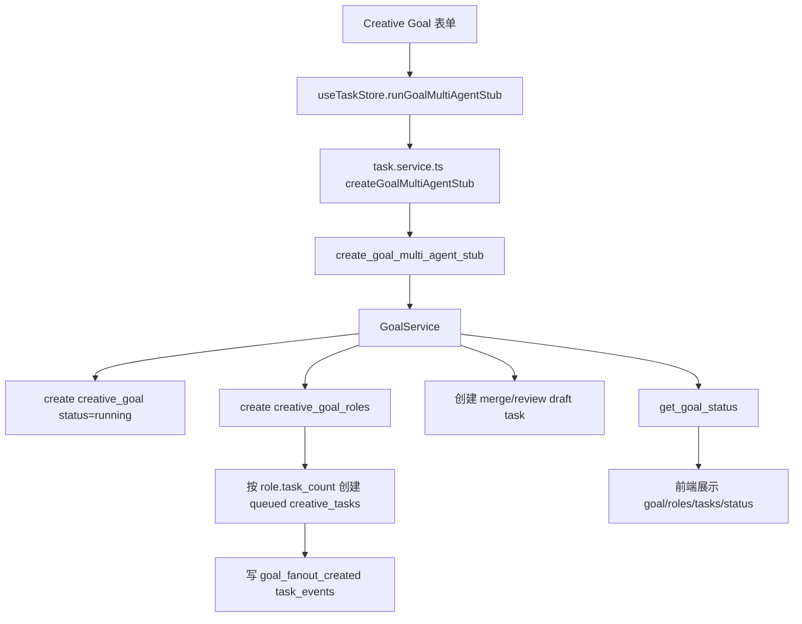

当前限制：

- `GoalService` 对 fan-out 总任务数有 stub 上限。
- 合并任务仍是 draft/stub，不是正式多 Agent 合并审查。
- 没有真正的并行 Agent runtime；当前是数据结构和 UI/任务模型预演。

### 7.5 Batch Image Demo

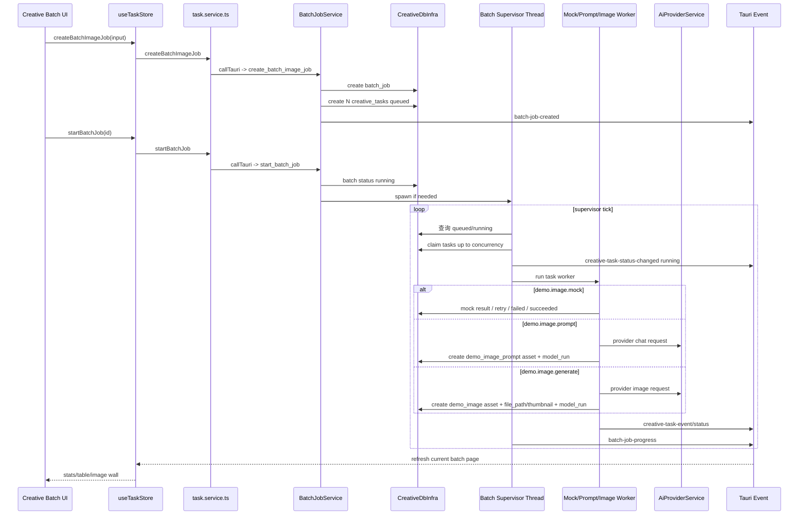

Batch 当前核心语义：

- `batch_jobs.status` 表示批次状态。
- 每个子任务是 `creative_tasks`，通过 `batch_job_id` 和 `sequence_no` 归属。
- 并发由 Rust supervisor 控制，不由 Vue 控制。
- prompt 和 image 任务都会记录 `model_runs`。
- real image 任务通过文件路径和缩略图路径回填结果，不向前端传大 base64。
- 连续失败预算可以触发自动暂停。

### 7.6 Worker Queue Skeleton

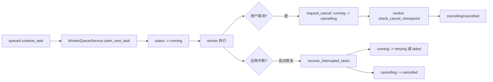

当前定位：

- 这是未来 Python worker pool 的队列语义骨架。
- 还不是完整远程 worker / Redis / 分布式队列。
- 与项目规则一致：优先 SQLite-backed local queue。

---

## 8. 安全与权限边界

当前明确红线：

- Vue 不直连 Python。
- Vue 不直接 `invoke()`。
- 非 `src/services/` 不导入 `@tauri-apps/*`。
- 非 `src/services/request.ts` 不裸 `fetch()`。
- 非 `src/services/tauri.ts` 不裸 `invoke()`。
- Store 不直接导入 `services/tauri`。
- 禁止前端 SQL / FS 插件。
- 禁止放宽 `assetProtocol.scope` 到 `$HOME/**/*`。
- 更新只走 Tauri updater。
- `main.rs` 必须用 `WebviewUrl::App("index.html".into())`。

当前已有防护：

| 风险 | 当前防护 |
|---|---|
| 前端越层调用 | `scripts/check-architecture.js` |
| 浏览器预览崩溃 | `isTauriRuntime()` + `tauri.mock.ts` |
| 文件路径穿透 | Rust `FileService` / `LoggerInfra` / `DbInfra` 校验 |
| 上传恶意文件 | 扩展名黑名单/白名单 + 大小限制 |
| 日志泄密 | `sensitive.rs` 和 Python/Rust 双侧脱敏 |
| Python 端口暴露 | sidecar 仅监听 `127.0.0.1` 且要求 runtime token |
| 大图污染前端状态 | 文件落盘，前端拿 file path / thumbnail |
| Provider SSRF/内网图 URL | `ai_provider_tester.py` 对非本地 provider 的图片 URL host 做限制 |
| DB 备份误导入 | `.db` 后缀、SQLite header、大小限制 |

---

## 9. 当前架构强项

1. 分层边界清楚，并且有自动检查。
2. Tauri 原生能力已经收敛到前端 service 层。
3. Rust service/infra 基本分层清楚，command 大多是薄代理。
4. 浏览器 Mock 能支撑前端快速调试，避免 Tauri runtime 缺失导致页面崩溃。
5. AI Provider 测试链路有队列、取消、并发、超时、输出限制和脱敏。
6. 创作系统数据模型已经有任务、事件、资产、资产关系、model_runs、batch、goal 的核心骨架。
7. 大对象策略基本正确：图片落盘，DB 存 metadata/path，事件 payload 不传大图。
8. Rust 对路径、日志、备份、上传、sidecar 启动环境都有较多安全考虑。
9. `check:architecture` 当前通过，说明至少静态红线未被破坏。

---

## 10. 当前架构压力点

### 10.1 `task` store 过宽

`useTaskStore` 当前同时管理：

- 普通后台任务进度。
- creative task event listener。
- prompt workflow。
- review workflow。
- domain assets。
- goal/multi-agent。
- batch job。
- 项目索引与历史。

这适合快速推进 Goal 链条，但后续业务复杂后会导致：

- 状态耦合。
- 组件难以局部复用。
- 批处理刷新与单任务 workflow 互相影响。
- 测试和回归难以精准定位。

建议未来拆分为：

```text
creative-task.store.ts
creative-asset.store.ts
creative-goal.store.ts
creative-batch.store.ts
creative-project.store.ts
background-task.store.ts
```

### 10.2 `ai` store 过宽

`useAiStore` 同时管理：

- provider config。
- model configs。
- active chat/image config。
- chat/image sessions。
- prompt library。
- backend queue。
- chat send。
- image generate。
- export/copy/open file。

建议未来拆分为：

```text
ai-provider.store.ts
ai-session.store.ts
ai-image.store.ts
ai-prompt-library.store.ts
ai-queue.store.ts
```

### 10.3 `commands/database.rs` 命名边界过宽

当前 `database.rs` 聚合：

- DB 备份/重置。
- creative task。
- batch job。
- goal。
- sidecar。
- worker queue。

建议正式化拆分：

```text
commands/database.rs          # 只保留 export/import/reset/status
commands/creative_task.rs
commands/creative_asset.rs
commands/creative_goal.rs
commands/creative_batch.rs
commands/creative_sidecar.rs
commands/worker_queue.rs
```

### 10.4 `creative_db.rs` 变成巨型 Repo

当前 `CreativeDbInfra` 同时承载：

- schema 初始化。
- migration-style ensure column。
- task CRUD。
- event CRUD。
- asset CRUD。
- model_run CRUD。
- batch job CRUD。
- goal CRUD。
- asset link CRUD。

建议未来按领域拆 repo：

```text
infra/creative/schema.rs
infra/creative/task_repo.rs
infra/creative/event_repo.rs
infra/creative/asset_repo.rs
infra/creative/model_run_repo.rs
infra/creative/batch_repo.rs
infra/creative/goal_repo.rs
```

### 10.5 正式 migration 体系不足

目前 schema 管理偏“启动时自愈”，适合早期，但正式业务升级需要：

- `schema_migrations` 表。
- 版本号。
- 幂等 migration。
- 破坏性迁移审批。
- migration dry-run / backup。
- 旧库兼容测试。

### 10.6 Python execution plane 仍是 stub

当前 `creative_health_server.py` 是健康和最小任务 stub，不是正式 workflow engine。未来正式系统需要：

- workflow runtime。
- worker loop。
- provider clients。
- prompt builder。
- review/revision agent。
- context builder。
- consistency analysis。
- asset ingestion。
- structured error model。
- budget / cancel / retry / checkpoint。

但仍应保持：Vue 不知道 Python 端口和 token，Rust 继续作为唯一入口。

### 10.7 项目域模型不足

当前 `projectId` 是字符串，没有 `projects` 表。面向业务调整时，这会限制：

- 项目重命名。
- 项目归档。
- 项目成员/权限。
- 项目级预算。
- 项目级资产索引。
- 项目级 settings。
- 项目导入导出。

建议新增正式 `creative_projects`，再把现有 `project_id` 逐步迁移到 FK 或稳定 ID 策略。

### 10.8 文档状态需要收敛

`docs/ai/creative-master-plan.md` 已记录 Goal 00-13 真实 Tauri 验证闭环；`agent/open-loops.md` 现已同步清理，后续待办统一收敛到 post-goal architecture hardening 与真实回归缺口，不再重新打开已完成 Goal 的收口条目。

---

## 11. 面向业务调整的影响矩阵

| 调整类型 | 应优先触碰的层 | 注意事项 | 必跑检查 |
|---|---|---|---|
| 新增页面 | `views/<module>`、`router`、`locales`、必要 store/service | 页面不直连 service，用户文案进 i18n | `npm run typecheck` |
| 新增 Tauri 能力 | frontend service、Rust command、Rust service、mock | command 必须注册到 `main.rs`，同步 `tauri.mock.ts` | `npm run check:architecture`、`npm run typecheck`、必要时 `tauri:build:no-bundle` |
| 新增 creative workflow | `task.service.ts`、creative store、Rust Task/Workflow service、Python sidecar | Vue 不直连 Python；任务、事件、资产必须落库 | `check:architecture`、`typecheck`、Rust tests |
| 新增 batch 类型 | `BatchJobService`、`task.service.ts`、UI mode、mock | 明确 retry/cancel/concurrency/model_runs/asset 输出 | `check_batch_demo_boundaries`、Rust batch tests |
| 新增资产类型 | `TaskService` 校验、`CreativeDbInfra`、UI 映射、i18n | 不覆盖旧资产；关系进 `asset_links` | `typecheck`、creative_db tests |
| 新增 DB 字段 | `creative_db.rs` 或未来 migration | 优先 nullable/default；旧库兼容测试 | `cargo test creative_db` |
| 新增 Provider 能力 | `ai_provider_tester.py` / Rust AiProviderService / AI store | 不把业务流程写进 provider gateway | AI sidecar tests |
| 新增文件能力 | `FileService`/`SystemService` | 路径白名单、大小、扩展名、asset scope | `check:architecture`、Rust tests |
| 修改更新机制 | updater service / Tauri updater config | 禁止自定义 Vue 热更新 | `tauri:build:no-bundle` |

---

## 12. 建议升级路线

### 阶段 A：架构硬化，不改业务体验

目标：降低后续业务调整成本。

建议：

1. 拆分 `commands/database.rs`。
2. 拆分 `CreativeDbInfra`。
3. 建立 `schema_migrations`。
4. 拆分 `useTaskStore`。
5. 持续同步 `agent/open-loops.md` 和 `creative-master-plan.md` 状态，避免重新混入已完成 Goal 的待办。

### 阶段 B：正式项目与资产域

目标：让创作系统从 demo projectId 进入真实项目管理。

建议：

1. 新增 `creative_projects`。
2. 引入正式 asset version/provenance 字段或配套表。
3. 明确 `asset_type`、`link_type`、`task_type` 的枚举文档。
4. 增加项目级导入导出和备份策略。
5. 将 UI 中的 seed project 过渡为 DB 项目。

### 阶段 C：Python workflow runtime

目标：把当前 sidecar stub 升级为真实执行面。

建议：

1. 保持 Rust 作为唯一入口。
2. Python 只监听 localhost + runtime token。
3. Python worker 通过 Rust/DB 协议消费任务，不让 Vue 直连。
4. 引入标准 task claim / heartbeat / checkpoint / cancel / retry。
5. 输出资产统一经 Rust 授权路径落盘和入库。

### 阶段 D：多 Agent 与审查返工

目标：从 fan-out stub 进入可审计协作。

建议：

1. 明确 Agent role 模型。
2. 引入 goal decomposition。
3. 引入 merge/review task 正式状态。
4. review result 和 revision draft 不覆盖源资产。
5. 所有模型调用写 `model_runs`。

### 阶段 E：生产级批量生成

目标：让 1000 级批量任务可控、可恢复、可暂停、可审计。

建议：

1. supervisor 与 worker loop 解耦。
2. batch stats 增量更新。
3. 大图缩略图懒加载。
4. 预算、熔断、限流、重试策略配置化。
5. 失败分类与 provider 观测仪表化。

---

## 13. 面向架构评审的核心问题

后续做升级评审时，建议按这些问题推进：

1. `project_id` 是否需要升级为正式项目表？
2. `creative_db.rs` 是否先拆 repo，还是先上 migration？
3. `useTaskStore` 是否在正式业务前拆分？
4. Python worker 是由 Rust 主动提交任务，还是 Python 拉取 SQLite-backed queue？
5. model_runs 是否作为所有 AI 调用的强制审计点？
6. asset provenance 是继续放 `metadata_json`，还是结构化成字段/表？
7. Batch supervisor 是否继续留在 Rust，还是逐步移到 Python worker runtime？
8. 真实 provider 网关配置是否完全复用 AI Provider 工作台，还是建立 creative provider profile？
9. review/revision 是否需要人工审批表？
10. 当前 `tauri.mock.ts` 是否继续承担完整浏览器演示，还是收敛为最小 contract mock？

---

## 14. 当前推荐结论

当前架构已经具备较完整的“桌面控制面 + 前端工作台 + 本地 SQLite 状态 + Python AI 执行面”的雏形。它最适合的下一步不是继续堆功能，而是做一次 post-goal architecture hardening：

1. 先拆宽 store 和宽 command。
2. 再固化 migration 与 project/asset 领域模型。
3. 再把 Python sidecar 从 health stub 升级为正式 workflow runtime。
4. 最后引入真正的多 Agent 协作、审查返工和生产级批量生成。

如果直接在现有 `CreativeWorkflowDemo.vue`、`useTaskStore`、`commands/database.rs` 和 `CreativeDbInfra` 上继续叠业务，短期会很快，长期会让任务状态、资产版本、批量恢复和多 Agent 合并越来越难验证。
