# Monster Workbench 当前架构说明

> 生成日期：2026-06-11
> 分析范围：基于当前工作区代码与文档，不等同于干净 `main` 分支快照。
> 验证佐证：本次分析期间执行 `npm run check:architecture`，结果通过。

本文面向后续架构升级与业务调整，重点说明当前项目的分层方式、核心架构、关键业务流、数据边界、风险点和升级建议。本文不包含代码实现方案。

---

## 1. 一页摘要

`monster-workbench` 是一个 Tauri v2 桌面客户端，前端是 `Vue 3 + Pinia + Vue Router + Vite + TailwindCSS + Element Plus/Base*`，后端是 Rust/Tauri 控制面，当前已经引入 Python sidecar 作为 AI Provider 测试脚本和创作 workflow 常驻 stub。

当前最重要的架构结论：

1. 标准调用链已经明确，并且通过脚本检查：

   ```text
   Vue Page/Component
     -> Pinia Store
     -> Frontend Service
     -> callTauri / Native Gateway
     -> Rust Command
     -> Rust Service
     -> Infra / SQLite / File / Python Sidecar
   ```

2. Rust 是桌面控制面，负责 Tauri IPC、权限边界、路径校验、SQLite 可信状态、事件桥接、sidecar 生命周期、更新和系统能力。
3. Vue 是展示与交互面，负责页面、表单、任务看板、资产展示、人工确认和实时状态呈现。
4. Python 当前有两条链路：
   - `ai_provider_tester.py`：一次性脚本，服务现有 AI Provider 连接测试、对话测试、生图测试。
   - `creative_health_server.py`：常驻 sidecar stub，服务持续型 AI 创作系统的 workflow 过渡验证。
5. 数据层有两个 SQLite 分支：
   - `monster_workbench.db`：创作任务、资产、批处理、Goal、model_runs、test_logs 等。
   - `navigation.db`：导航收藏。
6. 创作系统当前处于 Goal 00-13 后的硬化阶段：任务、资产、Goal、多 Agent stub、批量 mock/prompt/real-image demo 链路已经有代码痕迹和验证记录；下一阶段应该从“功能闭环验证”转向“领域拆分、迁移体系、正式 Python workflow runtime、资产版本治理”。

---

## 2. 总体架构图

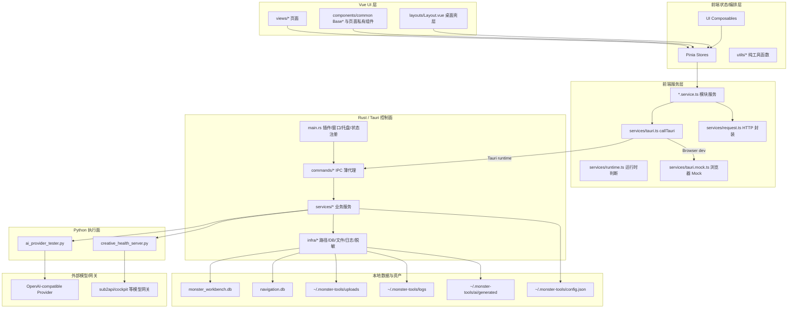

---

## 3. 前端架构分层

### 3.1 应用启动层

主要文件：

- `src/main.ts`
- `src/App.vue`
- `src/router/index.ts`
- `src/layouts/Layout.vue`

启动流程：

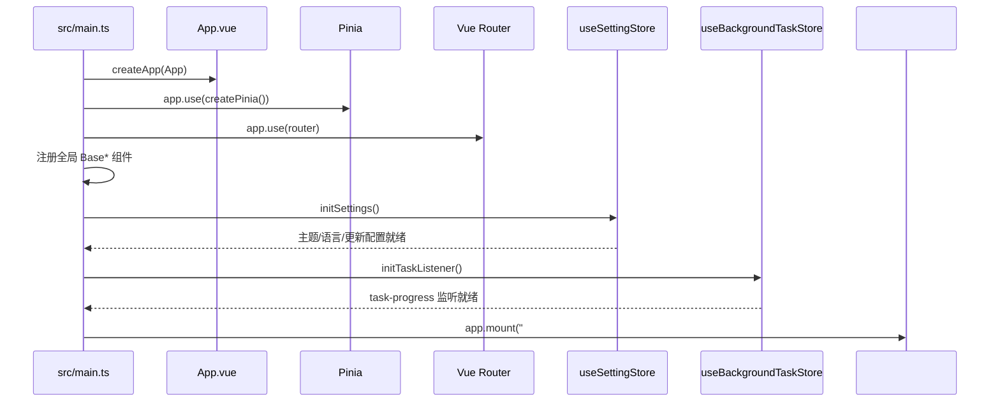

当前事实：

- `main.ts` 承担应用装配、全局基础组件注册、全局异常处理、设置初始化和后台任务监听初始化。
- `App.vue` 只挂载 `Layout`，保持入口壳层轻薄。
- `router/index.ts` 使用 hash history，并且路由页面懒加载。
- `Layout.vue` 是桌面主壳层：Sidebar、AppHeader、AppContent、router-view、UpdateModal、Toast、Message、ConfirmDialog、GlobalLoading 都在这里统一装配。

### 3.2 页面层 `src/views`

当前路由模块：

| 路由 | 页面 | 业务角色 |
|---|---|---|
| `/workspace` | `views/workspace/WorkspacePage.vue` | 工作台入口，当前提供创作系统入口卡片 |
| `/system` | `views/system/SystemPage.vue` | 系统状态、日志终端、错误监控 |
| `/tools` | `views/tools/ToolsPage.vue` | 工具箱：目录、端口、JSON、Base64、时间戳等 |
| `/navigation` | `views/navigation/NavigationPage.vue` | 导航收藏、分类、排序、导入导出 |
| `/ai` | `views/ai/AiPage.vue` | AI Provider 配置、对话、生图、提示词库、功能面板 |
| `/creative` | `views/creative/CreativePage.vue` | 持续型 AI 创作系统工作台/演示台 |
| `/settings` | `views/settings/SettingsPage.vue` | 外观、数据、诊断设置 |
| `/file-manager` | `views/file-manager/FileManagerPage.vue` | 上传文件管理、预览、批量删除、拖拽上传 |
| `/playground` | `views/playground/PlaygroundPage.vue` | 基础组件与工作流调试入口 |
| `/utils-docs` | `views/utils-docs/UtilsDocsPage.vue` | 工具函数文档展示 |
| `/403` `/500` `*` | error pages | 错误页 |

页面层的职责：

- 装配 store 状态和页面私有组件。
- 处理页面级交互，例如弹窗、确认、toast、查询参数。
- 不直接访问 Tauri、SQLite、Python、原始 HTTP。

当前值得注意的页面：

- `views/creative/CreativePage.vue` 当前已经是三栏工作台壳层，装配 `CreativeAssetSidebar`、`CreativeWorkspace`、`CreativeAgentMonitor`。
- `CreativeWorkflowDemo.vue` 当前主要位于中间工作区内部，更准确的定位是“项目中心 orchestration shell”：承载 prompt workflow、review stub、domain assets、Goal fan-out、batch mock/prompt/real-image、项目历史等多个业务域；左右栏已首轮接入当前项目、资产分类计数、任务队列和执行活动，但仍属于轻量项目/监控壳层，不是完整资产库或正式 Agent 控制台。
- `views/ai/AiPage.vue` 是 AI 工作台壳层，按 tab 组合 `AiProviderPanel`、`AiChatPanel`、`AiImagePanel`、`AiPromptPanel`、`AiFeaturePanel`。

### 3.3 组件层

组件分两类：

1. 全局基础组件：`src/components/common/Base*.vue`
   - 负责一致的桌面 UI 原子能力：按钮、输入、表格、面板、时间线、分页、弹窗、状态、上传、布局等。
   - 在 `main.ts` 中集中注册高频基础组件。
2. 页面私有组件：`src/views/<module>/components/*`
   - 例如 `views/navigation/components/*`、`views/file-manager/components/*`、`views/system/components/*`。
   - 只服务单个页面，不跨模块扩散。

### 3.4 Store 层

Store 是当前前端业务编排层。核心 store 如下：

| Store | 主要职责 | 典型下游服务 |
|---|---|---|
| `app` | 应用版本、本地数据目录、布局偏好 | `app.service` |
| `settings` | 主题、语言、自动更新、数据备份恢复 | `config.service`、`system.service` |
| `update` | 更新检查、更新弹窗、更新包下载进度 | `app-updater`、`updater.service`、`task` |
| `system` | DB 状态、日志、诊断导出、错误监控联动 | `system.service`、`logger` |
| `navigation` | 导航分页、分类、增删改、排序、导入导出 | `navigation.service` |
| `file-manager` | 上传文件列表、预览、批量删除、拖拽上传 | `file-manager.service` |
| `tools` | 工具箱各工具状态与系统工具调用 | `tools.service` |
| `ai` | AI façade，协调 provider/session/queue/image/prompt | `ai.service`、`config.service`、`system.service` |
| `background-task` | 全局后台任务进度 | `background-task.service` |
| `creative-project` | 当前项目、项目索引、种子、历史聚合 | `creative-project.service` |
| `creative-task` | prompt/review workflow 与任务事件 | `creative-task.service` |
| `creative-asset` | domain asset 草稿、关系与运行态 | `creative-asset.service` |
| `creative-goal` | goal 状态、fan-out、停止 | `creative-goal.service` |
| `creative-batch` | batch snapshot、分页任务、暂停/恢复/取消 | `creative-batch.service` |
| `window` | 桌面窗口控制状态 | `window-control` |
| `error-monitor` | 从日志中解析错误，记录处理状态 | `error-monitor.service` |
| `native-event` | Tauri 事件监听轻包装 | `native-event.service` |

当前仍需持续观察的中心点：

- `src/stores/ai.ts`：当前已收缩为 façade，主要负责 provider/session/queue/image/prompt 之间的协调。
- `src/views/creative/components/CreativeWorkflowDemo.vue`：当前已从综合大模板收敛为 orchestrator shell，但仍是 `/creative` 中央工作区的主要跨域编排点。

创作域 store 本身已经基本拆到位；后续更值得关注的是 façade 协调层和页面壳层是否继续膨胀。

### 3.5 Frontend Service 层

Service 是前端唯一允许接触底座、Tauri、HTTP 和浏览器/桌面差异的层。

关键服务：

| 文件 | 职责 |
|---|---|
| `services/tauri.ts` | `callTauri()` 唯一 IPC 网关；Tauri runtime 调 `invoke`，浏览器 dev 调 `tauri.mock.ts` |
| `services/tauri.mock.ts` | 浏览器离线 mock；模拟导航、设置、AI 队列、creative tasks、batch jobs、events |
| `services/runtime.ts` | 判断是否在 Tauri runtime |
| `services/request.ts` | 唯一裸 `fetch` 包装；支持 timeout、params、JSON/text 解析 |
| `services/app-updater.ts` | Tauri updater 插件封装 |
| `services/system.service.ts` | 系统能力聚合：路径、DB、文件、进程、日志、诊断、文件对话框、浏览器降级 |
| `services/background-task.service.ts` | `task-progress` 事件监听 |
| `services/creative-task.service.ts` | 创作任务、任务事件、prompt/review workflow 的前端服务外观 |
| `services/creative-project.service.ts` | 创作项目实体的前端服务外观 |
| `services/creative-asset.service.ts` | 创作资产与资产关系的前端服务外观 |
| `services/creative-goal.service.ts` | 创作目标与 multi-agent stub 的前端服务外观 |
| `services/creative-batch.service.ts` | batch job 创建、控制、分页与快照 |
| `services/creative-types.ts` | Creative 前端服务共享 DTO / 事件 / 快照类型 |
| `services/ai.service.ts` | AI Provider 测试/队列/取消的前端服务外观 |
| `services/navigation.service.ts` | 导航数据库 CRUD、备份、图片 URL、打开链接 |
| `services/file-manager.service.ts` | 上传文件列表、删除、引用检查、拖拽上传 |
| `services/config.service.ts` | 偏好配置读写 |
| `services/database.service.ts` | DB 备份导入导出重置 |

Service 层的关键模式：

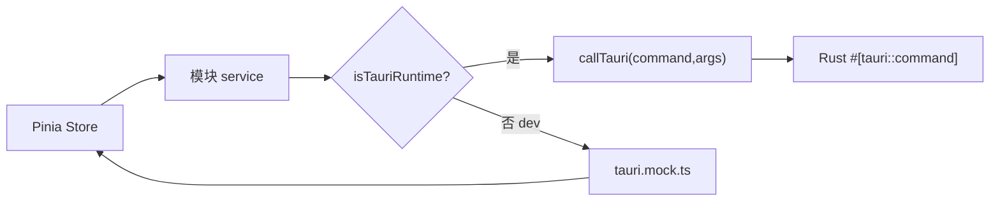

---

## 4. Rust / Tauri 后端分层

### 4.1 后端目录职责

```text
src-tauri/src/
├─ main.rs       # Tauri 入口，插件/窗口/托盘/状态/command 注册
├─ commands/    # IPC 命令薄代理
├─ services/    # Rust 业务服务
└─ infra/       # 路径、DB、文件、日志、脱敏、错误模型等基础设施
```

### 4.2 `main.rs` 控制面

`main.rs` 当前承担：

- 注册 Tauri 插件：dialog、opener、process、updater。
- 创建主窗口，必须通过 `WebviewUrl::App("index.html".into())` 加载前端入口。
- 初始化 `PathProvider`。
- 创建各 Rust service，并通过 `app.manage(Mutex<Service>)` 注入全局状态。
- 初始化 runtime schema。
- 创建托盘与窗口关闭转隐藏行为。
- 集中注册所有 `invoke_handler` commands。

当前被注入的服务包括：

```text
AppService
ConfigService
FileService
TaskService
AuthService
BatchJobService
DatabaseService
GoalService
LogService
SystemService
NavigationService
AiProviderService
SidecarLifecycleService
WorkerQueueService
```

### 4.3 Command 层

Command 层目录：

```text
commands/
├─ app.rs
├─ ai.rs
├─ auth.rs
├─ config.rs
├─ creative_batch.rs
├─ creative_goal.rs
├─ creative_project.rs
├─ creative_sidecar.rs
├─ creative_task.rs
├─ database.rs
├─ file.rs
├─ navigation.rs
├─ system.rs
├─ updater.rs
└─ worker_queue.rs
```

设计原则：

- Command 是 IPC 薄代理。
- 从 `State<Mutex<Service>>` 中取出 service。
- 调用 service 方法。
- 将 `AppError` 转成 JSON 字符串或返回序列化结构。

当前命名边界的一个重要现状：

- `commands/database.rs` 当前已经收回为窄边界，主要处理 DB 导入导出、重置和状态检查。
- Creative 运行时命令已按领域拆到 `creative_task`、`creative_goal`、`creative_batch`、`creative_project`、`creative_sidecar`、`worker_queue` 等命名空间。

### 4.4 Service 层

主要 Rust service：

| Service | 当前职责 |
|---|---|
| `AppService` | 版本号、本地数据目录 |
| `ConfigService` | `config.json` 偏好配置读写与校验 |
| `FileService` | 文件选择、上传、列出、删除、目录生成/读取，上传路径沙箱校验 |
| `DatabaseService` | DB 导出、导入、重置、runtime schema 初始化 |
| `NavigationService` | 导航数据 CRUD，忽略前端传入 db path，统一落到应用数据目录 |
| `SystemService` | 打开路径、窗口控制、进程查询/杀进程、文本文件、诊断报告 |
| `LogService` | 日志读写、清空、导出 |
| `AuthService` | 管理密码校验 |
| `AiProviderService` | AI Provider 测试队列、Python 测试脚本、取消、并发控制、生图输出目录 |
| `TaskService` | creative tasks/assets/task_events，prompt workflow，review stub，事件 emit |
| `GoalService` | creative goal、role、fan-out task、stop goal |
| `BatchJobService` | batch job 创建、启动、暂停、恢复、取消、supervisor、mock/prompt/generate worker |
| `SidecarLifecycleService` | Python 常驻 sidecar stub 生命周期、health、token、任务提交 |
| `WorkerQueueService` | claim/cancel/checkpoint/recovery 骨架 |

### 4.5 Infra 层

主要 infra：

| Infra | 当前职责 |
|---|---|
| `path.rs` | 统一定位 `~/.monster-tools` 与 `monster_workbench.db` |
| `db.rs` | 主 DB 导入/导出/重置，SQLite 文件校验 |
| `db_nav.rs` | `navigation.db` 建表、CRUD、自愈列补充 |
| `creative_db_schema.rs` + `creative_*_repo.rs` + `creative_db_tests.rs` | creative schema、repo 查询写入、旧库兼容回归 |
| `fs.rs` | 测试文件、目录结构生成、目录树读取 |
| `logger.rs` | 日志目录读写、脱敏、路径穿透防护 |
| `sensitive.rs` | 密钥、token、authorization、password 等脱敏 |
| `http.rs` | 基础连接检查 |
| `crypto.rs` | 加密/哈希相关基础能力，当前标记 dead_code |
| `mod.rs` | `AppError` / `AppResult` 统一错误模型 |

---

## 5. 数据与资产架构

### 5.1 存储位置

| 数据/资产 | 存储位置 | 管理方 | 说明 |
|---|---|---|---|
| 应用本地数据根目录 | `~/.monster-tools` | `PathProvider` | 上传、日志、配置、AI 生成文件的主要根 |
| 偏好配置 | `~/.monster-tools/config.json` | `ConfigService` | 主题、语言、自动更新、AI 配置等前端状态的后端持久化容器 |
| 上传文件 | `~/.monster-tools/uploads/images` / `uploads/files` | `FileService` | 文件类型、扩展名、大小、相对路径都有校验 |
| 日志 | `~/.monster-tools/logs` | `LogService` / `LoggerInfra` | 写入前脱敏，拒绝路径穿透文件名 |
| AI 生成缓存 | `~/.monster-tools/ai/generated` | `AiProviderService` | 生图测试输出；有最大文件数与过期清理 |
| 主 SQLite | `monster_workbench.db` | `DatabaseService` / `creative_db_schema` / `creative_*_repo` | 创作系统、model_runs、test_logs |
| 导航 SQLite | `navigation.db` | `NavigationService` / `DbNavInfra` | 导航收藏独立库 |

### 5.2 Creative 主库核心表

当前 `creative_db_schema::init_schema()` 维护：

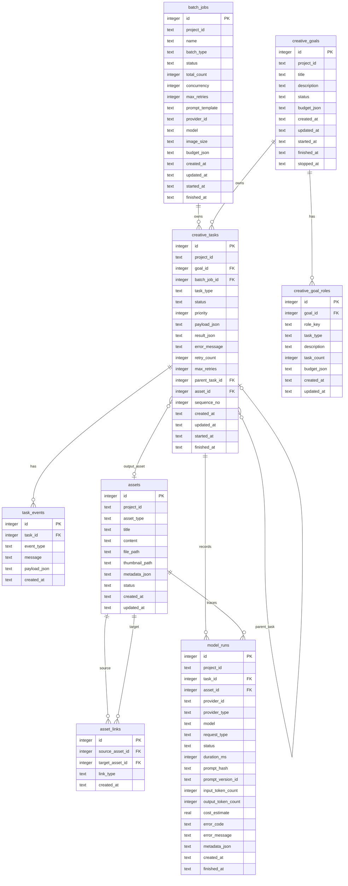

### 5.3 当前数据模型特点

优点：

- `task_events` 与 `creative_tasks` 分离，适合进度和审计。
- `model_runs` 已经预留 provider、model、token、cost、错误分类等观测字段。
- 大图不进 DB，`assets.file_path` / `thumbnail_path` 只存路径。
- `asset_links` 支持 `derived_from`、`uses_character`、`uses_scene`、`part_of` 等资产关系。
- `batch_jobs` 与 `creative_tasks.batch_job_id/sequence_no` 支持批量任务分页与状态统计。

当前不足：

- 没有独立 `projects` 表，`project_id` 仍是字符串维度，适合 demo，不适合正式多项目治理。
- creative schema 已切换到最小版本化 migration 框架：当前通过 `schema_migrations` 记录版本，并落地了 `bootstrap_creative_schema` 与 `add_creative_task_goal_batch_columns` 两个幂等迁移；但迁移前备份、破坏性变更审批与更细粒度领域迁移仍未完全正式化。
- `asset_version`、`parent_asset_id`、`source_task_id` 等 provenance 字段主要依赖 `metadata_json` 与 `asset_links` 表达，正式化后建议结构化。
- `task_status` 没有 DB-level enum 约束，状态合法性主要靠 service 层约束。

---

## 6. 核心业务域

### 6.1 基础桌面壳层

范围：

- 应用启动。
- 全局布局。
- 侧边栏路由。
- 主题、语言、布局偏好。
- 更新弹窗。
- 全局 Toast / Message / Confirm / Loading。
- 窗口最小化、最大化、关闭隐藏、托盘。

关键路径：

```text
main.ts -> App.vue -> Layout.vue -> Sidebar/AppHeader/AppContent/router-view
```

后端支持：

```text
main.rs -> app/window/updater commands -> AppService/SystemService/Updater
```

### 6.2 系统诊断与日志

范围：

- DB 状态检查。
- 本地数据目录展示。
- 日志读取、过滤、清空、导出。
- 错误监控，从日志行解析错误并维护 review 状态。
- 系统诊断导出。

关键路径：

```text
SystemPage
  -> useSystemStore
  -> system.service / logger
  -> commands::system
  -> SystemService / LogService
  -> LoggerInfra / DbInfra / PathProvider
```

### 6.3 文件上传与文件管理

范围：

- 选择文件、上传文件。
- 图片预览。
- 列出上传文件。
- 删除文件前检查导航引用。
- 强制删除时清理导航引用。
- 桌面拖拽上传。

关键路径：

```text
FileManagerPage
  -> useFileManagerStore
  -> file-manager.service
  -> file/upload/list/delete/check references commands
  -> FileService + NavigationService
  -> ~/.monster-tools/uploads
```

安全边界：

- 上传路径只允许落到 `uploads/images` 或 `uploads/files`。
- 图片有扩展名白名单和 20MB 大小限制。
- 普通文件拒绝脚本/可执行扩展名。
- 删除时拒绝绝对路径、`..` 和非 uploads 根路径。

### 6.4 导航收藏

范围：

- 导航条目 CRUD。
- 分类、精选、热门、点击量。
- 排序。
- 备份导入导出。
- logo/background 图片引用。

关键路径：

```text
NavigationPage
  -> useNavigationStore
  -> navigation.service
  -> commands::navigation
  -> NavigationService
  -> DbNavInfra
  -> ~/.monster-tools/navigation.db
```

注意：

- 前端仍传 `appStore.localPath` 给 navigation service，但 Rust `NavigationService` 当前忽略不可信参数，统一使用 `PathProvider` 定位 app dir。

### 6.5 工具箱

范围：

- 目录生成。
- 目录树读取。
- 端口进程查询和杀进程。
- 进程名查询和杀进程。
- JSON、Base64、时间戳等前端工具。

关键路径：

```text
ToolsPage
  -> useToolsStore
  -> tools.service / system.service
  -> commands::file / commands::system
  -> FileService / SystemService
```

### 6.6 AI Provider 工作台

范围：

- Provider 配置。
- 多模型配置。
- 模型列表查询。
- 聊天测试。
- 图片生成测试。
- 后端队列状态。
- 会话与提示词库。
- 生成结果文件打开、导出等。

核心链路：

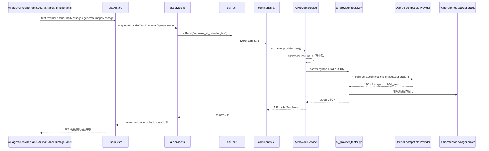

特点：

- AI Provider 测试是一次性 Python 脚本，不是常驻 workflow engine。
- Rust 侧有全局队列、运行槽、配置级串行/并发、取消 token。
- 生图测试输出文件落到 `~/.monster-tools/ai/generated`，前端通过 `convertFileSrc()` 展示。
- Python sidecar 对响应体大小、图片 base64、图片 URL 安全、敏感信息脱敏有防护。

### 6.7 持续型 AI 创作系统

当前创作系统已经具备以下骨架：

| 能力 | 当前入口 | 后端能力 | 状态 |
|---|---|---|---|
| `generate_image_prompt` workflow | `/creative` prompt tab | `TaskService` + `SidecarLifecycleService` + `creative_health_server.py` | 已有最小闭环 |
| review / revision stub | `/creative` prompt/review 区域 | `TaskService::run_review_asset_quality_stub` | stub |
| 领域资产 | `/creative` assets tab | `TaskService::create_creative_asset/link` | demo/stub |
| Goal + 多 Agent stub | `/creative` goal tab | `GoalService::create_goal_multi_agent_stub` | fan-out stub |
| Batch mock | `/creative` batch tab | `BatchJobService` mock worker | demo |
| Batch prompt | `/creative` batch tab | `BatchJobService` prompt worker shell + Python sidecar workflow + model_runs | demo |
| Batch real image | `/creative` batch tab | `BatchJobService` image worker shell + Python sidecar workflow + file path/thumbnail/model_runs | demo |
| Worker queue skeleton | command/service | `WorkerQueueService` | 骨架 |

---

## 7. 关键流程图

### 7.1 标准 Tauri IPC 调用

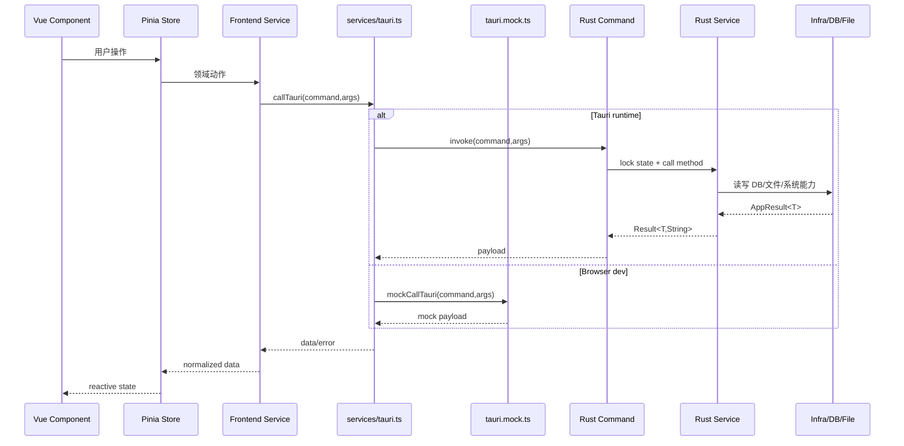

### 7.2 `generate_image_prompt` 最小创作 workflow

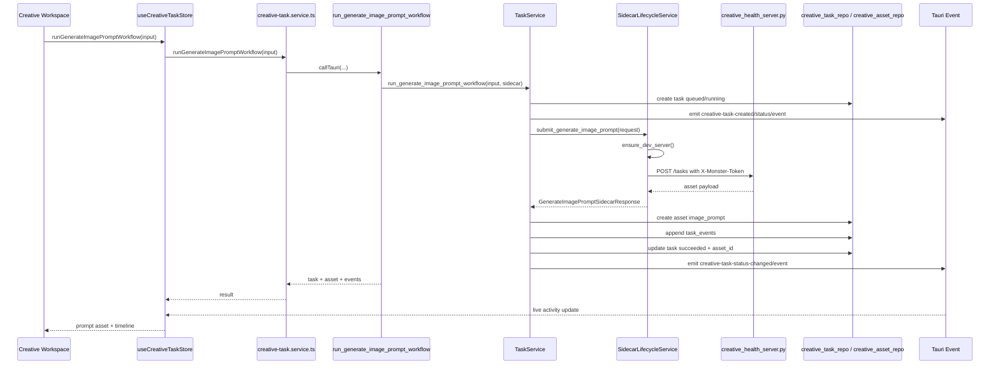

### 7.3 Review / Revision Stub

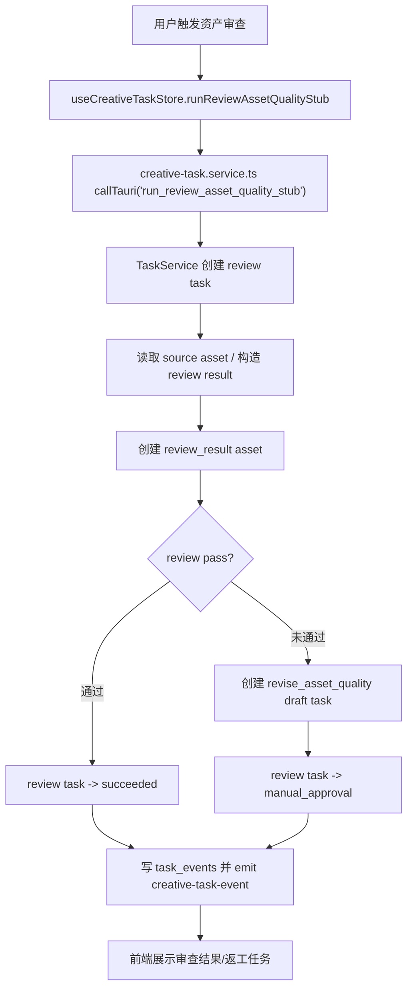

### 7.4 Goal + Multi-Agent Stub

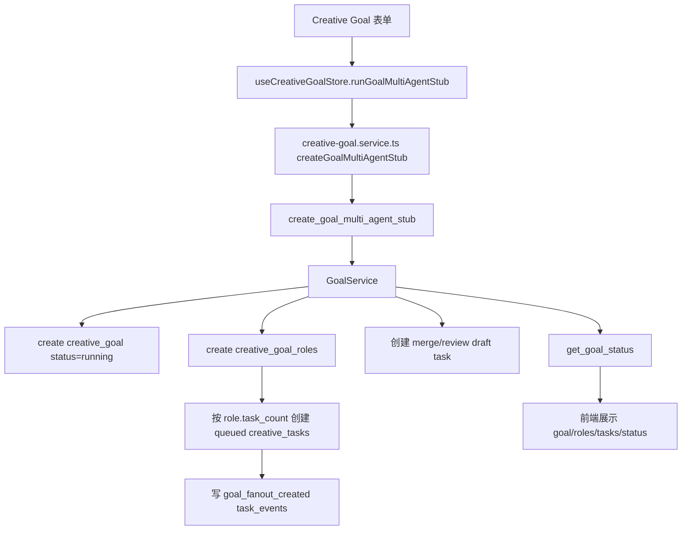

当前限制：

- `GoalService` 对 fan-out 总任务数有 stub 上限。
- 合并任务仍是 draft/stub，不是正式多 Agent 合并审查。
- 没有真正的并行 Agent runtime；当前是数据结构和 UI/任务模型预演。

### 7.5 Batch Image Demo

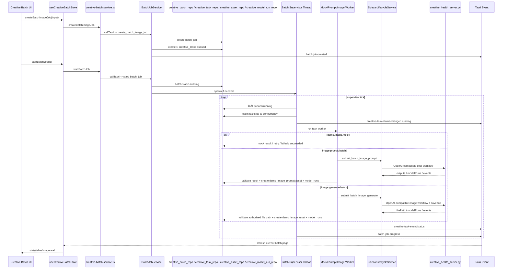

Batch 当前核心语义：

- `batch_jobs.status` 表示批次状态。
- 每个子任务是 `creative_tasks`，通过 `batch_job_id` 和 `sequence_no` 归属。
- 并发由 Rust supervisor 控制，不由 Vue 控制。
- prompt 和 image provider 执行已迁到 Python sidecar workflow；Rust 仍负责结果校验、可信落库和事件广播。
- prompt 和 image 任务都会记录 `model_runs`。
- real image 任务通过文件路径和缩略图路径回填结果，不向前端传大 base64。
- 连续失败预算可以触发自动暂停。

### 7.6 Worker Queue Skeleton

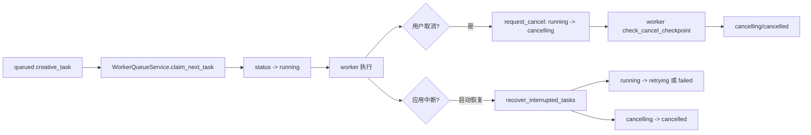

当前定位：

- 这是未来 Python worker pool 的队列语义骨架。
- 还不是完整远程 worker / Redis / 分布式队列。
- 与项目规则一致：优先 SQLite-backed local queue。

---

## 8. 安全与权限边界

当前明确红线：

- Vue 不直连 Python。
- Vue 不直接 `invoke()`。
- 非 `src/services/` 不导入 `@tauri-apps/*`。
- 非 `src/services/request.ts` 不裸 `fetch()`。
- 非 `src/services/tauri.ts` 不裸 `invoke()`。
- Store 不直接导入 `services/tauri`。
- 禁止前端 SQL / FS 插件。
- 禁止放宽 `assetProtocol.scope` 到 `$HOME/**/*`。
- 更新只走 Tauri updater。
- `main.rs` 必须用 `WebviewUrl::App("index.html".into())`。

当前已有防护：

| 风险 | 当前防护 |
|---|---|
| 前端越层调用 | `scripts/check-architecture.js` |
| 浏览器预览崩溃 | `isTauriRuntime()` + `tauri.mock.ts` |
| 文件路径穿透 | Rust `FileService` / `LoggerInfra` / `DbInfra` 校验 |
| 上传恶意文件 | 扩展名黑名单/白名单 + 大小限制 |
| 日志泄密 | `sensitive.rs` 和 Python/Rust 双侧脱敏 |
| Python 端口暴露 | sidecar 仅监听 `127.0.0.1` 且要求 runtime token |
| 大图污染前端状态 | 文件落盘，前端拿 file path / thumbnail |
| Provider SSRF/内网图 URL | `ai_provider_tester.py` 对非本地 provider 的图片 URL host 做限制 |
| DB 备份误导入 | `.db` 后缀、SQLite header、大小限制 |

---

## 9. 当前架构强项

1. 分层边界清楚，并且有自动检查。
2. Tauri 原生能力已经收敛到前端 service 层。
3. Rust service/infra 基本分层清楚，command 大多是薄代理。
4. 浏览器 Mock 能支撑前端快速调试，避免 Tauri runtime 缺失导致页面崩溃。
5. AI Provider 测试链路有队列、取消、并发、超时、输出限制和脱敏。
6. 创作系统数据模型已经有任务、事件、资产、资产关系、model_runs、batch、goal 的核心骨架。
7. 大对象策略基本正确：图片落盘，DB 存 metadata/path，事件 payload 不传大图。
8. Rust 对路径、日志、备份、上传、sidecar 启动环境都有较多安全考虑。
9. `check:architecture` 当前通过，说明至少静态红线未被破坏。

---

## 10. 当前架构压力点

### 10.1 Creative store 拆分已基本完成

此前 `useTaskStore` 曾同时承载后台任务、prompt/review workflow、domain assets、goal、batch 和项目索引。当前这条集中点已经基本拆开：

```text
creative-task.store.ts
creative-asset.store.ts
creative-goal.store.ts
creative-batch.store.ts
creative-project.store.ts
background-task.store.ts
```

当前更真实的剩余压力点不是 store 命名边界，而是：

- `/creative` 页面编排壳仍负责三栏共享状态与工作区装配。
- creative store 之间仍存在跨域编排。
- 左右栏已从静态占位进入真实状态接线，但仍需继续决定正式资产库 / Agent 监控台的产品深度。

### 10.2 AI store 主拆分已完成，剩余压力在 façade 协调层

此前 `useAiStore` 曾同时承载 provider、session、prompt library、queue、chat/image runtime。当前主拆分已经落地：

```text
ai-provider.store.ts
ai-session.store.ts
ai-session-runtime.ts
ai-image.store.ts
ai-image-runtime.ts
ai-prompt-library.store.ts
ai-queue.store.ts
ai-chat-runtime.ts
ai-provider-runtime.ts
```

当前更真实的剩余压力点是 `src/stores/ai.ts` 仍作为 façade 负责跨 store 编排，而不是旧的“大一统 store”问题。

### 10.3 `commands/database.rs` 已恢复为窄命名边界

此前 `database.rs` 曾混入 creative task、batch、goal、sidecar 和 worker queue。当前已恢复为只处理 DB 导入导出与状态检查：

```text
commands/database.rs          # 只保留 export/import/reset/status
```

creative 相关命令当前已经分别位于：

```text
commands/creative_task.rs
commands/creative_goal.rs
commands/creative_batch.rs
commands/creative_project.rs
commands/creative_sidecar.rs
commands/worker_queue.rs
```

### 10.4 `creative_db` 已完成去 façade 化

此前 `creative_db.rs` / `CreativeDbInfra` 曾同时承载 schema 初始化、领域 CRUD 和测试入口。当前阶段已经完成三步收口：

- `CreativeDbInfra` 已从 crate 生产与测试调用面移除。
- creative 领域共享类型已迁到 `src-tauri/src/infra/creative_types.rs`。
- `creative_db.rs` test-only 模块壳已删除，测试直接接到 `creative_db_tests.rs`。

当前创作域数据访问的真实形态更接近：

```text
creative_db_schema.rs
creative_task_repo.rs
creative_asset_repo.rs
creative_project_repo.rs
creative_goal_repo.rs
creative_batch_repo.rs
creative_model_run_repo.rs
creative_db_tests.rs
```

建议未来按领域拆 repo：

```text
infra/creative/schema.rs
infra/creative/task_repo.rs
infra/creative/event_repo.rs
infra/creative/asset_repo.rs
infra/creative/model_run_repo.rs
infra/creative/batch_repo.rs
infra/creative/goal_repo.rs
```

### 10.5 正式 migration 体系仍需继续硬化

当前 creative schema 已经有最小版本化迁移骨架，但距离生产级迁移治理还有差距：

- [x] `schema_migrations` 表。
- [x] 版本号。
- [x] 幂等 migration。
- [ ] 破坏性迁移审批。
- [ ] migration dry-run / backup。
- [ ] 覆盖更多历史旧库形态的兼容测试。

### 10.6 Python execution plane 仍是 stub

当前 `creative_health_server.py` 是健康和最小任务 stub，不是正式 workflow engine。未来正式系统需要：

- workflow runtime。
- worker loop。
- provider clients。
- prompt builder。
- review/revision agent。
- context builder。
- consistency analysis。
- asset ingestion。
- structured error model。
- budget / cancel / retry / checkpoint。

但仍应保持：Vue 不知道 Python 端口和 token，Rust 继续作为唯一入口。

### 10.7 项目域模型不足

当前已经有 `creative_projects` 表，但项目域仍处于“seed bootstrap + 聚合视图”的过渡态。面向业务调整时，仍有这些限制：

- 项目重命名。
- 项目归档。
- 项目成员/权限。
- 项目级预算。
- 项目级资产索引。
- 项目级 settings。
- 项目导入导出。

后续仍需要把 `creative_projects` 从“已有实体”继续推进成“真正的项目中心事实源”。

建议新增正式 `creative_projects`，再把现有 `project_id` 逐步迁移到 FK 或稳定 ID 策略。

### 10.8 文档状态需要收敛

Goal 00-13 真实 Tauri 验证闭环已经完成；后续待办统一收敛到 `agent/open-loops.md` 与真实回归缺口，不再重新打开已完成 Goal 的收口条目。

---

## 11. 面向业务调整的影响矩阵

| 调整类型 | 应优先触碰的层 | 注意事项 | 必跑检查 |
|---|---|---|---|
| 新增页面 | `views/<module>`、`router`、`locales`、必要 store/service | 页面不直连 service，用户文案进 i18n | `npm run typecheck` |
| 新增 Tauri 能力 | frontend service、Rust command、Rust service、mock | command 必须注册到 `main.rs`，同步 `tauri.mock.ts` | `npm run check:architecture`、`npm run typecheck`、必要时 `tauri:build:no-bundle` |
| 新增 creative workflow | `creative-task.service.ts`、creative store、Rust Task/Workflow service、Python sidecar | Vue 不直连 Python；任务、事件、资产必须落库 | `check:architecture`、`typecheck`、Rust tests |
| 新增 batch 类型 | `creative-batch.service.ts`、`BatchJobService`、UI mode、mock | 明确 retry/cancel/concurrency/model_runs/asset 输出 | `check_batch_demo_boundaries`、Rust batch tests |
| 新增资产类型 | `TaskService` 校验、`creative_asset_repo`、UI 映射、i18n | 不覆盖旧资产；关系进 `asset_links` | `typecheck`、creative_db tests |
| 新增 DB 字段 | `creative_db_schema.rs` / 对应 repo / 未来 migration | 优先 nullable/default；旧库兼容测试 | `cargo test creative_db_tests` |
| 新增 Provider 能力 | `ai_provider_tester.py` / Rust AiProviderService / AI store | 不把业务流程写进 provider gateway | AI sidecar tests |
| 新增文件能力 | `FileService`/`SystemService` | 路径白名单、大小、扩展名、asset scope | `check:architecture`、Rust tests |
| 修改更新机制 | updater service / Tauri updater config | 禁止自定义 Vue 热更新 | `tauri:build:no-bundle` |

---

## 12. 建议升级路线

### 阶段 A：架构硬化，不改业务体验

目标：降低后续业务调整成本。

建议：

1. 继续收敛 `/creative` 三栏工作台：中间 `CreativeWorkflowDemo.vue` 已接近 orchestration shell，左右栏已接入真实项目/资产/任务活动，后续重点是确认正式资产库与 Agent 监控台的产品深度。
2. 继续收敛 `src/stores/ai.ts` façade，避免新的 session / queue / image runtime 逻辑重新回流到单一入口。
3. 继续收敛 `TaskService` 与 `BatchJobService` 的 orchestration 边界，尽量让 asset CRUD、goal CRUD、batch snapshot 等稳定职责停留在对应 repo/service。
4. 在现有 `schema_migrations` 基础上继续补齐旧库兼容回归、备份策略与更细粒度 migration 约束。
5. 持续同步 `agent/open-loops.md` 与本文件，避免“代码已经推进、当前状态文档仍停留在旧阶段”。

### 阶段 B：正式项目与资产域

目标：让创作系统从“seed bootstrap + 聚合统计”进入正式项目生命周期和资产治理。

建议：

1. 继续完善 `creative_projects`：补项目编辑、归档、筛选、导入导出与更稳定的项目键策略。
2. 引入正式 asset version/provenance 字段或配套表。
3. 明确 `asset_type`、`link_type`、`task_type` 的枚举文档。
4. 增加项目级导入导出和备份策略。
5. 将 UI 中的 seed bootstrap 继续过渡为真实项目查询与管理视图。

### 阶段 C：Python workflow runtime

目标：把当前 sidecar stub 升级为真实执行面。

建议：

1. 保持 Rust 作为唯一入口。
2. Python 只监听 localhost + runtime token。
3. Python worker 通过 Rust/DB 协议消费任务，不让 Vue 直连。
4. 引入标准 task claim / heartbeat / checkpoint / cancel / retry。
5. 输出资产统一经 Rust 授权路径落盘和入库。

### 阶段 D：多 Agent 与审查返工

目标：从 fan-out stub 进入可审计协作。

建议：

1. 明确 Agent role 模型。
2. 引入 goal decomposition。
3. 引入 merge/review task 正式状态。
4. review result 和 revision draft 不覆盖源资产。
5. 所有模型调用写 `model_runs`。

### 阶段 E：生产级批量生成

目标：让 1000 级批量任务可控、可恢复、可暂停、可审计。

建议：

1. supervisor 与 worker loop 解耦。
2. batch stats 增量更新。
3. 大图缩略图懒加载。
4. 预算、熔断、限流、重试策略配置化。
5. 失败分类与 provider 观测仪表化。

---

## 13. 面向架构评审的核心问题

后续做升级评审时，建议按这些问题推进：

1. `creative_projects` 是否已经足够承接正式项目生命周期，还是仍需补充更稳定的项目键策略？
2. `creative_db_schema.rs` 与各 repo 是否先继续细分，还是先上 migration 治理？
3. `/creative` 三栏工作台中，哪些内容应视为正式工作台，哪些仍应留在验证/展示壳层？
4. Python worker 是由 Rust 主动提交任务，还是 Python 拉取 SQLite-backed queue？
5. model_runs 是否作为所有 AI 调用的强制审计点？
6. asset provenance 是继续放 `metadata_json`，还是结构化成字段/表？
7. Batch supervisor 是否继续留在 Rust，还是逐步移到 Python worker runtime？
8. 真实 provider 网关配置是否完全复用 AI Provider 工作台，还是建立 creative provider profile？
9. review/revision 是否需要人工审批表？
10. 当前 `tauri.mock.ts` 是否继续承担完整浏览器演示，还是收敛为最小 contract mock？

---

## 14. 当前推荐结论

当前架构已经具备较完整的“桌面控制面 + 前端工作台 + 本地 SQLite 状态 + Python AI 执行面”的雏形。它最适合的下一步不是继续堆功能，而是做一次 post-goal architecture hardening：

1. 先继续收敛 `/creative` 中央 orchestration shell 与 `ai.ts` façade。
2. 再固化 migration、project/asset/version/provenance 领域模型。
3. 再把 Python sidecar 从 health stub 升级为正式 workflow runtime。
4. 最后引入真正的多 Agent 协作、审查返工和生产级批量生成。

如果继续在现有 `CreativeWorkflowDemo.vue`、`src/stores/ai.ts`、Rust `TaskService` 和 `BatchJobService` 上无约束叠业务，短期会很快，长期会让任务状态、资产版本、批量恢复、多 Agent 合并和 provider 审计越来越难验证。

## 2026-06-11 补充：creative_types 首轮迁出

- 已新增 `src-tauri/src/infra/creative_types.rs`，把 creative 领域的共享实体、输入 DTO 与 filter DTO 从旧 `creative_db.rs` 承载面中迁出。
- repo / service / command 当前已直接从 `creative_types.rs` 引用共享类型。
- `creative_db.rs` 已删除，测试直接接入 `creative_db_tests.rs`。
- 本轮验证通过：`cargo test --manifest-path .\\src-tauri\\Cargo.toml init_schema_is_idempotent -- --nocapture`、`npm run verify`。
- 这意味着旧 `creative_db.rs` 集中点已经实质拆除，后续焦点转向 repo/test 边界与 migration 治理。

## 2026-06-11 补充：creative_projects 接线进展

- `creative_projects` 已具备 Rust command/service/repo、frontend service、Pinia state 和 browser mock 的最小闭环。
- `/creative` 的项目中心当前已经从单纯的 seed project card 演示，过渡到“SQLite 真实项目记录 + task/asset/goal/batch 聚合统计”的混合态展示。
- 这意味着项目域已经从 `projectId` 聚合，继续走向“项目实体 + 聚合视图”的过渡态；后续仍需把项目编辑、归档和导入导出补齐到完整生命周期。

## 2026-06-11 补充：creative-asset.store 接线完成

- 已新增并接通 `src/stores/creative-asset.ts`，把 domain asset draft、资产关系创建与 domain asset 运行状态从 `useTaskStore` 中抽离。
- `src/views/creative/components/CreativeWorkflowDemo.vue` 当前通过 `useCreativeAssetStore + useCreativeTaskStore + useCreativeGoalStore + useCreativeBatchStore + useCreativeProjectStore` 协作，`/creative` 页面已不再依赖 `useTaskStore`。
- `useTaskStore` 当前已基本收缩为 background task progress store，下一步更适合把这部分正式命名并独立为 `background-task.store.ts`。
## 2026-06-11 补充：creative-asset / background-task.store 完成

- 已新增 `src/stores/creative-asset.ts`，把 domain asset draft、资产关系创建与运行状态从 `useTaskStore` 中抽离。
- 已新增 `src/stores/background-task.ts`，并让 `src/stores/task.ts` 退化为兼容导出壳；当前全局后台任务进度已正式收口到 `background-task.store.ts`。
- `src/views/creative/components/CreativeWorkflowDemo.vue` 当前已经不再依赖 `useTaskStore`，`/creative` 页面所有业务域都已各自进入独立 store，`useTaskStore` 不再承载创作域职责。
## 2026-06-11 补充：background-task.store 收口完成

- `src/stores/task.ts` 兼容别名文件已经移除，仓库内不再保留 `useTaskStore` 入口。
- `src/main.ts`、`src/layouts/components/AppHeader.vue` 与 `src/stores/update.ts` 已统一切到 `useBackgroundTaskStore`。
- 当前 `background-task.store.ts` 已成为全局后台任务进度的唯一 store 命名，`/creative` 页面不再与全局任务提示共享历史 store 语义。
## 2026-06-11 补充：ai-session.store 接线进展

- 已新增 `src/stores/ai-session.ts`，正式承接 session 生命周期、active session、chat/image session 列表，以及 create/select/remove/rename/duplicate。
- `src/stores/ai.ts` 当前已改为通过 `useAiSessionStore` 读取 session 状态，并复用 session store 提供的 message mutation helper，不再保留第二套本地 session/message 写入实现。
- 这意味着 AI 域现在已经完成 `provider -> session` 两层拆分，下一步更适合继续聚焦 `image / queue / message recovery/export` 的剩余职责。

## 2026-06-11 补充：ai-queue.store 接线进展

- 已新增 `src/stores/ai-queue.ts`，正式承接 provider test queue、本地 testQueue、backendQueueStatus、activeAction、isTesting，以及本地队列收敛 helper。
- `src/stores/ai.ts` 当前已改为通过 `useAiQueueStore` 读取和维护队列状态，不再直接本地持有 queue refs 与第二套队列同步逻辑。
- 这意味着 AI 域现在已经完成 `provider -> session -> queue` 三层初步拆分，下一步更适合继续聚焦 `image / message recovery-export` 的剩余职责。

## 2026-06-11 补充：ai.ts façade 收口完成

- `src/stores/ai.ts` 已从旧的大一统实现切换为 façade 角色：自身只保留 load/hydrate、provider test orchestration、chat send/export 与跨 store 协调。
- provider/config 继续由 `ai-provider.ts` 承接；session 生命周期由 `ai-session.ts` 承接；queue 状态由 `ai-queue.ts` 承接；prompt library 由 `ai-prompt-library.ts` 承接；image runtime 由 `ai-image.ts` 承接。
- 本轮验证通过 `npm run typecheck` 与 `npm run check:architecture`，说明 AI 域已经从“代码上新增 store”继续推进到“主 façade 真正消费拆分后的 store”。

## 2026-06-11 补充：ai-provider-runtime.store 接线完成

- 已新增并正式接通 `src/stores/ai-provider-runtime.ts`，承接 AI provider test runtime orchestration：`refreshBackendQueueStatus`、`cancelBackendQueuedTests`、`cancelBackendQueuedTest`、`testProvider` 与相关 polling/runtime config helper。
- `src/stores/ai.ts` 当前已通过 `useAiProviderRuntimeStore` 委托上述运行时职责，自身继续保留 façade、session hydrate/persist、chat send/export 与跨 store 协调，不再保留第二套 provider test runtime 实现。
- 当时 `src/stores/ai.ts` 约 711 行，`src/stores/ai-provider-runtime.ts` 约 323 行；本轮验证 `npm run typecheck` 与 `npm run check:architecture` 均通过，说明 AI 域已继续从“大 façade 内嵌 runtime”推进到“facade + runtime store”结构。

## 2026-06-11 补充：ai-chat-runtime.store 与 ai-session-storage helper 接线完成

- 已新增 `src/stores/ai-chat-runtime.ts`，正式承接 chat send/export 运行时职责：`sendChatMessage`、`exportChatSession` 与内部 typewriter / export formatting helper。
- 已新增 `src/services/ai-session-storage.ts`，集中承接 session 偏好持久化与 hydrate helper：`persistAiSessions`、`normalizeAiSessions`。
- `src/stores/ai.ts` 当前通过 `useAiChatRuntimeStore` 委托 chat send/export，并通过 `ai-session-storage` helper 完成 session 读写收口；自身继续保留 façade、session/UI 协调、provider runtime 委托与初始 hydrate 编排。
- 当时 `src/stores/ai.ts` 已进一步收缩到约 323 行，`src/stores/ai-chat-runtime.ts` 约 244 行，`src/services/ai-session-storage.ts` 约 200 行；本轮验证 `npm run typecheck` 与 `npm run check:architecture` 均通过。

## 2026-06-11 补充：ai-session-runtime.store 接线完成

- 已新增 `src/stores/ai-session-runtime.ts`，正式承接 AI session 的 create/select/delete/rename/duplicate、active model config 同步与 loadConfig 协调。
- `src/stores/ai.ts` 当前通过 `useAiSessionRuntimeStore` 委托 session runtime 职责，自身继续保留 façade + provider runtime + chat runtime + image runtime 的组合入口。
- 当时 `src/stores/ai.ts` 已进一步缩减到约 228 行，`src/stores/ai-session-runtime.ts` 约 144 行；本轮验证 `npm run typecheck` 与 `npm run check:architecture` 均通过。

## 2026-06-11 AI 域继续收口

- `src/stores/ai-image.ts` 已移除本地 `patchAiPreferenceState` / `SESSIONS_KEY` / `persistSessions()`，统一改用 `src/services/ai-session-storage.ts` 的 `persistAiSessions()`。
- `src/stores/ai-image.ts` 与 `src/stores/ai-provider-runtime.ts` 共享了新的 `src/services/ai-provider-queue-sync.ts`，把后端队列状态同步、任务回填和测试状态更新收敛到一个 helper。
- 最新验证再次通过：`npm run typecheck`、`npm run check:architecture`。

## 2026-06-11 AI 图片域 state/runtime 拆分完成

- `src/stores/ai-image.ts` 已收缩为纯状态 store，当前只持有 `imageDraftSize`。
- 已新增 `src/stores/ai-image-runtime.ts`，正式承接 image message recovery、cancel、backend polling、generate orchestration 与打开落盘目录等运行时职责。
- `src/stores/ai.ts` 当前通过 `useAiImageRuntimeStore` 暴露图片运行时动作，通过 `useAiImageStore` 暴露图片尺寸状态；`src/stores/ai-provider-runtime.ts` 与 `src/stores/ai-session-runtime.ts` 也已改接新的 image runtime store。
- 本轮验证再次通过：`npm run typecheck`、`npm run check:architecture`。

## 2026-06-11 Creative 前端服务再拆一层

- 已新增 `src/services/creative-task.service.ts` 与 `src/services/creative-batch.service.ts`，把 Creative 业务从 `src/services/task.service.ts` 中进一步拆出。
- `creative-task.ts`、`creative-asset.ts`、`creative-goal.ts`、`creative-project.ts`、`creative-batch.ts` 已切到新的窄服务；当前 `task.service.ts` 在前端仅剩后台任务进度监听这一条非 Creative 通道。
- 本轮验证再次通过：`npm run typecheck`、`npm run check:architecture`。

## 2026-06-11 后台任务通道独立

- 已新增 `src/services/background-task.service.ts`，把 `task-progress` 监听从 `src/services/task.service.ts` 中独立出来。
- `src/stores/background-task.ts` 已切换到新的 `backgroundTaskService`；`src/services/task.service.ts` 现仅保留兼容入口 `taskService.listenTaskProgress`，不再承载 Creative 业务调用。
- 这一步让前端 service 面进一步从“历史大入口”走向“按域命名的窄服务”。
- 本轮验证再次通过：`npm run typecheck`、`npm run check:architecture`。

## 2026-06-11 补充：Creative 前端共享类型迁出

- 已新增 `src/services/creative-types.ts`，把 Creative 任务、资产、Goal、Batch、事件与 workflow DTO 从历史 `src/services/task.service.ts` 中迁出。
- `creative-task.service.ts`、`creative-asset.service.ts`、`creative-goal.service.ts`、`creative-batch.service.ts` 以及对应 store 已改为从 `creative-types.ts` 获取共享类型。
- 当前 `src/services/task.service.ts` 真正只保留 `taskService.listenTaskProgress` 兼容入口，运行时与类型层都不再承载 Creative 业务定义。

## 2026-06-11 补充：CreativeWorkflowDemo 页面层首轮拆分

- 已把 CreativeWorkflowDemo.vue 中的“项目列表筛选区”切到现有独立组件 src/views/creative/components/tabs/CreativeProjectList.vue。
- 已新增 src/views/creative/components/tabs/CreativeTabHistory.vue，把项目历史时间线（tasks/assets/goals/batch milestones）从主页面组件中抽离。
- 当前 CreativeWorkflowDemo.vue 仍然是 /creative 的主要 orchestration shell，但项目列表过滤逻辑和历史渲染逻辑已经不再内嵌在主页面文件中。
- 这说明页面层拆分已经开始落地，下一步更适合继续拆 prompt / assets / goal / batch 四个 workspace 分区，而不是回到 store/service 边界重做一轮。
- 本轮验证通过：`npm run typecheck`、`npm run check:architecture`。


## 2026-06-11 补充：CreativeWorkflowDemo prompt 分区抽离

- 已把 prompt workspace 分区从 CreativeWorkflowDemo.vue 中抽离到独立组件 src/views/creative/components/tabs/CreativeTabPrompt.vue。
- 当前 prompt 分区的表单输入、运行状态、事件时间线与 prompt asset 展示都已通过 props / emits 与主页面解耦。
- 这让 CreativeWorkflowDemo.vue 进一步朝“页面编排壳层”收敛，而不是继续同时承担所有 workspace 的细节模板。
- 本轮验证通过：npm run typecheck、npm run check:architecture。

## 2026-06-11 补充：CreativeWorkflowDemo assets 分区抽离

- 已把 assets workspace 分区从 CreativeWorkflowDemo.vue 中抽离到独立组件 src/views/creative/components/tabs/CreativeTabAssets.vue。
- 当前 assets 分区中的 review 表单、review 结果、domain assets 表单、domain state 与 link snapshot 已通过 props / emits 与主页面解耦。
- 这让 CreativeWorkflowDemo.vue 进一步从“综合大模板”收敛为按 workspace 装配状态和动作的 orchestration shell。
- 本轮验证通过：npm run typecheck、npm run check:architecture。

## 2026-06-11 补充：CreativeWorkflowDemo batch 分区抽离

- 已把 batch workspace 分区从 CreativeWorkflowDemo.vue 中抽离到独立组件 src/views/creative/components/tabs/CreativeTabBatch.vue。
- 当前 batch 分区中的配置表单、状态卡、活动时间线、分页任务表、结果表和图片墙都已通过 props / emits 与主页面解耦。
- 这让 CreativeWorkflowDemo.vue 进一步收敛为 orchestration shell；当前页面层剩余最明显的单块 workspace 主要是 goal 分区。
- 本轮验证通过：npm run typecheck、npm run check:architecture。

## 2026-06-11 补充：CreativeWorkflowDemo goal 分区抽离

- 已把 goal workspace 分区从 CreativeWorkflowDemo.vue 中抽离到独立组件 src/views/creative/components/tabs/CreativeTabGoal.vue。
- 当前 goal 分区中的目标表单、goal 状态卡、role timeline 与 fan-out task timeline 都已通过 props / emits 与主页面解耦。
- 叠加此前的 project list / history / prompt / assets / batch 拆分后，CreativeWorkflowDemo.vue 当前已基本收敛为“项目中心壳层 + workspace tab 装配 + 状态/动作编排”的 orchestration shell。
- 本轮验证通过：npm run typecheck、npm run check:architecture。

## 2026-06-11 补充：/creative 三栏壳层首轮接线

- `src/stores/creative-project.ts` 已新增 `activeCreativeProjectId`，当前项目不再只存在于 `CreativeWorkflowDemo.vue` 的本地 ref。
- `CreativeAssetSidebar.vue` 已接入真实 `creative-project` 索引状态：项目列表来自当前项目实体与任务/资产/Goal/Batch 聚合，资产分类和标签计数来自当前项目资产。
- `CreativeAgentMonitor.vue` 已接入真实任务与事件状态：队列来自当前项目历史任务和 batch paged tasks，日志来自 prompt/review/batch activity。
- `CreativeTaskForm.vue` 已改为使用当前 active project 创建 Goal 和 Batch，不再硬编码写入 `creative-main-project`。
- 本轮验证通过：`npm run verify`。

## 2026-06-11 补充：creative project Rust 后端首轮去集中化

- 已将 `src-tauri/src/services/creative_project_service.rs` 从 `CreativeDbInfra` 巨型 façade 切到直接调用 `creative_project_repo`。
- 已让 `src-tauri/src/infra/creative_project_repo.rs` 直接依赖 `creative_db_schema::init_schema()`，并在 repo 内部收口项目列表的非空过滤，不再经由 `CreativeDbInfra` 间接初始化。
- 这说明 Rust 后端的下一阶段硬化已经从“分析集中点”进入“按领域绕开巨型 façade”的真实推进，后续更适合继续评估 `goal / task / batch / worker_queue` 哪一块最值得优先切下一刀。
- 本轮验证通过：`npm run verify`、`cargo check --manifest-path .\\src-tauri\\Cargo.toml`。

## 2026-06-11 补充：goal / task / asset Rust 领域 repo 化继续推进

- `src-tauri/src/services/goal_service.rs` 已改为直接调用 `creative_goal_repo` 与 `creative_task_repo`，不再依赖 `CreativeDbInfra` 作为 goal 域入口。
- `src-tauri/src/services/task_service.rs` 已把任务、资产、关系、事件的常规 CRUD 与 workflow 持久化逻辑切到 `creative_task_repo` / `creative_asset_repo`。
- `src-tauri/src/infra/creative_task_repo.rs` 与 `src-tauri/src/infra/creative_asset_repo.rs` 已直接依赖 `creative_db_schema::init_schema()`，从而把 schema 初始化从巨型 façade 中继续下沉到领域 repo。
- 这一步让 Rust 后端的领域边界更接近当前文档推荐方向：service 负责流程编排，repo 负责写读和筛选，并为后续移除 `CreativeDbInfra` 的剩余测试/类型承载角色打下基础。
- 本轮验证通过：`npm run verify`、`cargo check --manifest-path .\\src-tauri\\Cargo.toml`。

## 2026-06-11 补充：worker queue 继续去集中化

- `src-tauri/src/services/worker_queue_service.rs` 已改为直接调用 `creative_task_repo`，不再依赖 `CreativeDbInfra` 进行 claim / cancel / recovery。
- 这一步让 worker queue 这条运行时链路也切到了领域 repo，说明后端架构推进已经不只停留在 project / goal / task / asset，而是开始触到 recovery / cancellation 这类运行时职责。
- 当前更清晰的下一块后端集中点是 `batch_job_service.rs`：它仍然同时混合 batch 状态流转、task claim/update、asset 落库、model run 记录与 provider 交互。
- 本轮验证通过：`cargo check --manifest-path .\\src-tauri\\Cargo.toml`、`npm run verify`。

## 2026-06-11 补充：batch service 数据访问去集中化

- `src-tauri/src/services/batch_job_service.rs` 已去掉对 `CreativeDbInfra` 的直接依赖，当前 batch 顶层 CRUD、snapshot、分页任务、取消链路，以及 mock/prompt/generate worker 中的 task/event/asset/model_run 持久化都已改为直接调用领域 repo。
- 当前该服务主要通过 `creative_batch_repo`、`creative_task_repo`、`creative_asset_repo`、`creative_model_run_repo` 组织数据访问，`BatchJobService` 自身继续承担流程编排、事件发射、sidecar 提交/结果归档和 supervisor 控制。
- `src-tauri/src/infra/creative_batch_repo.rs` 与 `src-tauri/src/infra/creative_model_run_repo.rs` 也已改为直接依赖 `creative_db_schema::init_schema()`，并在 repo 内部补齐本地 `non_empty_filter`，与 task/asset/goal/project repo 的收口方式保持一致。
- 这一步意味着 Rust Creative 运行时里最显著的“数据访问型集中点”已经继续后退，`batch_job_service.rs` 现在更像一个仍然偏宽的 orchestrator，而不是同时兼任数据 façade。
- 本轮验证通过：`cargo check --manifest-path .\\src-tauri\\Cargo.toml`、`npm run verify`。

## 2026-06-11 补充：生产代码已清空对 CreativeDbInfra 的直接依赖

- `src-tauri/src/services/database_service.rs` 的 runtime schema 初始化已从 `CreativeDbInfra::init_schema()` 切到 `creative_db_schema::init_schema()`。
- 叠加此前的 project / goal / task / asset / worker queue / batch 收口后，当前 `src-tauri/src/services/`、`src-tauri/src/commands/` 与 `src-tauri/src/main.rs` 生产代码层面已经不再直接引用 `CreativeDbInfra`。
- 这意味着 `CreativeDbInfra` 已退出生产代码调用面；后续实际推进应聚焦 repo/test 边界、schema migration 与 batch orchestration，而不是继续围绕旧 façade 扩展。
- 当前更值得继续推进的下一层不是再追逐零散引用，而是评估：
  1. `creative_db_schema.rs` / `creative_db_tests.rs` 与 repo 的边界是否继续细分；
  2. `batch_job_service.rs` 剩余 orchestration 是否继续留在 Rust，还是为后续 Python runtime 正式化预留迁移边界。
- 本轮验证通过：`cargo check --manifest-path .\\src-tauri\\Cargo.toml`，并通过代码检索确认生产代码层面不再出现 `CreativeDbInfra` 直接引用。

## 2026-06-11 补充：Rust TaskService / BatchJobService 编排边界评估

本轮按 `docs/rust-backend.md`、`docs/ai/creative-architecture-guardrails.md` 与 `docs/ai/workflow-runtime-boundary.md` 重新核对 Rust 侧 creative runtime 边界。

当前基线判断：

- `src-tauri/src/services/task_service.rs` 生产职责仍分三类：
  1. 可信状态入口：task / asset / asset_link / task_event 的校验、repo 写读与 Tauri event emit。
  2. 过渡 workflow 入口：`run_generate_image_prompt_workflow` 负责创建任务、调用 `SidecarLifecycleService`、落库 sidecar 返回的 prompt asset、更新 task 状态。
  3. demo / stub 业务逻辑：`run_review_asset_quality_stub` 与 `build_review_result` 在 Rust 内生成 review result、创建 review asset，并在失败时创建 `revise_asset_quality` draft task。
- `src-tauri/src/services/batch_job_service.rs` 是当前更明显的 Rust 编排集中点。它已经不再依赖旧 `CreativeDbInfra`，也已经把 prompt / image 的 provider 执行迁到 Python sidecar，但仍同时承担：
  1. batch job 创建、snapshot 查询、pause/resume/cancel。
  2. supervisor thread：按并发度 claim queued tasks，spawn worker thread，检查完成条件。
  3. mock worker：执行本地 smoke 任务、处理取消、重试、失败自动暂停。
  4. prompt / image worker shell：构造受控 sidecar request，提交 Python workflow，校验 protocol/taskId/status。
  5. 结果归档：校验 sidecar 输出文件路径，创建 `demo_image_prompt` / `demo_image` asset，写入 `model_runs`，维护 task result/event/status。

按文档边界，Rust 当前适合继续保留的职责是：

- IPC command 薄代理、权限与路径控制。
- SQLite 可信状态写入，包括 task/batch/asset/model_run 的最终落库。
- task / batch 状态机的最小可信转移：queued、running、cancelling、cancelled、succeeded、failed、paused、completed。
- Tauri event bridge，把 task/batch 状态变化广播给前端。
- sidecar lifecycle：启动、健康检查、runtime token、localhost 边界。
- 取消、暂停、恢复、启动恢复等桌面控制面入口。

按文档边界，不应继续在 Rust 内扩大的职责是：

- prompt 构建策略。
- review / revision / consistency 规则。
- 多 Agent 创作策略。
- provider 调用编排与 worker pool 业务逻辑。
- 图片生成 workflow 的业务分支。
- 基于业务语义的失败处理策略不断扩展到 Rust worker 中。

因此当前结论不是“马上删除 Rust supervisor”，而是把边界分成短中期两层：

1. 短期保留 Rust 作为 batch 控制面。`BatchJobService` 可以继续负责 batch job 生命周期、并发槽位、claim、pause/resume/cancel、事件和最终可信落库。
2. 短期停止在 `BatchJobService` 里继续新增生产型 worker 分支。`demo.image.mock` 可保留作本地验证；`demo.image.prompt` 与 `demo.image.generate` 已迁为 sidecar workflow，但命名和生命周期仍属于过渡链路。
3. 下一步若要新增正式 workflow，优先走 `SidecarLifecycleService -> Python workflow runtime`：Rust 创建/claim task，Python 执行 prompt/provider/review/image workflow，Rust 根据返回结果写入 task/asset/model_runs/event。
4. 中期再决定 supervisor 归属：
   - 方案 A：Rust 保留 supervisor，只把每个 claimed task 提交给 Python 执行；这是最平滑的迁移路径。
   - 方案 B：Python worker 拉取 SQLite-backed queue；这需要先固化 DB 写入协议、取消 checkpoint、崩溃恢复和权限边界，不能让 Python 任意改主库。

建议的收口顺序：

1. 先不要新增新的 Rust batch worker 类型；把 `demo.image.prompt/generate` 标记为过渡实现，并在正式业务类型出现前避免继续扩展 `demo.image.*` 语义。
2. 把 `TaskService::run_review_asset_quality_stub` 维持为 stub，不继续扩展真实审查规则；真实 review/revision 应进入 Python workflow runtime。
3. 继续把 `BatchJobService` 中的执行面边界收口：后续新增 workflow 优先提交给 sidecar，而不是通过 `AiProviderService::test_provider` 或新的 Rust provider helper 作为生产 batch runtime。
4. 保留 `model_runs` 作为所有 AI 调用的强制审计点；即使执行搬到 Python，最终审计记录也应由 Rust 可信写入或经过严格协议写入。
5. 后续拆代码时，优先拆“worker 执行业务”而不是拆“batch 状态控制”。也就是说，先让 Rust 从 prompt/image 业务执行中退出，再讨论 supervisor 是否迁走。

架构风险提示：

- `AiProviderService::test_provider` 当前语义仍偏“连接测试/Provider 测试”，不应重新作为 batch 生产执行入口，否则会让测试链路和正式 creative runtime 混淆。
- `demo.image.*` 命名说明当前 batch 类型仍带 demo 语义；在正式业务类型出现前，不应把这套命名直接扩展成生产分类体系。
- 当前 worker 使用 `std::thread::spawn` 直接派发，适合本地 demo 和短任务验证；正式长任务需要更明确的 lifecycle、预算、kill switch、恢复和事件节流策略。
- `TaskService` 下仍挂着 asset CRUD 与 workflow stub，Rust 侧命名还没有完全和前端 `creative-task / creative-asset / creative-batch` 对齐；但当前更高风险点仍是 batch worker 业务执行，而不是 asset CRUD 所在文件名。

二次核对后的更精确边界如下：

| 区域 | 当前代码事实 | 边界判定 | 后续动作 |
|---|---|---|---|
| `TaskService` task / asset / event 写读 | 通过 `creative_task_repo`、`creative_asset_repo`、`creative_model_run_repo` 做可信写入，并负责 Tauri event emit | 短期可保留在 Rust；这是控制面和可信状态入口，不是主要越界点 | 暂不为拆文件名而拆；等资产版本、来源建模稳定后再考虑独立 `AssetService` |
| `TaskService::run_generate_image_prompt_workflow` | 创建 task、启动 cancel checkpoint、提交 sidecar、校验结果、写 asset/model_runs/events/status | 合理的过渡 workflow 入口；业务执行已经在 Python stub，Rust 保留协议校验与落库 | 后续应收敛成通用 workflow submit/settle 模式，避免每个 workflow 在 `TaskService` 手写一套 |
| `TaskService::run_review_asset_quality_stub` | Rust 内部用长度阈值生成 review result，并创建 `revise_asset_quality` draft task | 只能视为 demo/stub；不应继续承载真实审查、返工或一致性规则 | 冻结为验证入口；正式 review/revision 迁入 Python workflow runtime |
| `BatchJobService` supervisor | Rust 用 `active_supervisors`、`std::thread::spawn`、concurrency slot、queued claim 驱动 batch | 短期仍适合留在 Rust；它承担桌面控制面、暂停/恢复/取消和可信状态转移 | 在 sidecar lifecycle、恢复、熔断协议稳定前，不迁给 Python worker pool |
| `BatchJobService` prompt/image worker shell | prompt/image 已提交 Python sidecar；Rust 仍构造 request、校验 protocol/taskId/status、落库 asset/model_runs/events | 方向正确，但仍是偏宽 orchestrator；新增生产 worker 不应继续在这里分支扩展 | 后续新增正式 workflow 走 sidecar runtime；Rust 只保留 claim、submit、settle、audit |
| `BatchJobService` prompt 模板替换 | `build_prompt_request` 在 Rust 内处理 `{{sequenceNo}}` / `{{index}}` | 这是 demo-era prompt 构建残留，生产场景不应扩大 | 正式 batch prompt builder 放到 Python；Rust 只传 template/input/context |
| `BatchJobService` sidecar lifecycle | batch prompt/image worker 已优先使用 app-managed `SidecarLifecycleService`；没有注入 state 的测试/孤立调用才回退临时 sidecar；batch `/tasks` 请求已移到 lifecycle mutex 锁外执行 | 已从 per-task dev sidecar 启停推进到首段生命周期复用和并发提交锁粒度收口，但仍缺少完整健康熔断与事件节流策略 | 下一步补熔断、事件节流和正式 workflow 命名，再讨论 supervisor 迁移 |
| batch type 命名 | `demo.image.mock/prompt/generate` 仍兼容；Rust batch 控制面已接受 `image.prompt.batch` / `image.generate.batch` 作为正式别名；sidecar 协议层也使用正式命名 | batch job 类型迁移已进入兼容期；UI / browser mock 已开始提交正式 prompt/generate 命名 | 后续继续保留历史兼容，并避免新增 `demo.image.*` 生产分类 |

本轮二次结论：

1. 当前不建议马上拆掉 Rust supervisor；风险更大的不是 supervisor 存在，而是继续把生产业务分支写进 `batch_job_service.rs`。
2. `TaskService` 的 asset CRUD 命名不完全理想，但不是最先要切的点；真正需要冻结的是 review/revision stub。
3. `BatchJobService` 里已经看不到重新使用 `AiProviderService::test_provider` 的生产调用，但仍复用了 `AiProviderConfig` 作为 DTO 适配，这是一种测试链路语义残留；正式 workflow provider DTO 应继续向 `SidecarProviderConfig` 和 runtime 协议靠拢。
4. 下一刀优先级应是 sidecar lifecycle 复用和正式 workflow 命名，而不是大改 Rust/Python 队列归属。

## 2026-06-11 补充：generate_image_prompt sidecar 协议首轮落地

- `src-tauri/src/services/sidecar_lifecycle_service.rs` 已为 `generate_image_prompt` 提交 `protocolVersion / taskId / workflowType / attempt / budget / provider / input / context` 形态的 sidecar task request。
- `src-tauri/sidecars/python/creative_health_server.py` 的 `generate_image_prompt` stub 已返回标准 workflow result：`outputs`、`modelRuns`、`events`、`retry`。
- `src-tauri/src/services/task_service.rs` 现在会校验 sidecar `protocolVersion`、`taskId` 和成功状态，再由 Rust 可信写入：
  - `assets`
  - `model_runs`
  - `task_events`
  - 最终 `creative_tasks.result_json/status/asset_id`
- 这一步只迁了最小 prompt workflow；当时 batch worker 尚未迁出 Rust。
- 本轮验证通过：
  - `python -m py_compile src-tauri\\sidecars\\python\\creative_health_server.py`
  - `cargo test --manifest-path .\\src-tauri\\Cargo.toml generate_image_prompt_workflow_persists_task_asset_and_events -- --nocapture`
  - `cargo check --manifest-path .\\src-tauri\\Cargo.toml`
- 该阶段下一步应继续补：
  1. Python sidecar cancel checkpoint API。
  2. 将 batch prompt worker 的 provider 调用改成 sidecar workflow，而不是继续扩展 Rust worker 分支。

## 2026-06-11 补充：sidecar 非成功结果状态映射

- `src-tauri/src/services/task_service.rs` 已补齐 `generate_image_prompt` 的 sidecar 非成功结果映射：
  - `failed` 按失败落库；
  - `cancelled` 按取消落库；
  - `blocked` 按阻塞落库；
  - `retrying` 或 `failed + retry.shouldRetry` 会在 retry budget 允许时转为 `retrying`，否则转为 `failed`。
- 非成功结果现在也会先落 `model_runs` 审计和 sidecar events，再更新 task 状态；外层错误兜底不会再覆盖已经映射过的受控状态。
- `creative_health_server.py` 增加了测试用 forced status stub，用于验证 Rust 对非成功结果的状态映射，不代表正式业务输入协议。
- 本轮验证通过：
  - `python -m py_compile src-tauri\\sidecars\\python\\creative_health_server.py`
  - `cargo test --manifest-path .\\src-tauri\\Cargo.toml generate_image_prompt_workflow_maps_sidecar_failure_result -- --nocapture`
  - `cargo test --manifest-path .\\src-tauri\\Cargo.toml sidecar_failure_status_respects_retry_budget -- --nocapture`
  - `cargo check --manifest-path .\\src-tauri\\Cargo.toml`
- 该阶段下一步剩余重点：
  1. Python sidecar cancel checkpoint API。
  2. 将 batch prompt worker 的 provider 调用迁到 sidecar workflow。

## 2026-06-11 补充：generate_image_prompt cancel checkpoint 落地

- `src-tauri/src/services/task_service.rs` 现在会为单次 `generate_image_prompt` workflow 启动临时 localhost cancel checkpoint 回调服务。
- `SidecarLifecycleService` 会把 `cancelCheckpoint.url/token` 放入 sidecar task request；该回调只监听 `127.0.0.1`，并通过 `X-Monster-Token` 校验请求。
- `creative_health_server.py` 在 workflow 步骤边界查询 cancel checkpoint：开始执行前检查一次，模拟耗时步骤后再检查一次；若 Rust 侧任务状态已是 `cancelling/cancelled`，Python 返回标准 `cancelled` workflow result，由 Rust 侧既有非成功映射落库。
- 这一步让 Python sidecar 不需要直接读 SQLite，也不需要知道 Tauri IPC；取消判断仍由 Rust 可信状态提供。
- 本轮验证通过：
  - `python -m py_compile src-tauri\\sidecars\\python\\creative_health_server.py`
  - `cargo test --manifest-path .\\src-tauri\\Cargo.toml cancel_checkpoint_server_reads_task_cancel_status -- --nocapture`
  - `cargo test --manifest-path .\\src-tauri\\Cargo.toml generate_image_prompt_workflow_persists_task_asset_and_events -- --nocapture`
  - `cargo check --manifest-path .\\src-tauri\\Cargo.toml`
- 该阶段下一步重点是将 batch prompt worker 的 provider 调用迁到 sidecar workflow，减少 `BatchJobService` 内的生产型 provider 编排。

## 2026-06-11 补充：batch prompt worker 迁到 sidecar workflow

- `src-tauri/src/services/batch_job_service.rs` 的 `demo.image.prompt` worker 已不再直接调用 `AiProviderService::test_provider`；Rust 仍负责 batch supervisor、claim、running、retry/cancel/failure 映射、asset/model_runs/task_events 可信落库与事件 emit。
- `src-tauri/src/services/sidecar_lifecycle_service.rs` 新增 `submit_batch_image_prompt`，按 `protocolVersion / taskId / workflowType / provider / input / context` 把 batch prompt task 提交给 Python sidecar。
- `src-tauri/sidecars/python/creative_health_server.py` 新增 `demo.image.prompt` workflow：Python 侧调用 OpenAI-compatible `/chat/completions`，返回标准 `outputs / modelRuns / events / retry` workflow result。
- 这一步完成了“先让 Rust 从 prompt provider 执行中退出，再讨论 supervisor 是否迁走”的第一段迁移；当时 `demo.image.mock` 仍是 Rust smoke worker，`demo.image.generate` 尚未迁移。
- 本轮验证通过：
  - `python -m py_compile src-tauri\\sidecars\\python\\creative_health_server.py`
  - `cargo test --manifest-path .\\src-tauri\\Cargo.toml prompt_batch_worker_persists_prompt_asset_and_model_run -- --nocapture --test-threads=1`
  - `cargo check --manifest-path .\\src-tauri\\Cargo.toml`
- 该阶段下一步重点是将 `demo.image.generate` 的 provider 调用与图片处理迁到 sidecar workflow，并继续保持 Rust 对文件路径、asset、model_runs 和 task_events 的可信写入。

## 2026-06-11 补充：batch image worker 迁到 sidecar workflow

- `src-tauri/src/services/batch_job_service.rs` 的 `demo.image.generate` worker 已不再直接调用 `AiProviderService::test_provider`；Rust 仍负责 batch supervisor、claim、running、retry/cancel/failure 映射、输出文件路径授权校验、asset/model_runs/task_events 可信落库与事件 emit。
- `src-tauri/src/services/sidecar_lifecycle_service.rs` 新增 `submit_batch_image_generate`，按 `protocolVersion / taskId / workflowType / provider / input / context` 把 batch image task 提交给 Python sidecar，并把 Rust 授权的 `outputDir` 明确传入执行面。
- `src-tauri/sidecars/python/creative_health_server.py` 新增 `demo.image.generate` workflow：Python 侧调用 OpenAI-compatible `/images/generations`，保存 `b64_json` 或安全图片 URL 到授权输出目录，再返回标准 `outputs / modelRuns / events / retry` workflow result。
- Rust 收到 sidecar result 后会校验 `protocolVersion`、`taskId`、`assetType` 和输出文件 canonical path，确认图片文件仍位于授权输出目录内，再复制 thumbnail、创建 `demo_image` asset 并写入 `model_runs`。
- 这一步完成了 batch prompt / image 两条 provider 执行链路从 Rust worker 到 Python sidecar workflow 的迁移；`BatchJobService` 当前更清晰地保留为 Rust 控制面和可信落库面，但仍偏宽，当时后续重点是硬化 sidecar lifecycle、batch cancel checkpoint、预算/超时协议和正式 workflow 命名。
- 本轮验证通过：
  - `python -m py_compile src-tauri\\sidecars\\python\\creative_health_server.py`
  - `cargo test --manifest-path .\\src-tauri\\Cargo.toml generate_batch_worker_persists_image_asset_files_and_model_run -- --nocapture --test-threads=1`
  - `cargo test --manifest-path .\\src-tauri\\Cargo.toml prompt_batch_worker_persists_prompt_asset_and_model_run -- --nocapture --test-threads=1`
  - `cargo check --manifest-path .\\src-tauri\\Cargo.toml`
- 该阶段下一步剩余重点：
  1. 给 batch prompt / image sidecar workflow 接入真实 cancel checkpoint，而不是只在 Rust worker 提交前后判断取消。
  2. 将当前 per-task dev sidecar 启停策略升级为更清晰的 sidecar lifecycle 复用与超时/熔断策略。
  3. 设计正式 batch task type 命名，避免把 `demo.image.*` 继续扩展成生产业务分类。

## 2026-06-11 补充：batch sidecar cancel checkpoint 接入

- 已新增 `src-tauri/src/services/cancel_checkpoint_service.rs`，把原先只在 `TaskService` 内部使用的 localhost cancel checkpoint 抽成共享 Rust 控制面能力。
- `TaskService::run_generate_image_prompt_workflow` 继续使用同一 checkpoint 协议；`BatchJobService` 的 `demo.image.prompt` 与 `demo.image.generate` sidecar request 现在也会携带 `cancelCheckpoint.url/token`。
- Python sidecar 已在 batch prompt / image workflow 的 provider 调用前后检查 checkpoint：若 Rust 侧 task 已进入 `cancelling/cancelled`，Python 返回标准 `cancelled` workflow result；Rust 再按既有可信路径写入 task status、task_events 和 model_runs，不创建最终 asset。
- 这一步把 batch 取消从“Rust worker 提交前后兜底判断”推进为“Python 执行面步骤边界可见的受控取消”，仍保持 Python 不直接读 SQLite、不知道 Tauri IPC、不拥有文件/DB 权限。
- 本轮验证通过：
  - `cargo test --manifest-path .\\src-tauri\\Cargo.toml prompt_batch_worker_observes_sidecar_cancel_checkpoint_after_provider_call -- --nocapture --test-threads=1`
  - `cargo test --manifest-path .\\src-tauri\\Cargo.toml generate_batch_worker_observes_sidecar_cancel_checkpoint_after_provider_call -- --nocapture --test-threads=1`
  - `cargo test --manifest-path .\\src-tauri\\Cargo.toml cancel_checkpoint_server_reads_task_cancel_status -- --nocapture --test-threads=1`
  - `cargo test --manifest-path .\\src-tauri\\Cargo.toml prompt_batch_worker_persists_prompt_asset_and_model_run -- --nocapture --test-threads=1`
  - `cargo test --manifest-path .\\src-tauri\\Cargo.toml generate_batch_worker_persists_image_asset_files_and_model_run -- --nocapture --test-threads=1`
  - `cargo check --manifest-path .\\src-tauri\\Cargo.toml`
  - `npm run check:architecture`
- 下一步剩余重点：
  1. 将当前 per-task dev sidecar 启停策略升级为更清晰的 sidecar lifecycle 复用与超时/熔断策略。
  2. 把 `budget` 从 `Value::Null` 推进为明确的 workflow 预算/超时协议。
  3. 设计正式 batch task type 命名，避免把 `demo.image.*` 继续扩展成生产业务分类。

## 2026-06-11 补充：sidecar budget / timeout 协议接入

- `src-tauri/src/services/sidecar_lifecycle_service.rs` 已新增 `SidecarWorkflowBudget`，sidecar task request 不再使用 `budget: null` 作为占位。
- `generate_image_prompt` 当前提交固定最小预算：`maxDurationMs=120000`、`maxTokens=1024`；batch prompt 会按 provider timeout 提交 `maxDurationMs` 与 `maxTokens=512`；batch image 会按 provider timeout 提交 `maxDurationMs` 与 `maxImages=1`。
- Rust `post_json` 的 sidecar read timeout 现在会由 `budget.maxDurationMs + 5s` 推导，并保留最小/最大边界，避免所有 workflow 共用硬编码 120s。
- `creative_health_server.py` 会读取 `budget` 并用它收敛 provider timeout；batch prompt 还会用 `budget.maxTokens` 控制 OpenAI-compatible `/chat/completions` 请求的 `max_tokens`。
- 这一步仍不是完整预算/计费系统，但已把“预算由 Rust 控制、Python 按协议执行局部约束”的方向落到 request/result runtime 上，为后续 Goal / Batch / Workflow 预算配置化留出明确入口。
- 本轮验证通过：
  - `python -m py_compile src-tauri\\sidecars\\python\\creative_health_server.py`
  - `cargo test --manifest-path .\\src-tauri\\Cargo.toml sidecar_budget_encodes_contract_and_drives_read_timeout -- --nocapture --test-threads=1`
  - `cargo test --manifest-path .\\src-tauri\\Cargo.toml missing_sidecar_budget_uses_default_read_timeout -- --nocapture --test-threads=1`
  - `cargo test --manifest-path .\\src-tauri\\Cargo.toml prompt_batch_worker_persists_prompt_asset_and_model_run -- --nocapture --test-threads=1`
  - `cargo test --manifest-path .\\src-tauri\\Cargo.toml generate_batch_worker_persists_image_asset_files_and_model_run -- --nocapture --test-threads=1`
  - `cargo test --manifest-path .\\src-tauri\\Cargo.toml prompt_batch_worker_observes_sidecar_cancel_checkpoint_after_provider_call -- --nocapture --test-threads=1`
  - `cargo test --manifest-path .\\src-tauri\\Cargo.toml generate_batch_worker_observes_sidecar_cancel_checkpoint_after_provider_call -- --nocapture --test-threads=1`
  - `cargo check --manifest-path .\\src-tauri\\Cargo.toml`
  - `npm run check:architecture`
- 下一步剩余重点：
  1. 将首段 sidecar lifecycle 复用继续升级为健康熔断、恢复和并发提交策略。
  2. 设计正式 batch task type 命名，避免把 `demo.image.*` 继续扩展成生产业务分类。

## 2026-06-11 补充：batch sidecar lifecycle 首段复用

- `src-tauri/src/services/batch_job_service.rs` 新增 `submit_with_batch_sidecar`，batch prompt/image worker 提交 Python workflow 时会优先获取 Tauri app state 中的共享 `SidecarLifecycleService`。
- 生产路径不再在每个 batch prompt/image task 内部 `SidecarLifecycleService::new(...)` 后立即 `stop_dev_health_server()`；未注入共享 state 的测试或孤立调用仍会使用临时 sidecar，并通过 lifecycle `Drop` 兜底清理子进程。
- `src-tauri/src/services/sidecar_lifecycle_service.rs` 已为 `SidecarLifecycleService` 增加 Drop 清理，降低异常路径或测试路径遗留 Python sidecar 进程的风险。
- 这一步只解决“每个 batch task 重启 sidecar”的生命周期问题，不改变 Rust supervisor 归属，也不把新的生产 workflow 分支写进 Rust worker。
- 本轮验证通过：
  - `cargo test --manifest-path .\\src-tauri\\Cargo.toml submit_with_batch_sidecar_uses_managed_lifecycle_when_present -- --nocapture --test-threads=1`
  - `cargo test --manifest-path .\\src-tauri\\Cargo.toml prompt_batch_worker_persists_prompt_asset_and_model_run -- --nocapture --test-threads=1`
  - `cargo test --manifest-path .\\src-tauri\\Cargo.toml generate_batch_worker_persists_image_asset_files_and_model_run -- --nocapture --test-threads=1`
  - `cargo test --manifest-path .\\src-tauri\\Cargo.toml prompt_batch_worker_observes_sidecar_cancel_checkpoint_after_provider_call -- --nocapture --test-threads=1`
  - `cargo test --manifest-path .\\src-tauri\\Cargo.toml generate_batch_worker_observes_sidecar_cancel_checkpoint_after_provider_call -- --nocapture --test-threads=1`
  - `cargo check --manifest-path .\\src-tauri\\Cargo.toml`
- 下一步剩余重点：
  1. 为共享 sidecar 补健康熔断、异常重启和事件节流策略。
  2. 设计正式 `taskType` / `workflowType` 命名，避免继续扩展 `demo.image.*`。

## 2026-06-11 补充：batch sidecar 并发提交锁粒度收口

- `src-tauri/src/services/sidecar_lifecycle_service.rs` 新增 `SidecarRuntimeEndpoint` 与 `ensure_runtime_endpoint()`，把“确保 sidecar 已启动、健康检查、读取 port/token”和“提交 `/tasks` 长请求”拆开。
- `SidecarLifecycleService::ensure_dev_server()` 遇到 `unhealthy/failed` 时会先尝试一次受控重启，再返回失败；这只是恢复策略首段，不等同于完整熔断系统。
- `src-tauri/src/services/batch_job_service.rs` 的 `submit_with_batch_sidecar` 现在只在获取 endpoint 时持有 app-managed lifecycle mutex；prompt/image workflow 的 HTTP `/tasks` 请求在锁外执行，避免 batch concurrency slots 被 Rust lifecycle mutex 串行化。
- 临时 sidecar fallback 仍会在提交期间持有本地 `SidecarLifecycleService` 实例生命周期，并继续依赖 `Drop` 做兜底清理。
- 本轮验证通过：
  - `cargo test --manifest-path .\\src-tauri\\Cargo.toml submit_with_batch_sidecar_uses_managed_lifecycle_and_releases_lock -- --nocapture --test-threads=1`
  - `cargo test --manifest-path .\\src-tauri\\Cargo.toml prompt_batch_worker_persists_prompt_asset_and_model_run -- --nocapture --test-threads=1`
  - `cargo test --manifest-path .\\src-tauri\\Cargo.toml generate_batch_worker_persists_image_asset_files_and_model_run -- --nocapture --test-threads=1`
  - `cargo test --manifest-path .\\src-tauri\\Cargo.toml services::batch_job_service::tests:: -- --nocapture --test-threads=1`
  - `cargo check --manifest-path .\\src-tauri\\Cargo.toml`
  - `npm run check:architecture`
  - `npm run typecheck`
- 下一步剩余重点：
  1. 为共享 sidecar 补完整健康熔断、事件节流和更明确的 shutdown 语义。
  2. 设计正式 `taskType` / `workflowType` 命名，避免继续扩展 `demo.image.*`。

## 2026-06-11 补充：batch sidecar 协议命名首轮正式化

- `src-tauri/src/services/sidecar_lifecycle_service.rs` 的 batch prompt / image sidecar request 已从旧 `demo.image.prompt/generate` taskType 改为正式协议名：
  - `image.prompt.batch`
  - `image.generate.batch`
- 对应 `workflowType` 也同步改为 `image.prompt.batch` / `image.generate.batch`，避免继续把 demo-era batch job 类型扩散到 Python workflow runtime 协议。
- `src-tauri/sidecars/python/creative_health_server.py` 暂时同时接受新旧 taskType：新协议用于 Rust 生产提交，旧 `demo.image.prompt/generate` 作为兼容别名保留，避免旧请求或测试夹具直接失效。
- 这一步只正式化 sidecar 协议层命名；`batch_jobs.batch_type`、UI 模式和现有批量 demo 白名单仍保留 `demo.image.mock/prompt/generate`，后续再做业务域 batch 类型迁移。
- 本轮验证通过：
  - `cargo test --manifest-path .\\src-tauri\\Cargo.toml batch_sidecar_requests_use_formal_task_and_workflow_types -- --nocapture --test-threads=1`
  - `python -m py_compile src-tauri\\sidecars\\python\\creative_health_server.py`
- 下一步剩余重点：
  1. 为共享 sidecar 补完整健康熔断、事件节流和更明确的 shutdown 语义。
  2. 设计 UI / batch job 类型从 `demo.image.*` 退出的兼容迁移路径。

## 2026-06-11 补充：batch job 类型正式别名兼容

- `src-tauri/src/services/batch_job_service.rs` 已接受正式 batch type 别名：
  - `image.prompt.batch`
  - `image.generate.batch`
- 这两个正式 batch type 不新增 worker 分支，而是通过 `is_prompt_batch_type` / `is_generate_batch_type` 路由到现有 prompt / image worker；旧 `demo.image.prompt/generate` 继续兼容。
- 默认 mock batch 仍保留 `demo.image.mock`，因为它只作为本地 smoke worker。
- 这一步让后续 UI 可以逐步切换 batch type，而不需要一次性迁移所有前端 mock、历史任务和 demo 页面。
- 本轮验证通过：
  - `cargo test --manifest-path .\\src-tauri\\Cargo.toml formal_batch_types_are_supported_aliases_without_new_workers -- --nocapture --test-threads=1`
  - `cargo test --manifest-path .\\src-tauri\\Cargo.toml batch_worker_started_labels_match_batch_type -- --nocapture --test-threads=1`
  - `cargo test --manifest-path .\\src-tauri\\Cargo.toml services::batch_job_service::tests:: -- --nocapture --test-threads=1`
  - `cargo check --manifest-path .\\src-tauri\\Cargo.toml`
  - `npm run check:architecture`
  - `npm run typecheck`
- 下一步剩余重点：
  1. 为共享 sidecar 补完整健康熔断、事件节流和更明确的 shutdown 语义。
  2. 在前端 UI / browser mock 层逐步把 batch type 提交值切到正式命名。

## 2026-06-11 补充：Rust 编排边界复核（正式 batch type 后）

本轮继续按 `docs/ai/workflow-runtime-boundary.md` 复核 `TaskService` 与 `BatchJobService` 的边界，未修改 Rust 代码。代码事实如下：

- `TaskService::run_generate_image_prompt_workflow` 仍符合“Rust 主动提交、Python 执行业务、Rust 可信落库”的过渡模式：Rust 创建 task、启动 cancel checkpoint、提交 sidecar、校验 `protocolVersion/taskId/status`，并写入 asset、model_runs、task_events 和最终 task 状态。
- `TaskService::run_review_asset_quality_stub` 仍是唯一明显的 Rust 内 review/revision 业务 stub：它会生成 review result、创建 `review_result` asset，并在不通过时创建 `revise_asset_quality` draft task。该入口应冻结为演示/验证能力，不继续承载真实审查、返工、一致性规则。
- `BatchJobService` 已支持正式 batch type 别名 `image.prompt.batch` / `image.generate.batch`，但没有新增 worker 分支，而是继续复用 `is_prompt_batch_type` / `is_generate_batch_type` 路由到现有 prompt / image worker shell。
- prompt / image worker shell 已不再执行 provider 调用；它们负责检查取消、构造 sidecar request、提交 Python workflow、校验返回结果、写入可信资产与审计记录。
- `build_prompt_request` 仍在 Rust 内处理 `{{sequenceNo}}` / `{{index}}` 替换，这是 demo-era prompt builder 残留；正式 batch prompt 构建不应继续扩展在 Rust。
- `build_provider_config` / `build_image_provider_config` 仍复用 `AiProviderConfig` 作为 DTO 适配；当前没有重新调用 `AiProviderService::test_provider`，但这个类型名仍带 provider 测试链路语义，后续应改向正式 workflow provider DTO。
- `settle_batch_prompt_sidecar_response` 与 `settle_batch_image_sidecar_response` 有较多相似的 protocol 校验、model_runs 写入、失败/取消/retry 映射和事件广播逻辑；这是可信落库面，不是必须迁到 Python，但后续适合抽成通用 settle helper，避免每个 workflow 在 Rust 手写一套。

本轮边界判定：

| 区域 | 当前结论 | 升级方向 |
|---|---|---|
| `TaskService` task/asset/event 写读 | Rust 控制面，短期保留 | 等资产版本、来源、权限模型稳定后再考虑独立 `AssetService` |
| `TaskService::run_generate_image_prompt_workflow` | 合理的过渡 workflow 入口 | 收敛为通用 submit/settle，不为每个正式 workflow 复制一套 Rust 编排 |
| `TaskService::run_review_asset_quality_stub` | stub，冻结 | 真实 review/revision 进入 Python workflow runtime |
| `BatchJobService` supervisor/concurrency/claim | 短期保留 Rust | sidecar lifecycle、熔断、恢复、shutdown 稳定后再评估 Python worker pool |
| `BatchJobService` prompt/image worker shell | 过渡 shell，方向正确 | 新增正式 workflow 不再新增 Rust worker 分支，统一提交 sidecar |
| `BatchJobService` prompt builder | demo 残留 | 正式 prompt builder 迁入 Python，Rust 只传 template/input/context |
| `BatchJobService` provider DTO | `AiProviderConfig` 语义残留 | 改向正式 `SidecarProviderConfig` / workflow provider DTO |
| batch type 命名 | Rust 已兼容正式别名，UI/browser mock prompt/generate 提交值已切到 `image.prompt.batch` / `image.generate.batch`；旧 `demo.image.prompt/generate` 继续兼容 | 下一步保持历史兼容，继续清理文档与测试夹具里的 demo-era 语义 |

因此当前仍不建议马上迁走 Rust supervisor。更安全的顺序是：

1. 继续保留旧 `demo.image.prompt/generate` 的读取兼容，但 UI 新提交不再使用这两个值。
2. 再补共享 sidecar lifecycle 的健康熔断、事件节流、shutdown/recovery 语义。
3. 再抽象 Rust sidecar result settle 公共路径，减少 `TaskService` 与 `BatchJobService` 中重复的状态映射。
4. 最后才评估 Python 拉队列或 worker pool；前提是有受控 claim/checkpoint/complete API，不允许 Python 任意读写主库。

## 2026-06-11 补充：UI / browser mock batch type 正式命名

- `/creative` 的批量任务创建入口已把 prompt / image 提交值切到正式 batch type：
  - `image.prompt.batch`
  - `image.generate.batch`
- `demo.image.mock` 继续作为本地 smoke worker 默认值保留。
- `src/services/tauri.mock.ts` 现在通过 helper 同时识别正式值与旧 `demo.image.prompt/generate`，包括 worker 分支、启动事件标签、取消消息和 batch type 过滤。
- `useCreativeFormatters()` 已补正式 batch/task type 的用户可见映射，避免历史页或活动流直接展示内部协议名。
- 这一步完成 UI / browser mock 层退出 demo-era prompt/generate 提交值；下一步重点回到共享 sidecar lifecycle 的健康熔断、事件节流、shutdown/recovery 语义，以及 Rust sidecar result settle 公共路径。

## 2026-06-11 补充：Rust TaskService / BatchJobService 编排边界再评估

本轮按 `docs/ai/workflow-runtime-boundary.md` 再次复核 `src-tauri/src/services/task_service.rs` 与 `src-tauri/src/services/batch_job_service.rs`。结论是：当前不优先拆 `TaskService` 文件名，也不优先迁走 Rust batch supervisor；更高价值的升级点是收敛业务执行残留和抽通用 settle。

代码事实：

- `TaskService` 仍主要承担 task / asset / event 的可信写读、`generate_image_prompt` 过渡 workflow 入口、`run_review_asset_quality_stub` 演示入口。`run_generate_image_prompt_workflow` 已符合“Rust 创建 task 与可信落库，Python 执行业务 workflow”的过渡模式。
- `run_review_asset_quality_stub` 仍是 Rust 内唯一明显的 review/revision 业务 stub：它会创建 `review_result` asset，并在不通过时创建 `revise_asset_quality` draft task。该入口应冻结，不继续扩展真实审查、返工或一致性规则。
- `BatchJobService` 仍是更宽的 Rust 编排集中点：它保留 batch 生命周期、supervisor、concurrency slot、claim、pause/resume/cancel、自动暂停、事件广播和可信落库。
- prompt / image batch worker 已不再直接执行 provider 调用，但 Rust 仍负责构造请求、提交 sidecar、校验 result、映射失败/取消/retry、写入 asset/model_runs/task_events/status。
- `build_prompt_request` 仍在 Rust 内替换 `{{sequenceNo}}` / `{{index}}`，属于 demo-era prompt builder 残留；正式 prompt builder 不应继续扩展在 Rust。
- `build_provider_config` / `build_image_provider_config` 仍把 batch payload 适配到 `AiProviderConfig`，这是 provider 测试链路 DTO 语义残留；后续应改向正式 workflow provider DTO。
- `settle_sidecar_non_success`、`settle_batch_prompt_sidecar_response`、`settle_batch_image_sidecar_response` 是同类可信 settle 逻辑，适合下一步抽公共 helper，减少每个 workflow 复制状态映射。
- `SidecarLifecycleService::ensure_dev_server` 已补首段 recovery circuit / backoff：`unhealthy/failed` 恢复失败后进入短冷却，冷却期间快速拒绝后续恢复请求；健康检查成功或 stop 会清空 circuit。这是首段恢复冷却，不等同于完整事件节流和 shutdown 体系。

当前边界判定：

| 区域 | 判定 | 后续动作 |
|---|---|---|
| `TaskService` task/asset/event 写读 | Rust 控制面，保留 | 不为文件名先拆；等资产版本、来源、权限模型稳定后再考虑 `AssetService` |
| `TaskService::run_generate_image_prompt_workflow` | 合理过渡入口 | 收敛为通用 submit/settle 模式，避免正式 workflow 逐个手写 |
| `TaskService::run_review_asset_quality_stub` | stub，冻结 | 真实 review/revision 迁入 Python workflow runtime |
| `BatchJobService` supervisor/concurrency/claim | 短期保留 Rust | sidecar 事件节流、shutdown 语义、受控 worker-pool API 稳定后再评估迁移 |
| `BatchJobService` prompt/image worker shell | 过渡 shell，方向正确 | 新增正式 workflow 不再新增 Rust worker 分支 |
| `BatchJobService` prompt builder / provider DTO | demo/test 语义残留 | 迁向 Python prompt builder 与正式 workflow provider DTO |
| Rust sidecar settle | 可信落库和审计面，保留 | 抽公共 helper，不迁给 Python 直接写库 |

更安全的推进顺序：

1. 继续保留旧 `demo.image.prompt/generate` 读取兼容，UI 新提交继续使用 `image.prompt.batch` / `image.generate.batch`。
2. 共享 `SidecarLifecycleService` 已有首段恢复冷却；继续补事件节流、shutdown 语义和失败恢复可观测性。
3. 抽象 Rust workflow submit/settle 公共路径，先消除 `TaskService` 与 `BatchJobService` 的状态映射重复。
4. 最后才评估 Python 拉队列或 worker pool；前提是有受控 claim/checkpoint/complete API，不允许 Python 任意读写主库。

本轮验证通过：

- `cargo test --manifest-path .\\src-tauri\\Cargo.toml services::sidecar_lifecycle_service::tests:: -- --nocapture --test-threads=1`
- `cargo check --manifest-path .\\src-tauri\\Cargo.toml`
- `npm run check:architecture`

## 2026-06-11 补充：sidecar shutdown 语义硬化

本轮继续按上一节边界结论推进 `SidecarLifecycleService`，只硬化 Rust 控制面与 Python sidecar 生命周期，不迁移 batch supervisor，也不新增生产 workflow worker。

代码事实：

- `src-tauri/sidecars/python/creative_health_server.py` 新增受 `X-Monster-Token` 保护的 `POST /shutdown`，返回 `shutting_down` 后异步调用 `server.shutdown()`。
- `src-tauri/src/services/sidecar_lifecycle_service.rs` 的 `stop_dev_health_server()` 现在会先向当前 sidecar endpoint 发送 `/shutdown`，再等待短窗口；如果 Python 未退出，才回退到 `child.kill()`。
- `stop_dev_health_server()` 仍负责清空 `port/pid/runtime_token` 与 recovery circuit，保持 Rust 是生命周期权威状态入口。
- 测试覆盖了 Rust 是否真的发出 `POST /shutdown`，以及既有 batch sidecar managed lifecycle 锁粒度未退化。

边界判定：

| 区域 | 当前状态 | 下一步 |
|---|---|---|
| sidecar recovery | 已有短冷却 circuit / backoff | 补恢复失败指标和事件可观测性 |
| sidecar shutdown | 已有 graceful `/shutdown` + kill fallback | 后续可补 shutdown 原因、耗时和失败事件 |
| batch supervisor | 仍保留 Rust | 不因 shutdown 已硬化就提前迁给 Python worker pool |
| workflow settle | 仍分散在 `TaskService` / `BatchJobService` | 下一阶段优先抽通用 submit/settle helper |

本轮验证通过：

- `python -m py_compile src-tauri\\sidecars\\python\\creative_health_server.py`
- `cargo test --manifest-path .\\src-tauri\\Cargo.toml services::sidecar_lifecycle_service::tests:: -- --nocapture --test-threads=1`
- `cargo test --manifest-path .\\src-tauri\\Cargo.toml services::batch_job_service::tests::submit_with_batch_sidecar_uses_managed_lifecycle_and_releases_lock -- --nocapture --test-threads=1`

## 2026-06-11 补充：sidecar 恢复可观测性

本轮继续在 `SidecarLifecycleService` 上补可观测性，不改变 Rust 控制面归属，也不把事件流或 worker pool 下放给 Python。

代码事实：

- `SidecarStatusSnapshot` 新增 `recoveryFailureCount`、`lastRecoveryFailureAt` 和 `recoveryBackoffRemainingMs`，前端 `src/services/sidecar.service.ts` 与 browser mock 已同步结构。
- `get_sidecar_status`、`check_sidecar_health`、`stop_sidecar_dev_health_server` 返回的状态现在能直接反映恢复失败次数和剩余冷却时间。
- `mark_recovery_failure` 会累计失败次数并记录最近一次恢复失败时间；`stop_dev_health_server()` 与健康成功会清掉 backoff 但不会抹掉历史计数。
- browser mock 继续保持 0 次恢复失败，但字段结构已对齐，避免联调时前后端 DTO 脱节。

边界判定：

| 区域 | 当前状态 | 下一步 |
|---|---|---|
| sidecar recovery | 已有短冷却 circuit / backoff + 恢复失败计数 | 补恢复/关闭事件记录与 event polling/throttling |
| sidecar shutdown | 已有 graceful `/shutdown` + kill fallback | 后续可补 shutdown 原因和耗时字段 |
| sidecar DTO | 前后端字段已对齐 | 保持不变，继续从事件和 settle 抽象推进 |

本轮验证通过：

- `cargo test --manifest-path .\\src-tauri\\Cargo.toml services::sidecar_lifecycle_service::tests:: -- --nocapture --test-threads=1`
- `cargo check --manifest-path .\\src-tauri\\Cargo.toml`
- `npm run typecheck`
- `npm run check:architecture`

## 2026-06-11 补充：sidecar 生命周期事件与节流

本轮继续沿 `SidecarLifecycleService` 做控制面事件化，不改变 Python sidecar 的执行面职责，也不引入 worker pool。

代码事实：

- `src-tauri/src/services/sidecar_lifecycle_service.rs` 新增 `SidecarStatusEventPayload`，通过 Tauri 事件 `creative-sidecar-status-changed` 广播 sidecar 生命周期状态。
- 事件覆盖 `starting`、`health_ok`、`health_failed`、`recovery_failed`、`recovery_backoff_active`、`stopping`、`stopped` 和 `process_exited` 等控制面状态。
- 同一 status 的重复事件有 1 秒节流；状态变化或关键事件仍可立即发出，避免高频 health check 把前端事件流刷爆。
- `src/services/sidecar.service.ts` 新增 `listenStatusChanged`，browser mock 也会在 start/check/stop 中派发同名事件，保持 Tauri 和 browser dev 结构一致。

边界判定：

| 区域 | 当前状态 | 下一步 |
|---|---|---|
| Tauri sidecar lifecycle event | 已有节流后的状态事件 | 后续可按 UI 需要接入侧边栏/诊断面板 |
| Python sidecar `/events` | 已有空事件响应 stub，未接入 Rust polling | 后续再评估是否需要轮询 Python 内部 workflow event |
| sidecar 状态持久化 | 当前只通过 Tauri event 和 status snapshot 暴露 | 如需跨会话审计，再设计持久化策略 |
| workflow settle | 仍分散在 `TaskService` / `BatchJobService` | 下一阶段仍建议抽通用 submit/settle helper |

本轮验证通过：

- `cargo test --manifest-path .\\src-tauri\\Cargo.toml services::sidecar_lifecycle_service::tests:: -- --nocapture --test-threads=1`
- `cargo check --manifest-path .\\src-tauri\\Cargo.toml`
- `npm run typecheck`
- `npm run check:architecture`

## 2026-06-12 补充：Rust workflow settle 首个通用 helper

本轮继续按 `TaskService` / `BatchJobService` 的边界复核推进，先抽出最稳定、最有复用价值的一段 Rust 可信落库逻辑，不改变 batch supervisor 归属，也不把业务执行面迁走。

代码事实：

- 新增 `src-tauri/src/services/workflow_settle_service.rs`，把 sidecar 结果的协议校验、事件落库与 model_runs 持久化抽成通用 helper。
- `validate_sidecar_task_result` 统一检查 `protocolVersion` 与 `taskId`，避免 `TaskService` 和 `BatchJobService` 各自重复写一遍基础协议门。
- `append_sidecar_result_events` 统一把 sidecar 返回的 `events` 持久化为 `task_events`，`TaskService` 继续保留自身的 `events` 聚合结果，`BatchJobService` 只关心可信落库。
- `persist_sidecar_model_runs` 统一把 sidecar 返回的 `modelRuns` 持久化为 `model_runs`；普通 task 保留 sidecar 自带 `promptHash`，batch prompt/image 仍用 `simple_prompt_hash(prompt_request)` 做 fallback。
- `create_ready_sidecar_asset` 统一把普通 sidecar output 创建为 `ready` asset；`TaskService::run_generate_image_prompt_workflow` 和 batch prompt success settle 已切换到该 helper。
- `TaskService::run_generate_image_prompt_workflow`、`settle_batch_prompt_sidecar_response` 和 `settle_batch_image_sidecar_response` 都已切换到这个 helper。
- `BatchJobService` 新增 `BatchWorkerKind` 与通用 failure/cancelled handler，prompt/image sidecar settle 的 retry、failed、cancelled 状态更新、事件名和 Tauri event emit 已收口；worker 启动前观察到取消的本地分支仍保留原处。
- image success settle 的资产创建和成功状态 result_json 仍然留在 `BatchJobService`，因为它包含输出文件路径授权、thumbnail 生成和 image-specific metadata。
- 继续复核 `src-tauri/sidecars/python/creative_health_server.py` 后确认：`GET /events` 仍只是 `{"ok": true, "events": []}` 空 stub；Rust 侧已有 `creative-sidecar-status-changed` 生命周期事件，但还没有 Python workflow 内部事件缓冲或 Rust polling 通道。

边界判定：

| 区域 | 当前状态 | 下一步 |
|---|---|---|
| sidecar protocol 校验 | 已抽通用 helper | 保持不变 |
| sidecar events 落库 | 已抽通用 helper | 保持不变 |
| sidecar model_runs 落库 | 已抽通用 helper | 保持不变 |
| 普通 ready asset 创建 | 已抽通用 helper | 保持不变 |
| batch failure/cancelled status settle | 已抽通用 helper | 保持不变 |
| image success settle | 仍保留在 `BatchJobService` | 继续保留 Rust 路径授权和 thumbnail 边界，后续只抽真正稳定的状态/result_json 小片段 |
| Rust sidecar lifecycle event | 已有 Tauri `creative-sidecar-status-changed` | 作为控制面观测能力保留；如需跨会话审计再设计持久化 |
| Python sidecar `/events` | 仍是空事件 stub | 下一步优先补事件缓冲、Rust polling 和持久化策略 |
| batch supervisor | 仍保留 Rust | 不因 settle 收口就迁到 Python worker pool |

继续评估后的结论：当前不要继续强抽 batch image success settle，也不要把 Rust batch supervisor 提前迁给 Python。下一步更有价值的是补齐 Python `/events` 真实事件流，并明确这些事件如何进入 Rust 受控的 `task_events`/诊断记录，再评估受控 worker-pool API。

本轮验证通过：

- `cargo test --manifest-path .\\src-tauri\\Cargo.toml services::task_service::tests:: -- --nocapture --test-threads=1`
- `cargo test --manifest-path .\\src-tauri\\Cargo.toml services::batch_job_service::tests:: -- --nocapture --test-threads=1`
