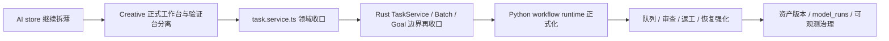

# Monster Workbench 架构模块执行清单

> 生成日期：2026-06-11
> 用途：把现有架构分析与升级路线图，进一步收敛为模块级执行清单
> 依据：当前工作区代码优先，其次参考 `docs/architecture-current-state.md`、`docs/architecture-upgrade-baseline.md`、`docs/architecture-upgrade-roadmap.md`

---

## 1. 这份清单怎么用

这份文档不是“未来愿景图”，而是用于回答下面 4 个执行问题：

1. 现在每个关键模块的真实状态是什么。
2. 每个模块下一步应该往哪里收。
3. 哪些模块可以并行推进，哪些必须串行。
4. 每一步的最小验收标准是什么。

建议把它作为：

- 架构评审会的模块议程
- 拆分 issue / 里程碑的底稿
- Goal 模式继续推进时的执行对照表

---

## 2. 当前代码事实优先级说明

`docs/architecture-current-state.md` 中既有主文说明，也有多段 2026-06-11 补充记录。当前代码已经继续向前推进，因此执行时应遵守下面的判定顺序：

1. 当前代码事实优先
2. `docs/architecture-current-state.md` 的补充段落次之
3. 旧的历史描述只作为演进背景，不作为当前事实

当前最关键的“代码事实”有两条：

1. `/creative` 页面已经不再依赖 `useTaskStore`
   - 当前由 `useCreativeTaskStore`、`useCreativeAssetStore`、`useCreativeGoalStore`、`useCreativeBatchStore`、`useCreativeProjectStore` 组合驱动
2. `src/stores/ai.ts` 已经把 provider/config/model/active ids 委托给 `src/stores/ai-provider.ts`
   - 但会话、图片、队列、发送流程仍留在 `ai.ts`

这意味着：

```text
Creative 域拆分已经进入“后续硬化阶段”
AI 域拆分仍处于“继续抽离中心职责阶段”
```

---

## 3. 模块级现状总览

| 模块 | 当前事实 | 当前问题 | 下一步目标 | 优先级 |
|---|---|---|---|---|
| `src/stores/ai.ts` | 已移出 provider/config/model | 仍承载 session/image/queue/send/export | 继续拆为 session / image / queue / facade | P0 |
| `src/stores/ai-provider.ts` | 已正式承接 provider 配置与 active ids | 仍主要是配置域，尚未直接成为 UI 主入口 | 保持稳定配置中枢 | P0 |
| `src/views/creative/components/CreativeWorkflowDemo.vue` | 已组合多个独立 creative store | 仍是综合 Demo 台 | 分离正式工作台与验证台 | P0 |
| `src/services/task.service.ts` | 仍是 Creative 域前端总入口 | 承担 task/asset/goal/batch/workflow/event | 逐步按领域拆 service facade | P1 |
| `src-tauri/src/services/task_service.rs` | 承担 task/asset/event/workflow | 后续容易继续膨胀 | 收敛为任务本体与事件中枢 | P1 |
| `src-tauri/src/services/batch_job_service.rs` | 已承担 batch 监督与 worker | 仍偏 demo/production 过渡态 | 补恢复、失败分类、统计治理 | P1 |
| `src-tauri/src/services/goal_service.rs` | 已承担 goal fan-out stub | 仍是 stub 级编排 | 补正式状态机、merge/review | P2 |
| `src-tauri/src/services/sidecar_lifecycle_service.rs` | 已有常驻 sidecar lifecycle | 仍是 stub runtime | 正式化任务协议与健康治理 | P1 |
| `src-tauri/src/services/worker_queue_service.rs` | 已有 claim/cancel/checkpoint/recover 骨架 | 执行语义仍偏骨架 | 补完整 cancel/retry/recover 语义 | P2 |
| `src-tauri/src/infra/creative_db.rs` 及相关 repo | 已具备 creative 核心表与 repo 雏形 | 仍有进一步按 repo 细化与迁移治理空间 | 补正式 migration / provenance / versioning | P2 |

---

## 4. 前端模块执行清单

## 4.1 AI 域

### 模块：`src/stores/ai.ts`

#### 当前职责

1. chat/image sessions
2. 图片请求与轮询
3. provider test queue 状态与轮询
4. 聊天发送 / 生图发送
5. 导出与本地恢复

#### 已完成的前置拆分

1. `ai-provider.ts`
   - provider config
   - model configs
   - selected config
   - active chat/image config ids
2. `ai-prompt-library.ts`
   - prompt library

#### 下一步建议拆分

1. `ai-session.store.ts`
   - chat/image session 生命周期
   - create/select/rename/delete/duplicate
2. `ai-generation.store.ts`
   - sendChat / sendImage / timeout / recovery
3. `ai-queue.store.ts`
   - provider test queue / polling / cancel / reconcile
4. `ai.ts`
   - 保留兼容 facade

#### 最小验收标准

1. `AiProviderPanel`、`AiChatPanel`、`AiImagePanel` 不需要一次性大改。
2. `ai.ts` 不再同时拥有 session、generation、queue 三大域的完整状态。
3. `typecheck` 和 `check:architecture` 继续通过。

---

### 模块：`src/views/ai/components/*`

#### 当前事实

当前面板仍主要通过 `useAiStore` 获取统一门面能力。

#### 推荐策略

短期保持面板不直接依赖多个新 store，由 `useAiStore` 继续承担兼容外观。

#### 何时再动 UI

只有当：

1. session
2. generation
3. queue

三块边界都已经稳定后，再考虑面板层的直接分域接线。

---

## 4.2 Creative 域

### 模块：`src/views/creative/components/CreativeWorkflowDemo.vue`

#### 当前事实

当前它已经不再依赖 `useTaskStore`，而是组合：

1. `useCreativeTaskStore`
2. `useCreativeAssetStore`
3. `useCreativeGoalStore`
4. `useCreativeBatchStore`
5. `useCreativeProjectStore`

#### 当前问题

虽然 store 已经拆了，但页面仍然是综合入口，继续承载：

1. prompt workflow
2. review workflow
3. domain asset draft
4. goal fan-out
5. batch mock/prompt/real-image
6. project history/index

#### 下一步目标

把它从“综合调试台”收敛为两类入口：

1. 正式工作台
   - Project
   - Task
   - Asset
   - Goal
   - Batch
2. 验证工作台
   - workflow smoke test
   - batch regression
   - sidecar / event / queue 验收

#### 最小验收标准

1. 正式业务入口不再默认展示全部 demo 能力。
2. demo 验证入口仍能复用现有 store 与 service。
3. 页面拆分不破坏现有 creative workflow 骨架。

---

### 模块：`src/stores/creative-*.ts`

#### 当前事实

当前 Creative 域已经按主要业务对象拆出：

1. `creative-project`
2. `creative-task`
3. `creative-asset`
4. `creative-goal`
5. `creative-batch`
6. `background-task`

#### 当前判断

这一层的主要任务已经不是“继续从 `useTaskStore` 抽离”，而是：

1. 补领域边界命名
2. 补页面组织方式
3. 补前后端 service 对齐

#### 推荐动作

短期不要重新合并，不要为了“少文件”回收拆分成果。

---

## 5. 前端服务层执行清单

## 5.1 模块：`src/services/task.service.ts`

#### 当前事实

它当前既承担：

1. task CRUD
2. asset CRUD
3. goal
4. batch
5. workflow
6. event listener

#### 问题

它已经是 Creative 域的前端总入口，继续扩张会导致所有功能都改同一个文件。

#### 推荐收口顺序

1. 第一阶段：保持对外 contract 不变，内部按区域分段整理
2. 第二阶段：抽出子 facade
   - `creative-task.service.ts`
   - `creative-asset.service.ts`
   - `creative-goal.service.ts`
   - `creative-batch.service.ts`
   - `creative-workflow.service.ts`
3. 第三阶段：仅在调用方稳定后，再考虑大规模重命名

#### 最小验收标准

1. 新增 workflow 不再默认继续挂进 `task.service.ts` 大入口。
2. 事件监听和 CRUD 能力边界更清楚。
3. 浏览器 mock 契约同步更新，不出现双轨分叉。

---

### 模块：`src/services/tauri.mock.ts`

#### 当前事实

它已经承载 AI 队列、creative task、batch job、event 等 mock。

#### 问题

随着真实链路复杂化，mock 与真实事件结构的漂移风险会上升。

#### 推荐动作

每次拆 service 或补事件语义时，同步审查：

1. event name
2. payload shape
3. status transition
4. failure shape

#### 最小验收标准

浏览器验证流程与真实 Tauri 链路，在事件语义上不出现明显偏差。

---

## 6. Rust 控制面执行清单

## 6.1 模块：`src-tauri/src/services/task_service.rs`

#### 当前事实

当前承担：

1. creative task
2. creative asset
3. task event
4. prompt workflow
5. review stub workflow

#### 问题

如果继续向里叠加审查、返工、资产入库、一致性分析，会变成后端 Creative 总管。

#### 推荐目标

让它更聚焦：

1. task 本体
2. task event
3. workflow 结果落库入口

把更复杂的创作业务规则逐步外移。

#### 推荐外移方向

1. review / revise 规则
2. generation workflow 细节
3. 更复杂的资产构建逻辑

应逐步转向：

- `GoalService`
- `BatchJobService`
- Python workflow runtime

---

## 6.2 模块：`src-tauri/src/services/batch_job_service.rs`

#### 当前事实

已经承担：

1. batch 创建
2. start / pause / resume / cancel
3. mock / prompt / image worker
4. supervisor

#### 下一步重点

1. 失败分类
2. retry 语义
3. cancel checkpoint
4. interrupted recovery
5. batch stats 增量一致性

#### 最小验收标准

批量任务不只是“能跑完”，还要“能暂停、能恢复、能解释失败”。

---

## 6.3 模块：`src-tauri/src/services/goal_service.rs`

#### 当前事实

当前是 goal fan-out stub，已经有：

1. goal
2. role
3. task fan-out
4. merge/review draft task

#### 下一步重点

1. 明确 goal 状态机
2. 明确 merge/review 的正式状态
3. 明确 budget / stop / manual approval 行为

#### 当前建议

在队列恢复、review/revise 闭环没稳定前，不建议让 goal 复杂度进一步快速膨胀。

---

## 6.4 模块：`src-tauri/src/services/sidecar_lifecycle_service.rs`

#### 当前事实

已经承载：

1. sidecar 启停
2. health check
3. runtime token
4. prompt workflow 请求转发

#### 当前问题

它已经是 Python runtime 的桌面入口，但 Python 本身仍然是 stub 级运行面。

#### 下一步重点

1. 任务协议版本化
2. sidecar 错误 / 业务错误分层
3. 请求超时与取消的统一语义
4. workflow 提交协议收敛

#### 最小验收标准

Rust 仍是 Vue 的唯一入口，Python 不直接暴露给前端。

---

## 6.5 模块：`src-tauri/src/services/worker_queue_service.rs`

#### 当前事实

已有：

1. claim
2. cancel
3. checkpoint
4. recovery

#### 下一步重点

1. 与 batch worker 的语义统一
2. 与 review/revise worker 的语义统一
3. startup recovery 规则正式化

#### 当前定位

它仍应是基础执行骨架，不应提前膨胀为远程分布式调度系统。

---

## 7. 数据与 repo 执行清单

## 7.1 模块：`src-tauri/src/infra/creative_db.rs` 及相关 repo

#### 当前事实

当前已经存在：

1. `creative_task_repo.rs`
2. `creative_asset_repo.rs`
3. `creative_batch_repo.rs`
4. `creative_goal_repo.rs`
5. `creative_model_run_repo.rs`
6. `creative_project_repo.rs`
7. `creative_db_support.rs`
8. `creative_db_schema.rs`

#### 当前判断

Creative DB 已经从“一个大文件硬扛全部逻辑”进入 repo 化阶段。

#### 下一步重点

1. migration 治理正式化
2. provenance / versioning 治理
3. 旧库兼容验证
4. 破坏性变更审批与备份策略

#### 最小验收标准

新增资产类型、batch 类型、goal 扩展时，不需要继续把所有 schema 逻辑堆回单点文件。

---

## 8. 串行与并行关系

## 8.1 可以并行推进的事项

1. `ai.ts` 继续拆薄
2. Creative 页面正式入口 / 验证入口信息架构设计
3. `task.service.ts` 的领域切分设计稿
4. Python runtime 协议草案

这些事项可以并行，因为它们主要是不同层的收口设计。

## 8.2 建议串行推进的事项

1. Creative 正式工作台页面重组
2. `task.service.ts` 实际拆 service facade
3. Rust `TaskService` 与 workflow 边界再收口
4. Python runtime 正式替换更多 stub 任务

这些事项建议串行，因为前一个阶段的边界会影响后一个阶段的 contract。

### 串行依赖图



---

## 9. 推荐拆成的执行包

## 执行包 A：AI Store 拆分

覆盖：

1. `src/stores/ai.ts`
2. `src/stores/ai-provider.ts`
3. `src/views/ai/components/*`

完成定义：

AI 域剩余厚职责被拆成 session / image / queue，`useAiStore` 只保留兼容 facade。

## 执行包 B：Creative 页面正式化

覆盖：

1. `src/views/creative/CreativePage.vue`
2. `src/views/creative/components/CreativeWorkflowDemo.vue`
3. `src/stores/creative-*.ts`

完成定义：

`/creative` 正式入口与验证入口分离。

## 执行包 C：Creative 前端服务域化

覆盖：

1. `src/services/task.service.ts`
2. `src/services/tauri.mock.ts`
3. 对应 creative store 调用方

完成定义：

task / asset / goal / batch / workflow 前端 facade 边界清晰。

## 执行包 D：Rust 服务边界收口

覆盖：

1. `task_service.rs`
2. `batch_job_service.rs`
3. `goal_service.rs`
4. `sidecar_lifecycle_service.rs`
5. `worker_queue_service.rs`

完成定义：

Rust 服务按任务本体、批量监督、目标编排、sidecar 生命周期、队列骨架分工更清楚。

## 执行包 E：Python Runtime 正式化

覆盖：

1. `creative_health_server.py`
2. Rust sidecar bridge
3. workflow 协议

完成定义：

至少一个真实 workflow 在正式 runtime 协议下稳定运行。

---

## 10. 每轮推进时都要复核的验收点

1. 是否仍遵守 `Vue -> Store -> Service -> Rust -> Infra / Sidecar`
2. 是否引入了新的中心节点
3. 是否让浏览器 mock 和真实链路出现契约漂移
4. 是否扩大了页面对底层能力的感知
5. 是否让日志、路径、图片、token 这些安全边界变弱

只要某一步让这 5 条中的任意 2 条变差，就应该暂停继续堆功能。

---

## 11. 一句话执行建议

**现在最值得做的不是再增加新功能，而是把已经拆开的 Creative 域继续正式化，同时把 AI 域剩余的厚门面拆完，给 Python workflow runtime 留出稳定的承接面。**
