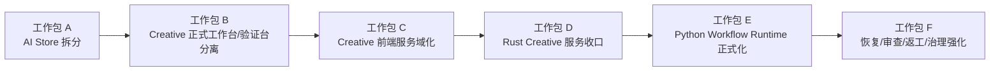

# Monster Workbench 架构评审议程与工作包

> 生成日期：2026-06-11
> 用途：把现有架构材料转成可直接用于评审、排期、拆 issue、做阶段验收的执行包
> 依赖文档：`docs/architecture-current-state.md`、`docs/architecture-upgrade-baseline.md`、`docs/architecture-upgrade-roadmap.md`、`docs/architecture-module-execution-checklist.md`

---

## 1. 这份文档解决什么问题

前面的几份文档已经回答了：

1. 当前架构是什么
2. 升级顺序是什么
3. 各模块该往哪里收

这份文档继续往下一步走，回答的是：

1. 评审会该怎么开
2. 应该拆成哪几个工作包
3. 每个工作包要避免什么扩散
4. 每个阶段什么算验收通过

---

## 2. 推荐评审议程

建议把 post-goal architecture hardening 评审拆成 3 场，而不是一次长会全部讲完。

## 2.1 评审一：边界与优先级确认

### 目标

统一“不动什么”和“先动什么”。

### 建议时长

60-90 分钟

### 议程

1. 当前稳定红线确认
   - `Vue -> Store -> Service -> Rust -> Infra / Sidecar`
   - 前端不直连 SQLite / 文件 / Python localhost
   - Rust 继续作为桌面控制面
2. 当前 P0 确认
   - `src/stores/ai.ts` 继续拆薄
   - `CreativeWorkflowDemo.vue` 正式工作台与验证台分离
3. 当前 P1 确认
   - `task.service.ts` / Rust `TaskService` 继续领域收口
   - Python workflow runtime 正式化时点
4. 当前不优先事项确认
   - 不提前引 Redis / 远程 worker
   - 不让 Vue 直连 Python
   - 不继续往 `ai.ts` / `CreativeWorkflowDemo.vue` 堆功能

### 会议产出

1. 一个确认过的 P0 / P1 列表
2. 一个确认过的非目标列表
3. 一个确认过的阶段顺序

---

## 2.2 评审二：模块收口与工作包确认

### 目标

确认每个工作包的边界、文件范围、非目标和依赖关系。

### 建议时长

90 分钟

### 议程

1. AI 域工作包
   - `ai-provider`
   - `ai-session`
   - `ai-generation`
   - `ai-queue`
   - `useAiStore` facade
2. Creative UI 工作包
   - 正式入口
   - 验证入口
   - `CreativeWorkflowDemo.vue` 收口
3. Creative 前端服务工作包
   - `task.service.ts` 的领域切分
4. Rust 服务工作包
   - `TaskService`
   - `BatchJobService`
   - `GoalService`
   - `SidecarLifecycleService`
   - `WorkerQueueService`
5. 数据与协议工作包
   - migration
   - runtime 协议
   - review / revise / recover 语义

### 会议产出

1. 工作包清单
2. 每个工作包的 owner
3. 串行 / 并行依赖图

---

## 2.3 评审三：阶段验收与回归门禁确认

### 目标

统一“做到什么程度算过关”。

### 建议时长

60 分钟

### 议程

1. 每个工作包的最小验收标准
2. 需要跑哪些命令
3. 哪些功能必须做真实桌面回归
4. mock 与真实链路一致性怎么复核

### 会议产出

1. 阶段验收表
2. 回归门禁表
3. 风险升级条件

---

## 3. 推荐工作包拆分

## 工作包 A：AI Store 第二轮拆分

### 范围

- `src/stores/ai.ts`
- `src/stores/ai-provider.ts`
- `src/stores/ai-prompt-library.ts`
- `src/views/ai/components/*`

### 目标

把 `ai.ts` 中剩余的厚职责拆成：

1. session
2. generation
3. queue
4. facade

### 非目标

1. 不先重做 AI 页面 UI
2. 不先改 Provider 测试链路协议
3. 不让面板直接依赖多个新 store

### 最小验收标准

1. `ai.ts` 不再同时持有 session / generation / queue 三大域完整状态
2. `AiProviderPanel`、`AiChatPanel`、`AiImagePanel` 继续可用
3. `npm run typecheck`
4. `npm run check:architecture`

### 风险点

1. session 持久化与恢复回归
2. image 轮询与 timeout 回归
3. queue cancel / status reconcile 回归

---

## 工作包 B：Creative 正式工作台与验证台分离

### 范围

- `src/views/creative/CreativePage.vue`
- `src/views/creative/components/CreativeWorkflowDemo.vue`
- `src/stores/creative-*.ts`

### 目标

把 `/creative` 从综合演示页收敛成：

1. 正式业务入口
2. 验证 / 回归入口

### 非目标

1. 不重写已有 creative store
2. 不在这一包里重做所有 workflow
3. 不在这一包里改 Python 协议

### 最小验收标准

1. 正式入口不再默认暴露全部 demo 能力
2. 验证入口仍能跑现有 prompt / review / goal / batch 链路
3. 现有 creative store 保持可复用
4. `npm run typecheck`

### 风险点

1. 页面重组时误伤现有验证能力
2. 验证入口消失后影响回归效率

---

## 工作包 C：Creative 前端服务域化

### 范围

- `src/services/task.service.ts`
- `src/services/tauri.mock.ts`
- Creative 相关 store 调用点

### 目标

把前端 Creative 能力从单一大 service 入口继续按领域收口。

### 建议拆分方向

1. `creative-task.service.ts`
2. `creative-asset.service.ts`
3. `creative-goal.service.ts`
4. `creative-batch.service.ts`
5. `creative-workflow.service.ts`

### 非目标

1. 不一次性重命名全部调用方
2. 不在这一包里处理 Rust service 全部重构

### 最小验收标准

1. 新增 workflow 不再默认挂进 `task.service.ts`
2. event listener、CRUD、workflow contract 边界更清楚
3. mock 事件语义同步更新
4. `npm run typecheck`
5. `npm run check:architecture`

### 风险点

1. mock 与真实事件结构漂移
2. facade 拆分过程中调用方兼容断裂

---

## 工作包 D：Rust Creative 服务收口

### 范围

- `src-tauri/src/services/task_service.rs`
- `src-tauri/src/services/batch_job_service.rs`
- `src-tauri/src/services/goal_service.rs`
- `src-tauri/src/services/sidecar_lifecycle_service.rs`
- `src-tauri/src/services/worker_queue_service.rs`

### 目标

让 Rust 控制面的服务边界更贴近正式职责，而不是继续向总管式中心节点膨胀。

### 非目标

1. 不把复杂创作业务逻辑全部留在 Rust
2. 不提前做分布式调度

### 最小验收标准

1. `TaskService` 更聚焦 task 本体与事件
2. `BatchJobService` 更聚焦批量执行监督
3. `GoalService` 更聚焦 fan-out / merge / status
4. `SidecarLifecycleService` 更聚焦生命周期与任务提交桥接
5. `WorkerQueueService` 更聚焦 claim/cancel/checkpoint/recover 语义
6. Rust 编译与相关回归通过

### 推荐验证

1. `cargo check`
2. 与 creative / batch / queue 相关的 Rust 测试
3. 必要时 `npm run tauri:build:no-bundle`

---

## 工作包 E：Python Workflow Runtime 正式化

### 范围

- `creative_health_server.py`
- Rust sidecar bridge
- workflow task protocol

### 目标

把 sidecar 从 health stub 推进到正式 workflow runtime。

### 非目标

1. 不让 Vue 直接访问 Python
2. 不把所有 workflow 一次性迁入 Python
3. 不在 runtime 未稳定前就引更复杂部署方案

### 最小验收标准

1. 有稳定任务协议
2. 有错误分层
3. 有 timeout / cancel / token / health 语义
4. 至少一个真实 workflow 稳定运行

### 风险点

1. 过早冻结协议导致后续返工
2. Rust / Python 职责边界模糊

---

## 工作包 F：恢复、审查、返工与治理强化

### 范围

- `worker_queue`
- `batch`
- `review / revise`
- `model_runs`
- `asset provenance`

### 目标

把“能演示”推进到“能长期运行”。

### 最小验收标准

1. cancel 语义统一
2. retry 语义统一
3. recovery 语义统一
4. review -> revise -> manual approval 闭环更完整
5. batch 失败分类可解释
6. asset / model run 记录可追踪

---

## 4. 推荐串并行关系

## 4.1 可并行

1. 工作包 A：AI Store 拆分
2. 工作包 B：Creative 正式入口与验证入口信息架构设计
3. 工作包 C：Creative 前端 service 域化设计稿
4. 工作包 E：Python runtime 协议草案

## 4.2 建议串行

1. 工作包 B 实际页面重组
2. 工作包 C 实际 service 拆分
3. 工作包 D Rust 服务边界再收口
4. 工作包 E 正式 runtime 落地
5. 工作包 F 恢复 / 审查 / 返工 / 治理强化

### 依赖图



---

## 5. 阶段验收表

| 阶段 | 通过条件 | 必跑命令 | 建议回归 |
|---|---|---|---|
| 阶段 A：AI 拆分 | `ai.ts` 只保留兼容 facade，面板仍可用 | `npm run typecheck` `npm run check:architecture` | AI 配置、聊天、生图、队列取消 |
| 阶段 B：Creative 页面正式化 | 正式入口与验证入口分离，验证台仍能跑链路 | `npm run typecheck` | prompt/review/goal/batch UI 流程 |
| 阶段 C：前端服务域化 | `task.service.ts` 不再继续成为大入口 | `npm run typecheck` `npm run check:architecture` | 浏览器 mock 与真实 contract 对照 |
| 阶段 D：Rust 服务收口 | 服务职责更清晰，Rust 编译与核心测试通过 | `cargo check` | creative / batch / queue 相关链路 |
| 阶段 E：Python runtime 正式化 | 至少一个真实 workflow 稳定运行 | `cargo check` `npm run typecheck` | sidecar 启停、health、cancel、timeout |
| 阶段 F：治理强化 | 恢复、审查、返工、资产追踪闭环更完整 | 按影响面组合运行 | batch 恢复、review/revise、model run 追踪 |

---

## 6. Issue 拆分模板

建议每个架构工作包拆 issue 时至少带上下面 6 项。

## 模板

### 标题

`架构：<模块/领域> <动作>`

示例：

- `架构：继续拆分 AI store 的 session 与 queue`
- `架构：分离 Creative 正式工作台与验证台`

### 必填字段

1. 背景
2. 当前问题
3. 范围
4. 非目标
5. 验收标准
6. 回归要求

### 建议正文结构

```md
## 背景

## 当前问题

## 本次范围

## 非目标

## 验收标准

## 回归要求

## 风险与回滚点
```

---

## 7. 风险升级条件

如果出现下面任一情况，应暂停继续堆功能，先回到架构评审：

1. 新增功能又要回到 `ai.ts` 或 `CreativeWorkflowDemo.vue`
2. 新增 workflow 继续默认挂进 `task.service.ts`
3. Vue 页面开始直接感知 Python runtime 细节
4. mock 与真实事件 contract 出现明显偏差
5. Rust service 职责再次向单点膨胀
6. 资产版本或 model run 记录无法支撑追踪

---

## 8. 一句话使用建议

**先用这份文档开评审确认工作包，再按工作包拆 issue 和排期，比直接进入实现更不容易返工。**
