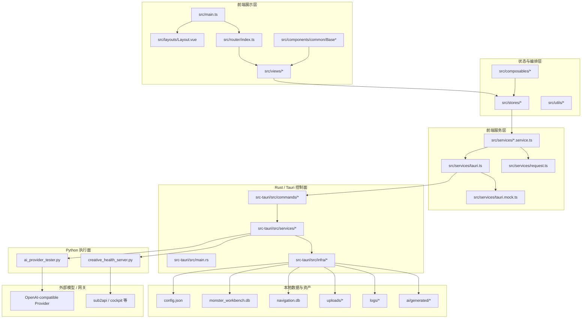
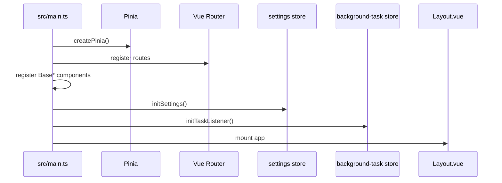
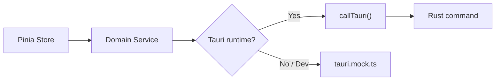
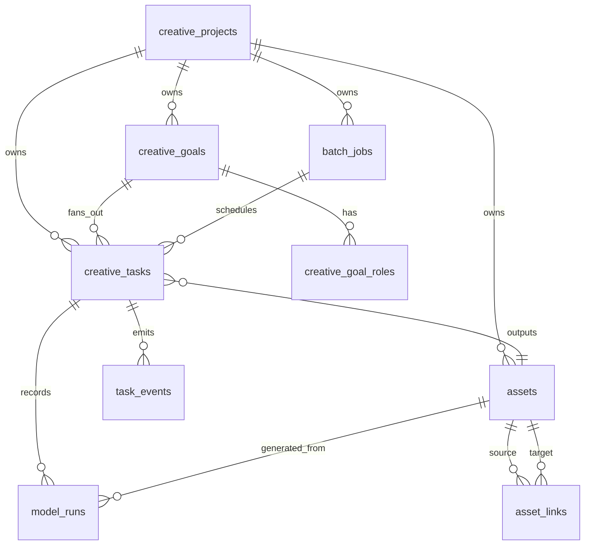
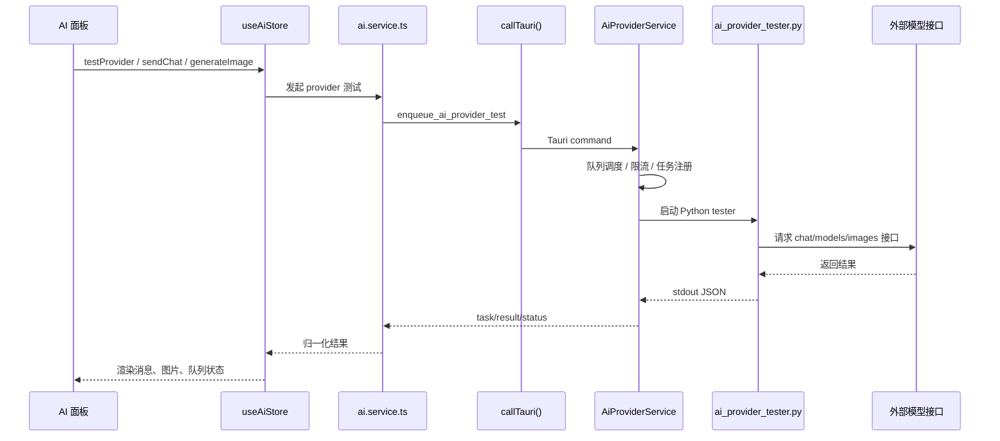
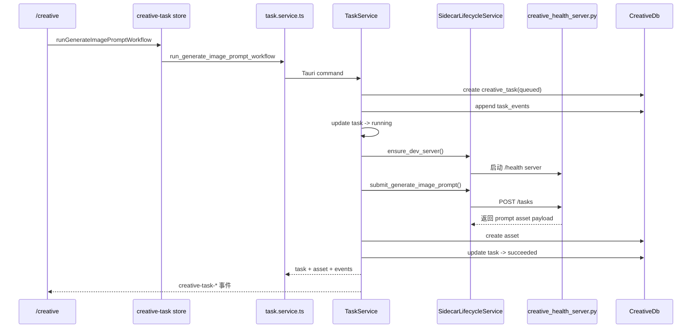
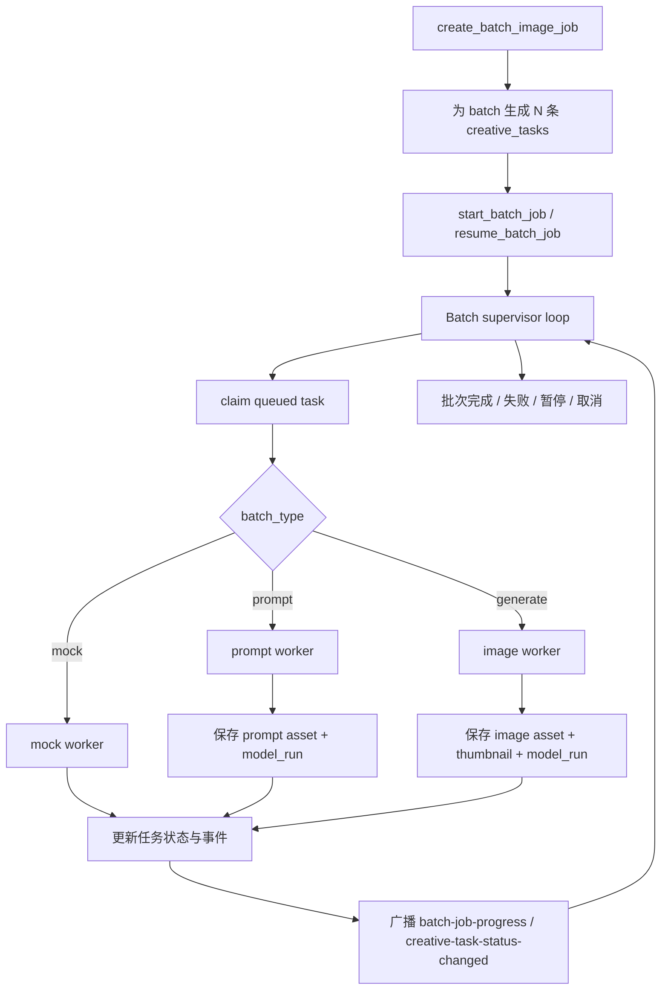
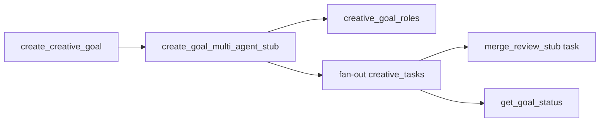

# Monster Workbench 架构升级基线说明

> 生成日期：2026-06-11
> 适用场景：架构升级、业务调整、领域拆分、运行边界梳理
> 分析依据：当前工作区代码、`AGENTS.md`、`docs/architecture.md`、`docs/architecture-current-state.md`、`docs/ai/*`

## 1. 文档目的

这份说明不是实现设计稿，而是当前项目的“现状架构底图”。它回答四个问题：

1. 当前项目的分层到底是怎么落地的。
2. 真正的核心架构轴线是什么。
3. AI 与 Creative 两条主业务链路目前各自如何运行。
4. 未来如果做架构升级或业务调整，哪些地方可以动，哪些地方不能乱动。

---

## 2. 一页结论

`monster-workbench` 当前不是一个普通的“前端页面 + Tauri 壳”项目，而是一套已经开始向“本地优先的持续型 AI 创作工作台”演进的桌面系统。

它的稳定主链路已经比较明确：

```text
Vue Component / Page
-> Pinia Store
-> Frontend Service
-> callTauri() / request.ts
-> Rust Command
-> Rust Service
-> Infra / SQLite / File / Python Sidecar
```

当前真正决定系统形态的，不是页面目录，而是下面 5 个运行轴：

1. `UI 交互轴`：Vue 页面、基础组件、布局、路由。
2. `状态编排轴`：Pinia Store，把页面操作翻译为业务动作。
3. `能力网关轴`：前端 Service，把 IPC、HTTP、Mock、桌面能力统一收口。
4. `桌面控制轴`：Rust/Tauri，承接权限、命令、事件、数据库、文件、sidecar 生命周期。
5. `创作执行轴`：Creative Task / Goal / Batch / Asset / Model Run / Worker Queue / Python Sidecar。

这套架构的优点是边界意识已经很强，升级空间也大；它的短板是“AI 域和 Creative 域还存在几个过厚的中心节点”，所以后续升级最重要的不是重写，而是继续按领域拆分。

---

## 3. 总体架构图



---

## 4. 技术栈与运行形态

### 4.1 前端

- `Vue 3`
- `Pinia`
- `Vue Router`
- `Vite`
- `TailwindCSS`
- `Element Plus`
- 大量 `Base*` 自定义基础组件

### 4.2 桌面层

- `Tauri v2`
- 使用原生插件：
  - `@tauri-apps/plugin-dialog`
  - `@tauri-apps/plugin-opener`
  - `@tauri-apps/plugin-process`
  - `@tauri-apps/plugin-updater`

### 4.3 后端控制面

- `Rust`
- `rusqlite`
- 通过 `#[tauri::command]` 暴露 IPC 能力

### 4.4 Python 执行面

- `ai_provider_tester.py`：Provider 测试脚本
- `creative_health_server.py`：Creative sidecar stub

### 4.5 双运行面

项目不是单一 Tauri 运行时，而是“双运行面”：

1. `桌面真实运行面`
   - 前端通过 `callTauri()` 调 Rust
   - Rust 管真实文件、数据库、进程、sidecar

2. `浏览器开发运行面`
   - 前端仍走同样的 service contract
   - `src/services/tauri.mock.ts` 提供 Browser Mock

这意味着它不是“浏览器版”和“桌面版”两套系统，而是“一套 contract，两个运行面”。

---

## 5. 前端分层

## 5.1 启动层

核心文件：

- `src/main.ts`
- `src/App.vue`
- `src/layouts/Layout.vue`
- `src/router/index.ts`

职责分配：

- `main.ts`
  - 创建 Vue 应用
  - 注册 Pinia 和 Router
  - 注册全局 Base 组件
  - 初始化错误处理
  - 初始化设置
  - 初始化后台任务监听

- `App.vue`
  - 只挂载 `Layout`

- `Layout.vue`
  - 统一承接侧边栏、顶部栏、内容区、更新弹窗、全局 Toast、全局 Message、确认框、全局 Loading

- `router/index.ts`
  - 使用 `hash history`
  - 所有页面懒加载

### 启动流程图



## 5.2 页面层

当前页面模块大致可以分成三类。

### A. 核心业务页

- `/ai`
- `/creative`
- `/navigation`
- `/file-manager`

### B. 系统与平台页

- `/workspace`
- `/system`
- `/settings`
- `/tools`

### C. 研发与辅助页

- `/playground`
- `/utils-docs`
- 错误页 `403/404/500`

页面层的规则执行得比较统一：

- 页面只装配 store 和本页组件
- 页面不直接调 `invoke()`
- 页面不直接调 `fetch()`
- 页面不直接导入 `src/services/*`

这对后续业务调整是非常有利的，因为 UI 可以改，交互可以换，但底层 contract 不会轻易散掉。

## 5.3 组件层

组件层分成两种：

1. `src/components/common/Base*`
   - 平台级基础组件
   - 承担按钮、表单、弹窗、布局、加载、数据态等能力

2. `src/views/<module>/components/*`
   - 页面私有组件
   - 只服务单一业务页

这意味着当前前端已经具备“业务组件”和“设计系统组件”分层的雏形。

---

## 6. 前端状态层

Store 是当前前端的真正业务编排中心。

### 6.1 通用平台 Store

- `app`
- `settings`
- `update`
- `system`
- `window`
- `error-monitor`
- `native-event`
- `background-task`

这些 store 承担的是平台能力，而不是业务领域。

### 6.2 业务域 Store

#### AI 域

- `src/stores/ai.ts`

当前它仍是一个超大 store，聚合了：

- Provider 配置
- Model 配置
- Chat Session
- Image Session
- Prompt Library
- 测试队列
- 后端队列状态
- 聊天发送
- 生图请求
- 导出与取消

这说明 AI 域虽然功能闭环很强，但领域边界尚未拆开。

#### Creative 域

Creative 域已经开始从“大总管 store”往领域化拆分：

- `creative-project`
- `creative-task`
- `creative-asset`
- `creative-goal`
- `creative-batch`

这是一条非常重要的信号：项目已经从“先跑通工作台”进入“开始做架构硬化”阶段。

### 6.3 当前 Store 层的结构性判断

当前 Store 层分成三种成熟度：

1. `成熟且职责清晰`
   - `settings`
   - `update`
   - `background-task`
   - `creative-goal`
   - `creative-project`

2. `基本清晰，但仍是中等复杂`
   - `file-manager`
   - `navigation`
   - `tools`
   - `creative-task`
   - `creative-batch`
   - `creative-asset`

3. `明显过厚，后续应继续拆分`
   - `ai.ts`

---

## 7. 前端服务层

前端服务层是当前架构最关键的护城河之一。

## 7.1 `src/services/tauri.ts`

这是唯一 IPC 网关。

职责：

- 在 Tauri 运行时调用 `invoke()`
- 在浏览器开发态切到 `tauri.mock.ts`
- 统一处理 IPC 错误
- 统一暴露 `listen`、`convertFileSrc`、`getCurrentWebviewWindow`、`getVersion`

这个文件的价值在于：它把“桌面能力是不是存在”从业务代码里剥离了出去。

## 7.2 `src/services/request.ts`

这是唯一 HTTP 网关。

职责：

- 包装 `fetch()`
- 统一 timeout
- 统一 query 拼接
- 统一 JSON/text 解析
- 统一错误结构

## 7.3 模块服务

按业务分成：

- `ai.service.ts`
- `task.service.ts`
- `creative-project.service.ts`
- `navigation.service.ts`
- `file-manager.service.ts`
- `system.service.ts`
- `database.service.ts`
- `config.service.ts`
- `updater.service.ts`

它们的共同模式是：

```text
Store 只表达业务动作
Service 才知道应该调用哪个 command、哪个 runtime、哪个 mock
```

### Service 边界图



---

## 8. Rust / Tauri 控制面

## 8.1 `src-tauri/src/main.rs`

这是桌面控制面的总入口。

它负责：

- 创建主窗口
- 使用 `WebviewUrl::App("index.html".into())` 加载前端
- 注册 Tauri 插件
- 初始化 `PathProvider`
- 初始化 runtime schema
- 创建系统托盘
- 注入所有 Rust Service
- 注册所有 IPC commands
- 处理关闭窗口时“隐藏而不是退出”的行为

### 当前注入的核心服务

- `AppService`
- `ConfigService`
- `CreativeProjectService`
- `FileService`
- `TaskService`
- `AuthService`
- `BatchJobService`
- `DatabaseService`
- `GoalService`
- `LogService`
- `SystemService`
- `NavigationService`
- `AiProviderService`
- `SidecarLifecycleService`
- `WorkerQueueService`

## 8.2 Command 层

当前 command 已按领域拆分：

- `app`
- `auth`
- `config`
- `creative_batch`
- `creative_goal`
- `creative_project`
- `creative_sidecar`
- `creative_task`
- `database`
- `file`
- `navigation`
- `system`
- `updater`
- `worker_queue`
- `ai`

这比早期把很多 creative 能力塞在 `database` 命名空间里要健康得多。

## 8.3 Service 层

Rust Service 是真正的业务控制面。

### 平台型 Service

- `AppService`
- `ConfigService`
- `DatabaseService`
- `SystemService`
- `FileService`
- `NavigationService`
- `LogService`
- `AuthService`

### AI/Creative 型 Service

- `AiProviderService`
- `TaskService`
- `GoalService`
- `BatchJobService`
- `SidecarLifecycleService`
- `WorkerQueueService`
- `CreativeProjectService`

### 当前最重的几个节点

从当前代码体量和职责密度看，后端的几个高压点很清楚：

1. `ai_service.rs`
2. `batch_job_service.rs`
3. `task_service.rs`

它们是后续演进时最需要注意“继续变厚”的地方。

---

## 9. Infra 与本地数据架构

## 9.1 路径与本地目录

`PathProvider` 统一决定：

- 应用本地根目录
- 主数据库路径
- 兼容 roaming/local 路径迁移

当前系统围绕本地目录工作，体现的是“本地优先”而不是“服务端优先”。

## 9.2 主数据库

主库：`monster_workbench.db`

当前 creative schema 由 migration 管理，核心表包括：

- `schema_migrations`
- `creative_projects`
- `creative_tasks`
- `creative_goals`
- `creative_goal_roles`
- `batch_jobs`
- `task_events`
- `model_runs`
- `assets`
- `asset_links`

### Creative 数据模型图



## 9.3 导航数据库

独立库：`navigation.db`

这说明当前项目实际上存在“两套数据库职责”：

1. `creative / app 主库`
2. `navigation 独立库`

这对后续拆业务有帮助，但也意味着未来如果做统一迁移治理，需要处理“多库策略”。

## 9.4 文件与资产

本地文件按用途拆分：

- `uploads/images`
- `uploads/files`
- `logs`
- `ai/generated`
- `config.json`

架构上已经遵守一个重要原则：

前端不直驱文件系统，文件操作必须先过 Rust。

---

## 10. AI 子系统架构

AI 子系统当前更像“Provider 工作台”，而不是“正式推理编排平台”。

## 10.1 当前职责

它负责：

- 多 Provider 配置
- 多模型配置
- 对话测试
- 生图测试
- Prompt Library
- 后端测试队列
- 已生成图片结果管理
- 聊天导出

## 10.2 前后端协作关系

### 前端

- `AiPage.vue` 是壳层
- 子面板分成：
  - `AiProviderPanel`
  - `AiChatPanel`
  - `AiImagePanel`
  - `AiPromptPanel`
  - `AiFeaturePanel`

### 状态与服务

- `ai.ts` 管绝大部分 AI 业务状态
- `ai.service.ts` 只暴露 provider test / queue / cancel 等接口

### 后端

- `AiProviderService` 负责：
  - 直接测试 provider
  - 将测试加入队列
  - 查询测试任务
  - 取消任务
  - 生成输出目录
  - 启动 Python tester
  - 管理并发和排队

### Python

- `ai_provider_tester.py` 负责真正的 OpenAI-compatible 接口探测与测试

## 10.3 AI Provider 流程图



## 10.4 AI 子系统的结构判断

优点：

- Provider contract 明确
- 并发与排队已经后移到 Rust
- 图片输出目录、超时、取消等能力已有基础

短板：

- `useAiStore` 过厚
- UI 语义、会话语义、Provider 配置语义、测试队列语义混在一起
- 当前更像“测试工作台”而不是“正式 AI Runtime”

---

## 11. Creative 子系统架构

Creative 是当前项目最重要的升级方向。

它已经具备了持续型创作系统的骨架，但还处在“骨架 + stub + demo + 部分真实能力”混合态。

## 11.1 当前领域对象

Creative 域当前已经形成以下概念：

- `Project`
- `Task`
- `Goal`
- `Goal Role`
- `Batch Job`
- `Asset`
- `Asset Link`
- `Model Run`
- `Worker Queue`
- `Sidecar`

这说明 Creative 不是单点功能，而是一个本地化工作流系统。

## 11.2 TaskService

`TaskService` 是 Creative 的基础执行入口，负责：

- 创建任务
- 查询任务
- 更新任务状态
- 追加 task event
- 创建资产
- 创建资产关系
- 跑 `generate_image_prompt` workflow
- 跑 `review_asset_quality` stub
- 向前端发 `creative-task-*` 事件

它当前扮演的是“轻量工作流编排器”。

## 11.3 GoalService

负责：

- 创建 goal
- 多 agent stub fan-out
- 汇总 goal status
- 停止 goal

本质上它已经在模拟“目标拆解 -> 角色任务扇出 -> 汇总”的创作编排过程。

## 11.4 BatchJobService

这是当前 Creative 域里最复杂的执行器之一。

负责：

- 创建批量任务
- 生成批次下的所有子任务
- 启动/暂停/恢复/取消批次
- supervisor 循环调度
- 并发槽位管理
- 子任务状态推进
- 进度事件广播
- mock / prompt / generate 三种 worker 路径
- 失败预算与自动暂停
- 结果落资产和 model_run

它已经不只是 CRUD，而是一个本地批处理调度器。

## 11.5 WorkerQueueService

负责：

- claim 下一条 queued task
- cancel 请求
- cancel checkpoint 检查
- 启动恢复

这说明队列不只是 UI 概念，已经有明确的任务状态机语义。

## 11.6 SidecarLifecycleService

负责：

- 拉起 Python sidecar
- 端口保留
- token 授权
- 健康检查
- 停止 sidecar
- 提交 `generate_image_prompt` 请求

当前它还不是完整 runtime，但已具备“sidecar 生命周期控制面”的基本形态。

## 11.7 Creative 主流程图

### A. Prompt Workflow



### B. Batch Workflow



### C. Goal Workflow



---

## 12. 事件驱动与状态机

Creative 域并不是纯同步调用，而是“命令 + 状态变更 + 事件广播”的混合模式。

### 12.1 关键事件

- `task-progress`
- `creative-task-created`
- `creative-task-status-changed`
- `creative-task-event`
- `batch-job-created`
- `batch-job-status-changed`
- `batch-job-progress`

### 12.2 状态机

文档中已经定义标准任务状态：

- `draft`
- `queued`
- `running`
- `paused`
- `cancelling`
- `cancelled`
- `succeeded`
- `failed`
- `retrying`
- `blocked`

这对后续升级非常重要，因为任务状态一旦成为公共语义，很多业务调整都要围绕状态机扩展，而不能各自发明状态。

---

## 13. 当前架构的核心优点

1. 分层红线已经落到脚本检查，不只是靠自觉。
2. 前端对 Tauri、HTTP、Mock 的接触点已经收口。
3. Rust 已经承担桌面权限、路径、安全、sidecar 生命周期、事件广播这些该它承担的职责。
4. Creative 域的数据骨架已经成形，不再只是 demo 级内存态。
5. 任务、资产、批量、目标、多 agent stub 之间已经存在统一的本地模型。
6. 浏览器开发态和桌面真实态共享 contract，降低了前端联调门槛。

---

## 14. 当前架构的主要风险点

## 14.1 AI 域仍有巨型中心节点

`src/stores/ai.ts` 仍然过厚。

风险：

- 配置、会话、Prompt、测试队列、图片生成状态耦合
- 小改动容易波及整块 UI
- 后续接正式 AI Runtime 时，现有 store 会很难继续承载

## 14.2 Creative 工作台仍是综合壳

`/creative` 当前虽然 store 已拆分，但 `CreativeWorkflowDemo.vue` 仍承担综合工作台角色。

风险：

- 页面语义仍偏“演示总台”
- 真正业务页边界还不够明确
- 一旦 Creative 域继续扩大，这个页面会先变成 UI 瓶颈

## 14.3 Rust 侧几个 service 已偏厚

尤其是：

- `AiProviderService`
- `BatchJobService`
- `TaskService`

风险：

- 业务编排、存储调用、状态推进、事件广播、外部调用逐渐卷在同一层
- 如果不继续下沉 repo / runtime / executor 边界，后面改动会越来越重

## 14.4 Python sidecar 仍处于 stub 阶段

`creative_health_server.py` 现在本质上是 workflow stub，不是正式 runtime。

风险：

- 当前能证明链路通，但不能证明复杂创作运行时成立
- 一旦上审查、返工、一致性、多 agent 真并发，现有 stub 不够

## 14.5 多库与多资产目录后续需要治理

当前存在：

- 主库
- 导航库
- 上传目录
- 生成目录
- 配置文件

风险：

- 备份、迁移、版本治理、项目归档需要更明确的一致性策略

---

## 15. 面向升级和业务调整的建议抓手

下面不是实现方案，而是“优先观察哪些杠杆点”。

## 15.1 先按领域继续拆，不要按技术重写

最适合继续拆的，不是 Vue、不是 Tauri，而是几个中心领域：

- `AI Provider 配置`
- `AI Session`
- `AI Prompt Library`
- `AI Image Queue`
- `Creative Project`
- `Creative Runtime`
- `Creative Review / Revision`
- `Asset Provenance / Versioning`

## 15.2 把 `/creative` 从综合工作台过渡到正式领域工作台

建议未来把 `/creative` 理解为平台容器，而不是单一巨页。

更稳的方向是：

- 项目视图
- 任务视图
- 资产视图
- Goal 视图
- Batch 视图
- Review / Revision 视图

## 15.3 让 Python 成为真正执行面，但不要让 Vue 直接碰它

正确边界已经很清楚：

```text
Vue -> Frontend Service -> Rust -> Python -> Rust -> Vue Event
```

不要退化成：

```text
Vue -> Python
```

## 15.4 继续强化 migration 与项目域

目前已经有 `schema_migrations`，这很好，但还要继续向下走：

- 项目级归档
- 资产版本
- 数据兼容
- 旧库迁移
- 文件与记录的一致性

## 15.5 把“测试工作台”和“正式业务运行面”慢慢分开

当前 AI 页很像 Provider 调试台，Creative 页很像架构演示台。

这是合理的起点，但后续业务调整时最好区分：

1. `调试/验证面`
2. `正式工作面`

否则用户体验和架构语义会一直纠缠。

---

## 16. 最值得当作升级起点的部位

如果以“尽量小改、收益最大”的角度看，当前最值得作为升级抓手的点是：

1. `src/stores/ai.ts`
   - 继续按 provider / session / image / prompt / queue 拆分

2. `Creative 页面结构`
   - 从综合 demo 页向正式多视图工作台演进

3. `Batch / Task / Review / Revision 的运行时边界`
   - 明确哪些属于 Rust 控制面，哪些属于 Python 执行面

4. `creative_projects + assets + model_runs`
   - 进一步实体化项目域和资产来源链

5. `Sidecar 正式化`
   - 把 stub 逐步推进成真正 workflow runtime

---

## 17. 适合作为后续架构升级讨论的提纲

后续如果要基于这份基线继续开设计讨论，最自然的顺序是：

1. 先定业务域边界
2. 再定 Store 拆分边界
3. 再定 Rust Service / Python Runtime 边界
4. 再定数据迁移与资产治理边界
5. 最后才是 UI 结构调整

这样升级会沿着现有架构顺势推进，而不是把已经稳定的控制链拆坏。
