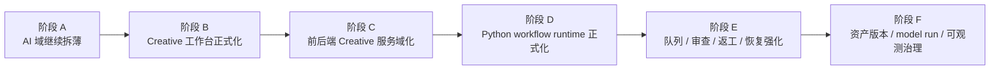

# Monster Workbench 架构升级路线图

> 生成日期：2026-06-11
> 适用场景：架构评审、业务调整、领域拆分、阶段排期、风险共识
> 依据文档：`docs/architecture-current-state.md`、`docs/architecture-upgrade-baseline.md`、`docs/ai/creative-architecture-guardrails.md`、`docs/ai/creative-system-roadmap.md`

---

## 1. 这份路线图回答什么问题

这份文档不讨论具体编码实现，而是回答 5 个升级决策问题：

1. 当前架构升级应该先动哪里，后动哪里。
2. 哪些改动属于高收益、低风险。
3. 哪些改动虽然看起来诱人，但当前阶段不该先做。
4. AI 域、Creative 域、Rust 控制面、Python 执行面之间的升级依赖是什么。
5. 面向后续业务扩展时，什么顺序最能避免返工。

---

## 2. 当前升级判断

基于当前代码与文档现状，可以把项目升级任务分成两类：

### 已经具备基础、可以继续硬化的部分

1. 前后端标准调用链已经稳定。
2. Creative 域已经有任务、资产、目标、批量的领域骨架。
3. Rust 控制面已经具备 service / command / infra 分层。
4. Python sidecar 已经有常驻 stub 入口。
5. 浏览器 mock 与桌面真实运行面已经共用同一套 service contract。

### 仍处于“可跑通但未正式化”的部分

1. `src/stores/ai.ts` 仍然偏厚。
2. `src/views/creative/components/CreativeWorkflowDemo.vue` 仍然是综合演示台。
3. `src/services/task.service.ts` 正在变成 Creative 域总入口。
4. Rust `TaskService` 正在变成后端 Creative 域总中枢。
5. Python sidecar 还不是正式 workflow runtime。
6. 资产版本治理、模型运行治理、失败恢复治理还没有完全成型。

所以当前升级主线不应该是“重写”，而应该是：

```text
继续拆薄中心节点
-> 把演示链路收敛成正式运行链路
-> 正式化 Python workflow runtime
-> 补齐资产/版本/可观测/恢复治理
```

---

## 3. 升级总原则

## 3.1 保持不变的红线

以下内容应视为升级过程中不轻易变动的基础设施：

1. `Vue -> Store -> Service -> callTauri/request -> Rust Command -> Rust Service -> Infra / Sidecar`
2. 前端不直连 SQLite、文件系统、Python localhost。
3. Rust 负责桌面控制面、权限边界、路径治理、IPC、事件桥接。
4. Python 逐步承担 workflow、worker、provider 调用、审查、返工等执行职责。
5. 大图落盘，前端只拿路径、缩略图、资产 URL。
6. 浏览器开发态继续共用同一套 service contract，不分叉业务逻辑。

## 3.2 评价一次升级是否值得做的标准

一个升级动作，至少应满足下面 4 条中的 2 条：

1. 减少中心节点复杂度。
2. 让领域边界更清晰。
3. 降低后续业务扩展改动面。
4. 提高真实运行链路与调试链路的一致性。

如果一项改动只是“看起来更漂亮”，但会破坏已有边界或扩大改动面，不建议当前阶段先做。

---

## 4. 推荐升级顺序

## 4.1 总体顺序图



这个顺序的核心逻辑是：

1. 先处理最容易继续膨胀的前端中心节点。
2. 再把 Creative 从“演示台”收敛成“正式工作台”。
3. 然后把前后端服务边界按领域继续收口。
4. 再把 Python 从 stub 推进到正式执行面。
5. 最后补齐批量生产和资产治理。

---

## 5. 分阶段路线图

## 阶段 A：AI 域继续拆薄

### 目标

把 `src/stores/ai.ts` 从厚门面继续拆成更清晰的领域节点。

### 当前依据

已经完成的前置动作：

1. `ai-provider.ts` 已承接 provider / model / active config。
2. `ai-prompt-library.ts` 已承接 prompt library。
3. `ai.ts` 目前仍保留 chat/image/session/queue/send/export 等职责。

### 建议继续拆分的 4 个子域

1. Provider 配置域
2. Session 域
3. Generation 执行域
4. Queue 与可观测域

### 本阶段收益

1. 减少 AI 域继续膨胀。
2. 为后续新增模型网关、更多会话类型、更多生图模式降低改动面。
3. 为 AI 与 Creative 后续融合保留更清晰的接口边界。

### 本阶段风险

1. 面板兼容层如果处理不好，容易影响 `AiProviderPanel`、`AiChatPanel`、`AiImagePanel`。
2. 会话、队列、图片状态如果边界拆得过早，可能产生行为回归。

### 推荐策略

先保留 `useAiStore` 作为兼容门面，内部逐步委托给更小的 store。

### 完成标志

1. `ai.ts` 不再同时拥有 provider、session、queue、generation 四类主职责。
2. UI 面板仍可通过兼容层工作。
3. `check:architecture` 与 `typecheck` 仍然通过。

---

## 阶段 B：Creative 工作台正式化

### 目标

把 `CreativeWorkflowDemo.vue` 的综合演示台定位拆清楚，区分：

1. 正式业务工作台
2. 研发验证 / 回归验证台

### 当前依据

`CreativeWorkflowDemo.vue` 当前同时承担：

1. prompt workflow
2. review workflow
3. 领域资产草稿
4. goal fan-out
5. batch mock/prompt/real-image
6. project index / history

### 为什么这一阶段重要

如果这一层不先收敛，后续所有正式业务都会继续堆进演示台，导致：

1. 页面职责持续变厚。
2. 正式业务流程与测试入口混在一起。
3. 组件拆分失去清晰目标。

### 推荐收敛方向

#### 正式工作台可以围绕业务对象组织

1. Project 视图
2. Task / Activity 视图
3. Asset 视图
4. Goal 视图
5. Batch 视图

#### 验证台继续承担

1. workflow smoke test
2. batch regression
3. mock / prompt / real-image 验证
4. sidecar / event / queue 链路验收

### 本阶段收益

1. UI 结构更适合长期演进。
2. 正式业务入口可以按用户任务流设计。
3. Demo 逻辑不再污染正式工作台。

### 完成标志

1. Creative 域存在“正式入口”和“验证入口”的清晰区分。
2. 演示能力不再成为默认主编排页面。
3. UI 层的业务语义和验证语义分离。

---

## 阶段 C：Creative 前后端服务按领域收口

### 目标

避免 `task.service.ts` 与 Rust `TaskService` 继续演化成跨全域总线。

### 当前依据

前端 `task.service.ts` 当前已经承接：

1. creative task
2. creative asset
3. creative goal
4. creative batch
5. workflow
6. 事件监听

Rust `TaskService` 当前也已经同时承接：

1. task CRUD
2. asset CRUD
3. task event
4. prompt workflow
5. review stub workflow

### 推荐收口方向

#### 前端服务层

逐步向下面方向演进：

1. `creative-task.service.ts`
2. `creative-asset.service.ts`
3. `creative-goal.service.ts`
4. `creative-batch.service.ts`
5. `creative-workflow.service.ts`

#### Rust 服务层

逐步明确：

1. `TaskService` 更聚焦任务本体与事件
2. `BatchJobService` 聚焦批次与批量执行
3. `GoalService` 聚焦 goal fan-out 与状态聚合
4. `SidecarLifecycleService` 聚焦 sidecar 生命周期与任务转发
5. workflow 逻辑尽量向 Python runtime 迁移

### 本阶段收益

1. 降低领域间相互污染。
2. 让后续新增 workflow、review、revision 不必继续改同一个中心文件。
3. 让前后端领域对齐更容易。

### 本阶段风险

1. contract 拆分过程容易造成 service 层名称变动过大。
2. 如果没有兼容策略，会影响已有调用方。

### 推荐策略

先按职责委托拆分，再决定是否重命名 service 暴露面。

---

## 阶段 D：Python workflow runtime 正式化

### 目标

把 `creative_health_server.py` 从 sidecar stub 逐步推进为正式 workflow runtime。

### 当前依据

当前 Python 侧已经具备：

1. sidecar 常驻健康检查
2. prompt workflow 基础任务入口

但还未完全具备：

1. 正式任务协议版本化
2. 标准事件协议
3. 失败分类
4. retry / cancel / checkpoint 行为约定
5. 更稳定的资产写回协议

### 本阶段应明确的内容

1. 请求协议
2. 响应协议
3. 任务状态流转
4. sidecar 错误与业务错误分层
5. token / health / lifecycle 约定
6. worker 执行上下文

### 为什么不建议更早做这一步

如果在前端和 Rust 领域边界尚未收敛之前就把 Python runtime 做重，会出现：

1. 多次返工协议。
2. Sidecar 接口随着 UI 和 service 重复变化。
3. 工作流运行面过早承担不稳定的前端抽象。

### 完成标志

1. Python sidecar 有稳定任务协议。
2. 至少一个真实 workflow 可稳定运行。
3. Rust 与 Python 的职责边界清晰。

---

## 阶段 E：队列、审查、返工、恢复能力强化

### 目标

把“可运行骨架”继续推进到“可恢复、可取消、可审查、可返工”的生产态基础能力。

### 当前依据

当前已经有：

1. worker queue skeleton
2. review stub
3. batch mock / prompt / real-image demo
4. task events

### 下一步应补的关键能力

1. cancel checkpoint 语义统一
2. retry 语义统一
3. recovery 语义统一
4. review -> revise -> manual approval 闭环
5. batch 失败分类与恢复策略

### 本阶段收益

1. 系统从“演示能跑”走向“长任务可控”。
2. 能支撑更长链路的创作任务。
3. 为多 Agent、批量生产和资产治理提供稳定底盘。

---

## 阶段 F：资产版本、model run、可观测治理

### 目标

让创作系统具备正式生产所需的资产与运行治理。

### 当前依据

项目已经有：

1. assets
2. asset_links
3. model_runs
4. batch_jobs
5. logs

但这些能力还没有完全形成正式治理体系。

### 本阶段重点

1. 资产版本与来源关系
2. prompt/version/provenance
3. model run 记录完整度
4. 成本与失败统计
5. 项目级可观测视图
6. 批次级回放与定位能力

### 本阶段收益

1. 系统真正可用于长期生产和追踪。
2. 后续做质量评估、成本控制、一致性分析会更稳。

---

## 6. 优先级矩阵

| 优先级 | 事项 | 价值 | 风险 | 建议 |
|---|---|---|---|---|
| P0 | 继续拆薄 `src/stores/ai.ts` | 高 | 中 | 应优先推进 |
| P0 | Creative 正式工作台与 Demo 验证台分离 | 高 | 中 | 应优先推进 |
| P1 | `task.service.ts` / Rust `TaskService` 领域收口 | 高 | 中高 | 在前两步后推进 |
| P1 | Python workflow runtime 协议正式化 | 高 | 中高 | 在领域边界更稳后推进 |
| P2 | 审查 / 返工 / 恢复强化 | 高 | 中 | 紧随 runtime 正式化 |
| P2 | 资产版本 / model run / 可观测治理 | 中高 | 中 | 在生产链路稳定后推进 |
| P3 | 更大范围 UI 重做 | 中 | 高 | 不建议当前阶段先做 |
| P3 | 提前引入 Redis / 远程 worker | 低 | 高 | 当前阶段不建议 |

---

## 7. 业务调整场景下的推荐动作

## 场景 A：要新增一种创作资产

优先影响：

1. asset 类型体系
2. asset link 关系
3. 对应 workflow 输入输出
4. Project / Asset 视图

推荐前提：

先保证 Creative 工作台已经按正式业务域组织。

## 场景 B：要新增一个 workflow

优先影响：

1. workflow service contract
2. task / event / asset 落库
3. Python runtime 协议
4. 前端活动流与结果视图

推荐前提：

先明确 workflow 是否属于 prompt、review、revision、generation 中哪一类执行域。

## 场景 C：要扩展 Goal 为正式多 Agent 系统

优先影响：

1. goal model
2. role/task fan-out
3. worker queue
4. review / merge
5. budget / kill switch

推荐前提：

先把队列、恢复、审查闭环补稳，再扩大 Goal 复杂度。

## 场景 D：要把批量生图变成正式生产链路

优先影响：

1. 并发治理
2. retry / cancel / recover
3. model_runs
4. artifact 路径治理
5. 缩略图 / 原图策略
6. 批次观测与排障

推荐前提：

先完成 Python runtime 正式化与批量失败恢复语义统一。

---

## 8. 当前阶段不建议优先做的事

下面这些事情现在做，收益不如风险高：

1. 推倒现有 Tauri + Rust + Python 结构重来。
2. 提前让 Vue 直接请求 Python localhost。
3. 提前把队列切到 Redis / 远程 worker。
4. 提前重做全部页面 UI。
5. 在 AI 域尚未拆薄前继续往 `ai.ts` 叠新能力。
6. 在 Creative 正式工作台未收敛前继续把更多流程叠进 `CreativeWorkflowDemo.vue`。

这些动作会让现有结构优势失效，且返工概率高。

---

## 9. 建议的评审顺序

如果要开一次架构升级评审会，建议按这个顺序讨论：

1. 现有红线哪些不动
2. AI 域剩余拆分边界
3. Creative 正式工作台与验证台分离方式
4. `task.service.ts` / Rust `TaskService` 的领域收口方式
5. Python workflow runtime 的正式化时点
6. 队列 / 审查 / 返工 / 恢复语义
7. 资产版本与可观测治理

这个顺序的好处是：先收敛稳定边界，再讨论大能力扩展，不容易失焦。

---

## 10. 一句话路线图

如果要把整条升级路线压缩成一句话：

**先拆薄 AI 与 Creative 的中心节点，再把演示链路收敛成正式运行链路，最后让 Python workflow runtime 与资产治理承接持续型 AI 创作系统的正式复杂度。**
